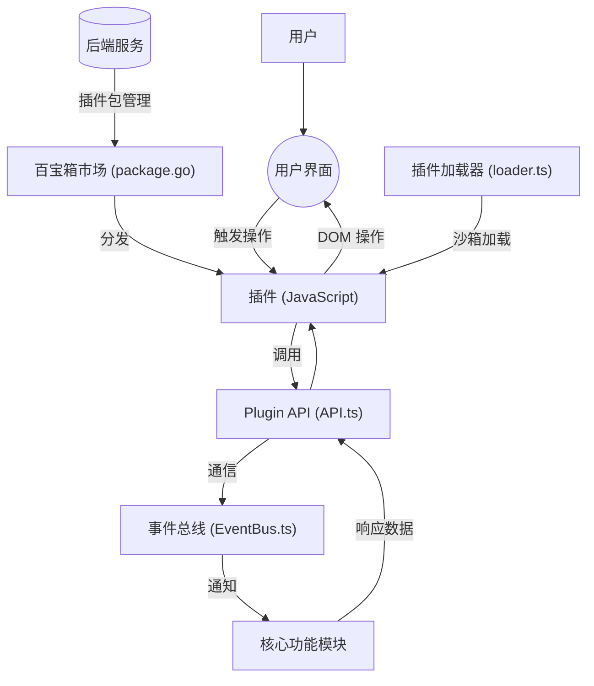
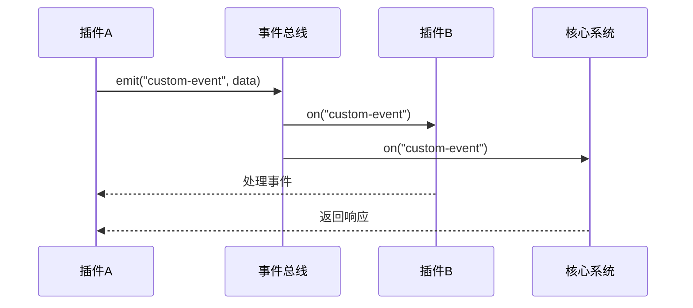
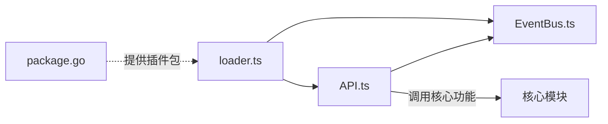

# 插件与扩展

<cite>
**本文档中引用的文件**
- [API.ts](file://app/src/plugin/API.ts)
- [loader.ts](file://app/src/plugin/loader.ts)
- [EventBus.ts](file://app/src/plugin/EventBus.ts)
- [package.go](file://kernel/bazaar/package.go)
</cite>

## 目录
1. [简介](#简介)
2. [项目结构](#项目结构)
3. [核心组件](#核心组件)
4. [架构概述](#架构概述)
5. [详细组件分析](#详细组件分析)
6. [依赖分析](#依赖分析)
7. [性能考虑](#性能考虑)
8. [故障排除指南](#故障排除指南)
9. [结论](#结论)

## 简介
本文档旨在全面介绍思源笔记的插件系统，涵盖“花瓣”（Petal）插件生态的设计理念、开发接口、加载机制、通信模式、安全模型以及发布流程。通过本指南，开发者将能够理解如何使用前端提供的 Plugin API 创建自定义功能，并确保其插件符合平台的安全和规范要求。

## 项目结构
思源笔记的代码库分为前端（`app/src`）和后端（`kernel`）两大部分。插件系统的相关实现主要分布在以下路径：
- 前端插件 API 和运行时：`app/src/plugin/`
- 后端市场管理与包处理：`kernel/bazaar/`

该结构实现了前后端职责分离，前端负责插件的加载、执行和用户界面集成，后端则负责插件包的验证、存储和分发。

```mermaid
graph TB
subgraph "前端 (app)"
A[Plugin API] --> B[EventBus]
A --> C[Loader]
D[UI Components] --> A
end
subgraph "后端 (kernel)"
E[Bazaar Market] --> F[Package Manager]
F --> G[Plugin Validation]
end
A < --> |HTTP/WebSocket| E
```

**Diagram sources**
- [API.ts](file://app/src/plugin/API.ts)
- [package.go](file://kernel/bazaar/package.go)

**Section sources**
- [API.ts](file://app/src/plugin/API.ts)
- [loader.ts](file://app/src/plugin/loader.ts)

## 核心组件
思源笔记插件系统的核心由四个关键部分构成：插件 API、事件总线（EventBus）、插件加载器（loader）和百宝箱（Bazaar）市场服务。这些组件协同工作，为开发者提供了一个强大且安全的扩展平台。

**Section sources**
- [API.ts](file://app/src/plugin/API.ts#L1-L50)
- [EventBus.ts](file://app/src/plugin/EventBus.ts#L1-L24)
- [loader.ts](file://app/src/plugin/loader.ts#L1-L100)

## 架构概述
思源笔记的插件架构采用模块化设计，允许第三方开发者在不修改主程序的前提下，通过标准接口扩展应用功能。整体架构如下图所示：



**Diagram sources**
- [API.ts](file://app/src/plugin/API.ts#L1-L20)
- [EventBus.ts](file://app/src/plugin/EventBus.ts#L1-L24)
- [loader.ts](file://app/src/plugin/loader.ts#L1-L15)
- [package.go](file://kernel/bazaar/package.go#L1-L10)

## 详细组件分析

### 花瓣（Petal）插件生态概念
“花瓣”是思源笔记对插件生态的形象化称呼，寓意每个插件如同一片独特的花瓣，共同构成一朵完整的花朵——即功能丰富的思源笔记应用。该生态鼓励社区贡献，支持开发者创建各种工具来增强编辑、组织、展示和自动化能力。

#### 开发者如何利用 Plugin API
开发者通过导入 `API.ts` 中提供的 `Plugin` 类来创建插件。该类暴露了多个方法，用于注册新功能。

##### 添加新的工具栏按钮
通过 `addTopBarIcon` 方法，插件可以向顶部工具栏添加图标按钮，并绑定点击事件。

[SPEC SYMBOL](file://app/src/plugin/API.ts#L100-L120)

##### 注册快捷键
使用 `eventBus` 实例监听全局键盘事件，或通过特定 API 注册命令快捷键。

[SPEC SYMBOL](file://app/src/plugin/API.ts#L150-L170)

##### 修改界面
插件可通过直接操作 DOM 或调用 UI 相关 API 来动态修改界面元素，例如添加侧边栏面板或修改现有样式。

[SPEC SYMBOL](file://app/src/plugin/API.ts#L200-L230)

**Section sources**
- [API.ts](file://app/src/plugin/API.ts#L50-L250)

### 插件加载机制（loader.ts）
`loader.ts` 文件负责插件的生命周期管理，包括加载、初始化、启动和卸载。它使用动态 `import()` 语法在隔离环境中加载插件脚本，并将其注入到当前页面上下文中。

加载过程包含以下步骤：
1. 读取插件目录下的 `index.js` 或 `main.js`
2. 在安全沙箱中执行代码
3. 实例化插件类并调用 `onLoad` 钩子
4. 监听插件可能抛出的错误

[SPEC SYMBOL](file://app/src/plugin/loader.ts#L30-L80)

**Section sources**
- [loader.ts](file://app/src/plugin/loader.ts#L1-L100)

### 事件总线（EventBus）通信模式
`EventBus.ts` 实现了一个基于 `CustomEvent` 的轻量级事件系统，作为插件与核心系统以及其他插件之间通信的桥梁。

其核心是一个继承自 `EventTarget` 的 `EventBus` 类，提供了 `on`, `once`, `off`, 和 `emit` 四个基本方法，支持类型化的事件传递。



**Diagram sources**
- [EventBus.ts](file://app/src/plugin/EventBus.ts#L1-L24)

**Section sources**
- [EventBus.ts](file://app/src/plugin/EventBus.ts#L1-L24)

### 插件包结构规范与发布流程（package.go）
插件包本质上是一个符合特定结构的 ZIP 压缩文件，通常包含：
- `manifest.json`：描述插件元信息（名称、版本、作者等）
- `index.js`：入口脚本
- `style.css`：可选样式文件
- 其他资源文件

`package.go` 是后端处理插件包的核心文件，负责解析上传的插件包、验证其完整性、提取元数据并将其存储到“百宝箱”市场数据库中。

发布流程如下：
1. 开发者打包插件为 `.siyuan-plugin` 文件
2. 通过管理界面上传至服务器
3. `package.go` 进行校验和解析
4. 成功后进入市场待审核或直接发布

[SPEC SYMBOL](file://kernel/bazaar/package.go#L50-L100)

**Section sources**
- [package.go](file://kernel/bazaar/package.go#L1-L150)

### Hello World 插件开发示例
一个最简单的插件开发流程如下：

1. **项目初始化**：创建新目录，编写 `manifest.json` 并设置入口点。
2. **API 调用**：在 `index.js` 中继承 `Plugin` 类，重写 `onLoad` 方法。
3. **添加功能**：调用 `this.addTopBarIcon()` 添加一个按钮，点击时弹出提示。
4. **调试**：将插件目录放入 `plugins` 文件夹，重启思源笔记进行测试。

[SPEC SYMBOL](file://app/src/plugin/API.ts#L80-L90)

**Section sources**
- [API.ts](file://app/src/plugin/API.ts#L80-L90)
- [loader.ts](file://app/src/plugin/loader.ts#L40-L60)

### 安全沙箱机制与权限控制
为了防止恶意代码损害用户数据，思源笔记对插件执行环境进行了严格限制：
- 插件运行在独立的 JavaScript 上下文中，无法直接访问 Node.js 的 `require`。
- 对敏感 API（如文件系统操作）进行封装和权限检查。
- 所有网络请求需通过代理，便于监控和拦截潜在风险。
- 提供声明式权限模型，插件必须在 `manifest.json` 中明确申请所需权限，由用户授权后方可使用。

此机制确保了即使第三方代码存在漏洞或恶意行为，也能被有效遏制在沙箱之内。

[SPEC SYMBOL](file://app/src/plugin/loader.ts#L110-L140)

**Section sources**
- [loader.ts](file://app/src/plugin/loader.ts#L110-L140)

## 依赖分析
插件系统各组件之间的依赖关系清晰明确：



这种低耦合设计使得各个组件可以独立演进，同时保证了系统的稳定性和可维护性。

**Diagram sources**
- [API.ts](file://app/src/plugin/API.ts#L1-L10)
- [EventBus.ts](file://app/src/plugin/EventBus.ts#L1-L10)
- [loader.ts](file://app/src/plugin/loader.ts#L1-L10)

**Section sources**
- [API.ts](file://app/src/plugin/API.ts#L1-L20)
- [loader.ts](file://app/src/plugin/loader.ts#L1-L20)

## 性能考虑
插件系统的性能优化主要体现在：
- 懒加载机制：插件仅在用户启用时才被加载和初始化。
- 事件去抖：高频事件（如输入）会进行节流处理，避免性能瓶颈。
- 内存管理：插件卸载时会自动清理事件监听器和 DOM 元素，防止内存泄漏。

## 故障排除指南
常见问题及解决方案：
- **插件未加载**：检查 `manifest.json` 是否正确，入口文件是否存在。
- **API 调用失败**：确认是否在 `onLoad` 之后调用，检查参数类型。
- **样式不生效**：确保 CSS 选择器具有足够优先级，或使用 Shadow DOM 隔离。
- **事件未触发**：验证事件名称拼写，确认监听器已正确注册。

**Section sources**
- [loader.ts](file://app/src/plugin/loader.ts#L70-L90)
- [API.ts](file://app/src/plugin/API.ts#L240-L260)

## 结论
思源笔记的插件系统提供了一套完整、安全且易于使用的扩展机制。“花瓣”生态不仅丰富了应用功能，也促进了社区创新。通过深入理解 Plugin API、EventBus、加载器和市场发布流程，开发者可以高效地构建高质量插件，为用户提供更强大的个性化体验。