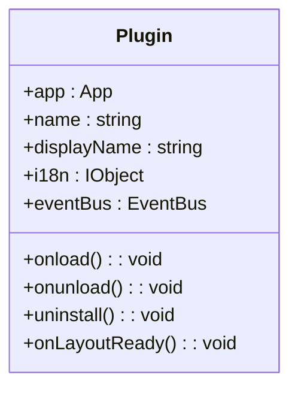
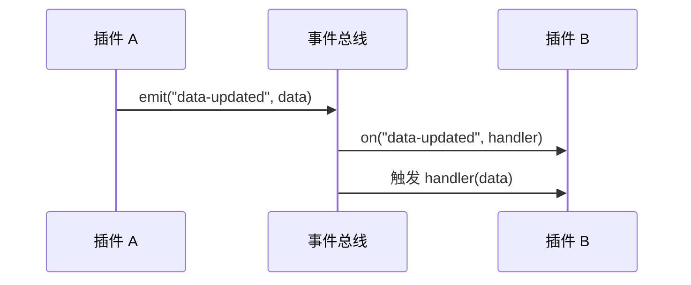

# 插件开发指南

<cite>
**本文档中引用的文件**
- [API.ts](file://app/src/plugin/API.ts)
- [loader.ts](file://app/src/plugin/loader.ts)
- [EventBus.ts](file://app/src/plugin/EventBus.ts)
- [index.ts](file://app/src/plugin/index.ts)
- [Setting.ts](file://app/src/plugin/Setting.ts)
- [constants.ts](file://app/src/constants.ts)
- [types/index.d.ts](file://app/src/types/index.d.ts)
- [protyle.d.ts](file://app/src/types/protyle.d.ts)
</cite>

## 目录
1. [简介](#简介)
2. [项目结构与配置](#项目结构与配置)
3. [插件生命周期](#插件生命周期)
4. [核心 API 功能详解](#核心-api-功能详解)
5. [事件总线 EventBus 机制](#事件总线-eventbus-机制)
6. [“Hello World” 插件示例](#hello-world-插件示例)
7. [常见问题与最佳实践](#常见问题与最佳实践)
8. [附录：类型定义参考](#附录类型定义参考)

## 简介

思源笔记是一款支持高度可扩展性的知识管理工具，其前端提供了丰富的 Plugin API，允许开发者创建自定义功能以增强用户体验。本指南旨在为开发者提供一份详尽的插件开发文档，涵盖从环境搭建、API 使用、事件通信到调试部署的全流程。

通过本指南，您将学习如何使用 `Plugin` 类构建插件，利用 `API.ts` 提供的核心方法与主应用交互，掌握 `EventBus.ts` 实现的安全通信机制，并了解插件从加载、初始化到销毁的完整生命周期。此外，我们还将探讨作用域隔离、样式冲突等常见问题，并提供最佳实践建议，帮助您开发出稳定高效的插件。

**Section sources**
- [index.ts](file://app/src/plugin/index.ts#L0-L441)
- [API.ts](file://app/src/plugin/API.ts#L0-L339)

## 项目结构与配置

一个标准的思源插件项目应包含以下核心文件：

- `manifest.json`：插件的元信息配置文件，定义名称、版本、入口脚本等。
- `main.js` 或 `main.ts`：插件的主逻辑文件，导出继承自 `Plugin` 的类。
- `style.css`（可选）：插件的自定义样式文件。
- `i18n/` 目录（可选）：存放多语言翻译文件。

`manifest.json` 是插件的入口配置，其关键字段包括：
- `name`：插件唯一标识符。
- `displayName`：插件显示名称。
- `version`：版本号。
- `main`：主脚本文件路径。
- `frontend`：指定兼容的前端类型（如 `"desktop"`）。

当插件被加载时，思源会读取此文件并根据配置加载相应的 JavaScript/CSS 资源。

**Section sources**
- [loader.ts](file://app/src/plugin/loader.ts#L0-L227)

## 插件生命周期

思源插件的生命周期由 `Plugin` 基类定义，主要包含以下几个阶段：

### 初始化 (Constructor)
插件实例化时，构造函数接收包含 `app` 实例、插件名称和国际化文本的对象。此时可以进行一些基础属性的初始化。



**Diagram sources**
- [index.ts](file://app/src/plugin/index.ts#L0-L441)

### 加载 (onload)
`onload()` 方法在插件被加载后调用。这是执行初始化逻辑的主要时机，例如注册命令、添加 UI 元素或订阅事件。如果在此方法中抛出异常，插件将加载失败。

### 布局就绪 (onLayoutReady)
`onLayoutReady()` 方法在主应用的 UI 布局完全渲染后调用。此时可以安全地访问和操作 DOM 元素，例如将自定义按钮插入工具栏或状态栏。

### 卸载 (onunload)
当插件被禁用或关闭时，`onunload()` 方法会被调用。开发者应在此处清理资源，如移除事件监听器、销毁定时器或清除 DOM 元素，以防止内存泄漏。

### 销毁 (uninstall)
`uninstall()` 方法在插件被卸载时调用。它用于执行最终的清理工作，例如删除插件创建的数据文件。

整个生命周期由 `loader.ts` 中的 `loadPlugins` 和 `loadPluginJS` 函数管理，确保插件按正确顺序被加载和初始化。

**Section sources**
- [index.ts](file://app/src/plugin/index.ts#L0-L441)
- [loader.ts](file://app/src/plugin/loader.ts#L0-L227)

## 核心 API 功能详解

`API.ts` 文件暴露了 `API` 对象，封装了与思源主应用交互的核心方法。

### 创建自定义面板
通过 `addDock()` 方法可以向侧边栏（Dock）添加自定义面板。需要提供面板的配置（如图标、标题、位置）以及初始化、更新和销毁的回调函数。

```typescript
this.addDock({
    type: "myPanel",
    config: { icon: "iconApp", title: "My Panel", position: "LeftBottom" },
    init: () => { /* 初始化逻辑 */ },
    update: () => { /* 更新逻辑 */ },
    destroy: () => { /* 清理逻辑 */ }
});
```

### 添加工具栏按钮
使用 `addTopBar()` 方法可以在顶部工具栏添加按钮。需指定图标（SVG ID 或 SVG 代码）、提示文字和点击回调。

```typescript
this.addTopBar({
    icon: "iconSearch",
    title: "Open My Tool",
    position: "left",
    callback: (evt) => { /* 处理点击 */ }
});
```

### 注册全局快捷键
通过 `addCommand()` 方法可以注册全局快捷键。快捷键配置会自动与用户的键盘映射设置同步。

```typescript
this.addCommand({
    langKey: "openTool",
    langText: "Open My Tool",
    hotkey: "Ctrl+Shift+M",
    callback: () => { /* 执行操作 */ }
});
```

### 监听编辑器事件
虽然不能直接在 `API` 中注册事件监听器，但可以通过 `eventBus` 订阅由主应用发出的各种事件，例如 `click-editorcontent`（点击编辑区域）或 `switch-protyle`（切换编辑器）。

### 其他核心功能
- `openTab()` / `openWindow()`：打开新标签页或窗口。
- `showMessage()` / `hideMessage()`：显示或隐藏消息提示。
- `fetchPost()` / `fetchGet()`：发起网络请求。
- `getActiveEditor()`：获取当前激活的编辑器实例。

**Section sources**
- [API.ts](file://app/src/plugin/API.ts#L0-L339)
- [index.ts](file://app/src/plugin/index.ts#L0-L441)

## 事件总线 EventBus 机制

`EventBus.ts` 实现了一个基于 `CustomEvent` 的发布-订阅模式，是插件与主应用及其他插件之间进行松耦合通信的核心机制。

### 工作原理
每个 `Plugin` 实例都拥有一个独立的 `eventBus` 属性，其内部维护一个 `EventTarget`。开发者可以使用 `on()`、`once()` 和 `off()` 方法来订阅、一次性订阅和取消订阅事件。使用 `emit()` 方法可以触发事件并传递数据。



**Diagram sources**
- [EventBus.ts](file://app/src/plugin/EventBus.ts#L0-L53)

### 事件类型
事件类型由 `TEventBus` 类型定义，涵盖了应用内的各种用户交互和状态变化，例如：
- `ws-main`：WebSocket 主连接事件。
- `sync-start` / `sync-end`：同步开始/结束。
- `click-blockicon`：点击块图标。
- `open-menu-*`：打开各类右键菜单。
- `loaded-protyle-static`：静态内容加载完成。

### 安全通信
由于每个插件的 `eventBus` 是独立的，这保证了通信的隔离性。插件只能通过主应用广播的公共事件或显式地与其他插件共享 `eventBus` 实例来进行通信，避免了命名冲突和意外干扰。

**Section sources**
- [EventBus.ts](file://app/src/plugin/EventBus.ts#L0-L53)
- [types/index.d.ts](file://app/src/types/index.d.ts#L0-L799)

## “Hello World” 插件示例

下面是一个完整的“Hello World”插件实现。

### 项目结构
```
hello-world/
├── manifest.json
└── main.ts
```

### manifest.json
```json
{
  "name": "hello-world",
  "displayName": "Hello World",
  "version": "1.0.0",
  "main": "main.js",
  "frontend": "desktop"
}
```

### main.ts
```typescript
import { Plugin } from "siyuan";

export default class HelloWorldPlugin extends Plugin {
    onload() {
        console.log("Hello World plugin loaded!");
        // 添加一个顶部工具栏按钮
        this.addTopBar({
            icon: "iconInfo",
            title: "Say Hello",
            position: "right",
            callback: () => {
                alert("Hello, SiYuan!");
            }
        });
    }

    onunload() {
        console.log("Hello World plugin unloaded.");
    }
}
```

### 开发与调试
1. 将插件文件夹放入思源的 `data/plugins/` 目录。
2. 在思源的「插件」设置页面中启用该插件。
3. 查看浏览器开发者工具的控制台输出日志。
4. 修改代码后，重新加载插件即可看到效果。

**Section sources**
- [index.ts](file://app/src/plugin/index.ts#L0-L441)
- [API.ts](file://app/src/plugin/API.ts#L0-L339)

## 常见问题与最佳实践

### 作用域与样式冲突
- **问题**：插件的 CSS 样式可能影响主应用或其他插件。
- **解决方案**：使用 CSS Modules 或在选择器前添加唯一的命名空间（如 `.plugin-hello-world .my-class`）。避免使用全局选择器。

### 性能优化
- **避免频繁 DOM 操作**：批量更新 DOM，使用 `requestAnimationFrame` 进行动画。
- **及时清理资源**：在 `onunload()` 中务必移除所有事件监听器和定时器。
- **懒加载**：对于大型功能模块，采用动态导入（`import()`）的方式按需加载。

### 最佳实践
- **遵循 TypeScript**：充分利用类型系统减少运行时错误。
- **国际化**：使用 `this.i18n` 对象提供多语言支持。
- **错误处理**：在异步操作和事件回调中妥善处理异常，避免插件崩溃。
- **文档化**：为插件编写清晰的 README 和内联注释。

**Section sources**
- [index.ts](file://app/src/plugin/index.ts#L0-L441)
- [loader.ts](file://app/src/plugin/loader.ts#L0-L227)
- [Setting.ts](file://app/src/plugin/Setting.ts#L0-L104)

## 附录：类型定义参考

本节列出了一些关键的类型定义，供开发时查阅。

### IPluginData
描述插件数据的接口，包含名称、显示名、JavaScript 代码、CSS 代码和国际化文本。

### IPluginDockTab
定义 Dock 面板的配置，包括位置、大小、图标、快捷键和标题。

### TEventBus
枚举了所有可用的事件类型字符串。

### ICommand
定义命令对象的结构，包含语言键、文本、默认和自定义快捷键以及回调函数。

### IProtyleOptions
`Protyle` 编辑器的配置选项，可用于自定义编辑器行为。

这些类型定义位于 `types/index.d.ts` 和 `types/protyle.d.ts` 文件中。

**Section sources**
- [types/index.d.ts](file://app/src/types/index.d.ts#L0-L799)
- [types/protyle.d.ts](file://app/src/types/protyle.d.ts#L0-L546)