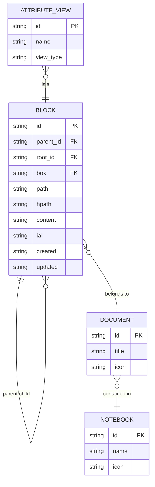
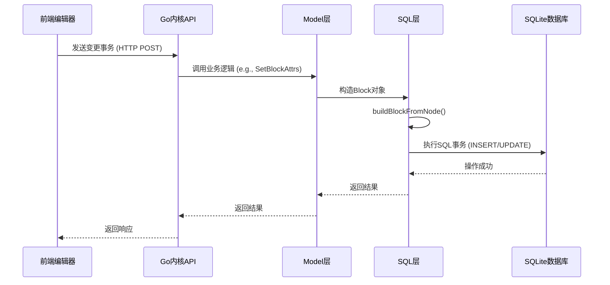

# 数据模型

<cite>
**本文档引用的文件**
- [block.go](file://kernel/sql/block.go)
- [blocktree.go](file://kernel/treenode/blocktree.go)
- [database.go](file://kernel/sql/database.go)
- [blockial.go](file://kernel/model/blockial.go)
- [av.go](file://kernel/av/av.go)
</cite>

## 目录
1. [引言](#引言)
2. [核心实体领域模型](#核心实体领域模型)
3. [块的树形结构实现](#块的树形结构实现)
4. [块的元数据（IAL）](#块的元数据（ial）)
5. [数据持久化流程](#数据持久化流程)
6. [数据库表关系与ER图](#数据库表关系与er图)
7. [索引策略与查询优化](#索引策略与查询优化)
8. [事务处理与数据一致性](#事务处理与数据一致性)
9. [结论](#结论)

## 引言
思源笔记（SiYuan Note）是一款基于块（Block）概念的本地优先、双向链接的个人知识管理系统。其数据模型设计精巧，以“块”为核心单元，构建了文档、笔记本和属性视图等高级抽象。本数据模型文档旨在深入剖析思源笔记的核心数据结构，详细解释其在SQLite数据库中的存储机制、前后端交互的数据流以及保障数据一致性的关键措施。

## 核心实体领域模型
思源笔记的数据模型围绕几个核心实体构建：块（Block）、文档（Document）、笔记本（Notebook）和属性视图（Attribute View）。这些实体共同构成了一个灵活且强大的知识组织体系。

### 块 (Block)
“块”是思源笔记中最基本的内容单元。它不仅仅是一个文本段落，而是一个可以包含任何类型内容（如标题、列表、代码块、嵌入块等）的通用容器。每个块都拥有唯一的ID，并通过`parent_id`和`root_id`字段与其他块建立父子关系，从而形成一个树状结构。这种设计使得用户可以轻松地创建大纲、折叠内容和进行细粒度的编辑。

### 文档 (Document)
“文档”在思源笔记中被视为一种特殊的“块”，即根块（Root Block）。它是所有其他块的祖先，代表了一个独立的Markdown文件。文档的路径（Path）和可读路径（HPath）信息被存储在数据库中，用于文件系统的定位和用户友好的显示。

### 笔记本 (Notebook)
“笔记本”是最高层级的组织单元，相当于文件系统中的一个文件夹。它包含了多个文档（`.sy`文件），并为其中的所有块提供了一个命名空间。每个块都归属于一个特定的笔记本，通过`box`字段进行标识。

### 属性视图 (Attribute View)
“属性视图”是一种强大的数据管理工具，允许用户以表格、看板或画廊的形式对具有特定属性的块进行分组、筛选和排序。它本身也是一个块，但其内容由数据库中的元数据动态生成，而非直接存储在文件中。

**Section sources**
- [block.go](file://kernel/sql/block.go#L36-L58)
- [av.go](file://kernel/av/av.go#L36-L46)

## 块的树形结构实现
思源笔记通过巧妙地利用SQLite数据库来实现块的树形结构，其核心在于`blocks`表中的`parent_id`和`root_id`两个字段。

### parent_id 字段
`parent_id`字段直接指明了当前块的父块ID。这构成了树的直接父子关系链。例如，一个子列表项的`parent_id`会指向其父列表项的ID。通过递归查询`parent_id`，系统可以快速构建出从任意块到根节点的完整路径。

### root_id 字段
`root_id`字段则存储了当前块所属文档的根块ID。这个设计至关重要，因为它将整个树的结构扁平化地映射到了数据库的一张表中。无论一个块在树中嵌套多深，它的`root_id`始终指向其文档的根块。这极大地简化了查询操作，例如，要获取某个文档下的所有块，只需执行一条简单的SQL语句：`SELECT * FROM blocks WHERE root_id = '目标文档ID'`。

### 在构建大纲和嵌套内容中的作用
这种树形结构是思源笔记实现大纲功能的基础。当用户折叠一个标题块时，前端会根据该块的ID，查询所有`parent_id`为其ID的子块，并将其隐藏。同时，由于`root_id`的存在，系统可以高效地维护整个文档的块索引，确保在打开、搜索或同步文档时能够快速加载所有相关内容。此外，这种结构也支持复杂的嵌套内容，如超级块（Super Block）内部可以包含任意深度的子块，所有这些子块都通过`parent_id`和`root_id`与主文档保持关联。

**Diagram sources**
- [block.go](file://kernel/sql/block.go#L36-L58)
- [blocktree.go](file://kernel/treenode/blocktree.go#L47-L97)

## 块的元数据（IAL）
每个块都附带一组丰富的元数据，称为内联属性列表（Inline Attribute List, IAL）。这些元数据以键值对的形式存储在块的`ial`字段中，并在数据库层面有专门的表示。

### 关键字段及其用途
- **id**: 块的唯一标识符，由系统自动生成，遵循时间戳模式。
- **created**: 块的创建时间，通常由块ID的时间戳部分推导而来，格式为`yyyyMMddHHmmss`。
- **updated**: 块的最后更新时间，每次块内容或属性发生变化时都会更新。此字段对于同步和版本控制至关重要。
- **name**: 块的名称，可用于自定义锚文本。
- **alias**: 块的别名，可在引用时作为替代显示文本。
- **memo**: 块的备注信息。
- **tags**: 块的标签，用逗号分隔。
- **custom-*:** 用户自定义的属性前缀，用于扩展块的功能。

在Go内核中，`ial`字段在`sql.Block`结构体中被定义为字符串（`string`），但在内存中的`model.Block`结构体里则被解析为`map[string]string`，以便于程序的访问和操作。

**Section sources**
- [block.go](file://kernel/sql/block.go#L36-L58)
- [blockial.go](file://kernel/model/blockial.go#L219-L276)

## 数据持久化流程
思源笔记的数据持久化是一个从前端到后端再到数据库的严谨过程，确保了数据变更的可靠性和一致性。

### 流程概述
1.  **前端变更触发**: 当用户在编辑器中修改内容时，前端会生成一个描述变更的操作（Operation），并将其打包成一个事务（Transaction）。
2.  **API调用**: 前端通过HTTP API（如`/api/block/updateBlockAttrs`）将这个事务发送给Go内核。
3.  **Go内核解析**: 内核接收到请求后，由`api/block.go`中的相应处理器（Handler）进行解析。它会调用`model`层的业务逻辑，如`SetBlockAttrs`函数，来处理具体的变更。
4.  **生成SQL语句**: `model`层的逻辑会进一步调用`sql`包中的函数。例如，在`sql/database.go`中，`buildBlockFromNode`函数负责将内存中的AST（抽象语法树）节点转换为`sql.Block`结构体实例。在此过程中，会根据节点的IAL属性生成相应的SQL插入或更新语句。
5.  **写入数据库**: 生成的SQL语句在一个数据库事务（Transaction）中被执行。`sql/database.go`中的`UpsertBlockTree`等函数负责管理这些数据库操作，确保原子性。一旦事务提交，数据便被持久化到SQLite数据库中。

**Diagram sources**
- [block.go](file://kernel/api/block.go#L0-L799)
- [database.go](file://kernel/sql/database.go#L0-L1555)
- [blockial.go](file://kernel/model/blockial.go#L0-L306)

## 数据库表关系与ER图
思源笔记的数据库设计清晰地反映了其数据模型。主要的表包括`blocks`、`attributes`、`refs`和`assets`。

- **blocks 表**: 存储所有块的核心信息，是整个数据模型的中心。
- **attributes 表**: 存储块的自定义属性（如`custom-*`），实现了属性的灵活扩展。
- **refs 表**: 记录块之间的引用关系，支持双向链接功能。
- **assets 表**: 管理文档中引用的资源文件（如图片、音频）。

这些表通过`block_id`和`root_id`等外键紧密关联，形成了一个完整的知识网络。

**Diagram sources**
- [database.go](file://kernel/sql/database.go#L0-L1555)

## 索引策略与查询优化
为了保证在大型知识库中的查询性能，思源笔记在数据库上建立了精心设计的索引。

- **主键索引**: `blocks`表的`id`字段上有主键索引`idx_blocks_id`，确保了通过ID查找块的O(1)时间复杂度。
- **全文搜索索引**: 使用SQLite的FTS5虚拟表技术，创建了`blocks_fts`和`blocks_fts_case_insensitive`表，分别支持区分大小写和不区分大小写的全文搜索。这使得用户可以快速找到包含特定关键词的块。
- **路径索引**: `blocks`表上的`idx_blocks_root_id`和`idx_blocks_parent_id`索引，极大地加速了按文档或父块查询子块的操作，这对于构建大纲和导航至关重要。

**Section sources**
- [database.go](file://kernel/sql/database.go#L0-L1555)

## 事务处理与数据一致性
数据一致性是思源笔记的核心要求。系统通过严格的事务处理来保障这一点。

- **原子性**: 所有的数据写入操作都在一个数据库事务中完成。如果在事务执行过程中发生任何错误，整个事务将被回滚（Rollback），防止数据库进入不一致的状态。
- **隔离性**: 通过`db.Begin()`开启事务，确保了并发操作不会相互干扰。
- **持久性**: 事务提交（Commit）后，数据被永久写入磁盘。
- **缓存一致性**: 内核还维护了一个内存缓存（Cache），在数据变更后会及时更新或清除相关缓存条目（如`cache.PutBlockIAL`），确保内存状态与数据库状态同步。

**Section sources**
- [database.go](file://kernel/sql/database.go#L0-L1555)
- [blockial.go](file://kernel/model/blockial.go#L0-L306)

## 结论
思源笔记的数据模型以其“块”为核心，通过`parent_id`和`root_id`构建高效的树形结构，利用IAL实现灵活的元数据管理，并通过严谨的事务流程确保数据的持久化和一致性。其数据库设计充分考虑了查询性能，通过合理的索引策略支持快速的全文搜索和大纲导航。这一坚实的数据基础，为思源笔记提供了强大的功能支撑，使其成为一个高效、可靠的知识管理工具。