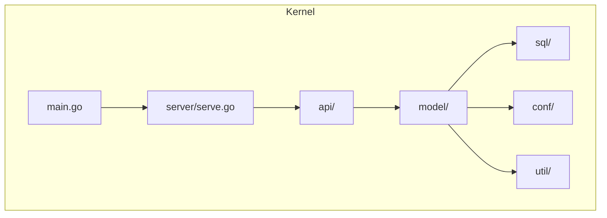
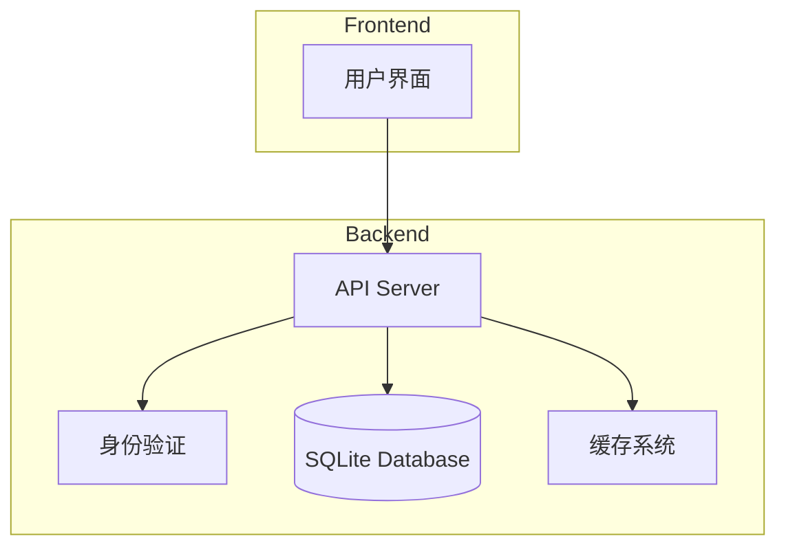
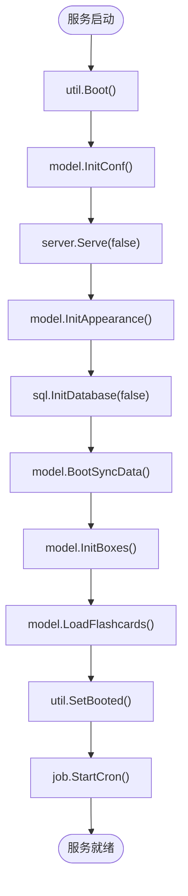
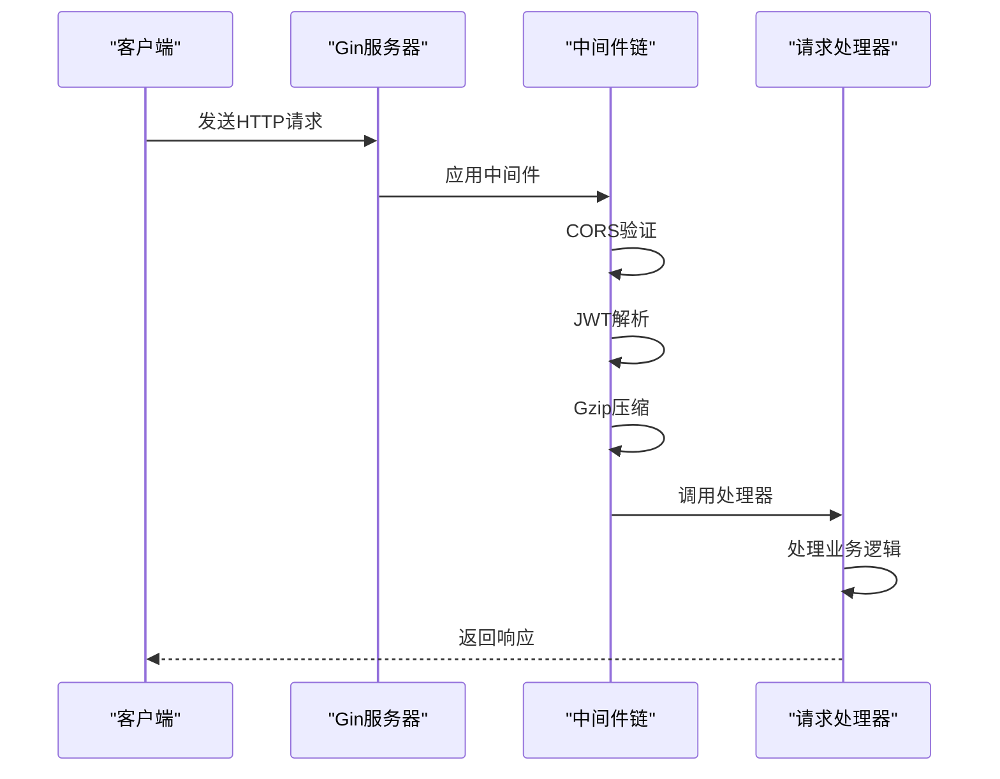
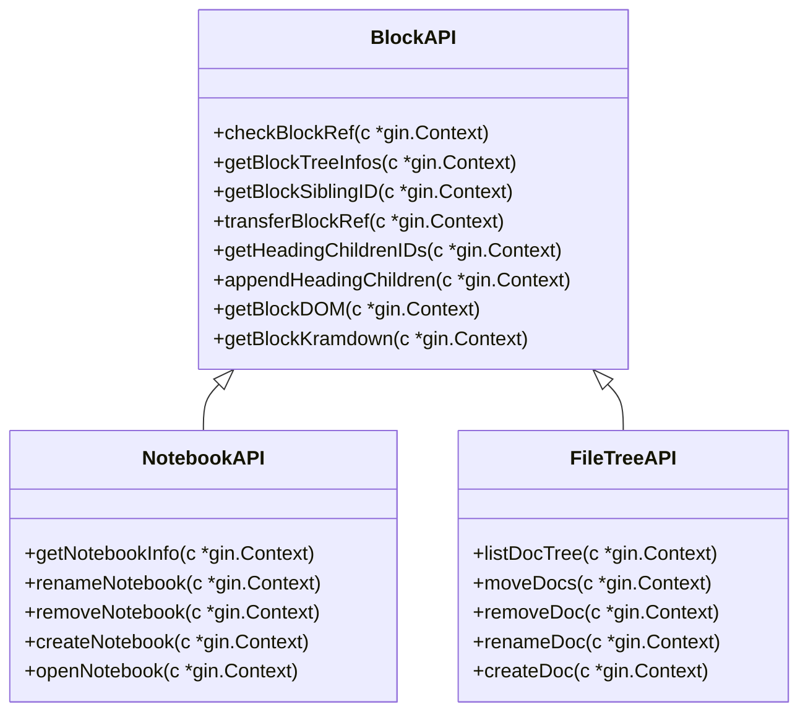
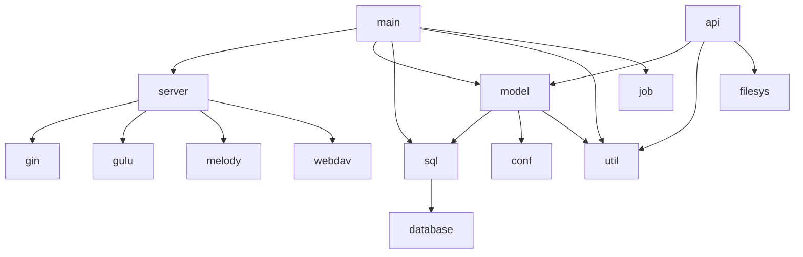

# 后端架构

<cite>
**本文档引用文件**
- [main.go](file://kernel/main.go)
- [serve.go](file://kernel/server/serve.go)
- [block.go](file://kernel/api/block.go)
- [notebook.go](file://kernel/api/notebook.go)
- [filetree.go](file://kernel/api/filetree.go)
</cite>

## 目录
1. [简介](#简介)
2. [项目结构](#项目结构)
3. [核心组件](#核心组件)
4. [架构概览](#架构概览)
5. [详细组件分析](#详细组件分析)
6. [依赖分析](#依赖分析)
7. [性能考虑](#性能考虑)
8. [故障排除指南](#故障排除指南)
9. [结论](#结论)

## 简介
思源笔记是一款基于块的本地优先双向链接笔记应用，其后端采用Go语言实现微内核服务架构。本架构文档深入解析了该系统的后端设计，涵盖服务启动流程、HTTP服务器实现、API接口设计、数据持久化机制以及前后端通信协议等关键方面。

## 项目结构
思源笔记的后端代码主要位于`kernel`目录下，采用模块化设计，各组件职责分明。核心结构包括：
- `api/`: 提供RESTful API接口，处理前端请求
- `model/`: 数据模型和业务逻辑层
- `server/`: HTTP服务器实现
- `sql/`: SQLite数据库操作
- `conf/`: 配置管理
- `util/`: 工具函数库

**图表来源**
- [main.go](file://kernel/main.go#L1-L60)
- [serve.go](file://kernel/server/serve.go#L1-L799)

**章节来源**
- [main.go](file://kernel/main.go#L1-L60)
- [serve.go](file://kernel/server/serve.go#L1-L799)

## 核心组件
思源笔记后端的核心组件包括微内核服务、HTTP服务器、API路由系统、SQLite数据库持久化层以及并发处理机制。这些组件协同工作，为前端提供稳定高效的服务支持。

**章节来源**
- [main.go](file://kernel/main.go#L1-L60)
- [serve.go](file://kernel/server/serve.go#L1-L799)

## 架构概览
思源笔记采用微内核架构设计，将核心功能与扩展功能分离。主程序通过`main.go`启动，初始化配置并启动HTTP服务器。服务器使用Gin框架处理HTTP请求，通过中间件进行身份验证和请求处理。数据通过SQLite数据库持久化存储，并利用goroutine实现高并发处理能力。

**图表来源**
- [main.go](file://kernel/main.go#L1-L60)
- [serve.go](file://kernel/server/serve.go#L1-L799)

## 详细组件分析

### 服务启动流程分析
思源笔记的服务启动流程在`main.go`中定义，遵循严格的初始化顺序。首先调用`util.Boot()`进行基础环境准备，然后初始化配置`model.InitConf()`，接着启动HTTP服务器`server.Serve(false)`，之后初始化外观设置和数据库连接。最后启动定时任务和各种后台监控服务。

**图表来源**
- [main.go](file://kernel/main.go#L1-L60)

**章节来源**
- [main.go](file://kernel/main.go#L1-L60)

### HTTP服务器实现分析
HTTP服务器实现在`server/serve.go`文件中，基于Gin框架构建。服务器配置了多种中间件，包括跨域资源共享(CORS)、JWT身份验证、Gzip压缩等。服务器注册了多个路由组，分别处理静态资源、WebSocket连接、WebDAV服务以及API接口。

#### 请求处理流程

**图表来源**
- [serve.go](file://kernel/server/serve.go#L1-L799)

**章节来源**
- [serve.go](file://kernel/server/serve.go#L1-L799)

### API接口设计分析
API接口分布在`kernel/api`目录下的多个文件中，每个文件对应一个功能模块。接口设计遵循RESTful规范，使用JSON格式进行数据交换。所有API接口都需要通过身份验证才能访问。

#### 块(Block)模块API
块是思源笔记的核心数据单元，`block.go`文件提供了对块的各种操作接口：

**图表来源**
- [block.go](file://kernel/api/block.go#L1-L799)
- [notebook.go](file://kernel/api/notebook.go#L1-L427)
- [filetree.go](file://kernel/api/filetree.go#L1-L799)

**章节来源**
- [block.go](file://kernel/api/block.go#L1-L799)
- [notebook.go](file://kernel/api/notebook.go#L1-L427)
- [filetree.go](file://kernel/api/filetree.go#L1-L799)

## 依赖分析
思源笔记后端依赖于多个第三方库和内部模块，形成了复杂的依赖关系网络。

**图表来源**
- [main.go](file://kernel/main.go#L1-L60)
- [serve.go](file://kernel/server/serve.go#L1-L799)

**章节来源**
- [main.go](file://kernel/main.go#L1-L60)
- [serve.go](file://kernel/server/serve.go#L1-L799)

## 性能考虑
思源笔记在性能方面做了多项优化：
1. 使用Gzip压缩减少网络传输数据量
2. 利用goroutine实现高并发处理
3. 采用SQLite数据库进行高效的数据持久化
4. 实现了资产文件缓存机制
5. 使用内存中的会话存储提高访问速度

系统通过`job.StartCron()`启动定时任务，定期执行清理和优化操作。同时，通过`cache.LoadAssets()`预加载常用资源，减少运行时延迟。

## 故障排除指南
当遇到后端服务问题时，可以按照以下步骤进行排查：

1. **检查端口占用**：确保指定端口未被其他进程占用
2. **查看日志文件**：检查`logging`模块输出的错误信息
3. **验证配置文件**：确认`conf`目录下的配置文件格式正确
4. **检查数据库状态**：验证SQLite数据库文件是否可访问
5. **测试网络连接**：确认前端能够正常连接到后端服务

常见错误码及其含义：
- 401: 未授权访问，需要提供有效的JWT令牌
- 403: 禁止访问，当前用户权限不足
- 404: 请求的资源不存在
- 500: 服务器内部错误，需查看详细日志

**章节来源**
- [main.go](file://kernel/main.go#L1-L60)
- [serve.go](file://kernel/server/serve.go#L1-L799)

## 结论
思源笔记的后端架构设计体现了现代桌面应用的最佳实践。微内核架构提供了良好的扩展性和维护性，Go语言的高性能特性保证了系统的响应速度。通过合理的模块划分和清晰的接口设计，系统实现了复杂功能的同时保持了代码的可读性。未来可以通过引入更高级的缓存策略和数据库优化技术进一步提升系统性能。