# 构建与部署

<cite>
**本文档引用的文件**
- [webpack.config.js](file://app/webpack.config.js)
- [webpack.desktop.js](file://app/webpack.desktop.js)
- [webpack.mobile.js](file://app/webpack.mobile.js)
- [webpack.export.js](file://app/webpack.export.js)
- [electron-builder.yml](file://app/electron-builder.yml)
- [electron-builder-darwin.yml](file://app/electron-builder-darwin.yml)
- [electron-builder-linux.yml](file://app/electron-builder-linux.yml)
- [Dockerfile](file://Dockerfile)
- [darwin-build.sh](file://scripts/darwin-build.sh)
- [linux-build.sh](file://scripts/linux-build.sh)
- [win-build.bat](file://scripts/win-build.bat)
</cite>

## 目录
1. [简介](#简介)
2. [前端构建配置](#前端构建配置)
3. [桌面应用打包配置](#桌面应用打包配置)
4. [容器镜像构建](#容器镜像构建)
5. [自动化构建脚本分析](#自动化构建脚本分析)
6. [CI/CD流程](#cicd流程)
7. [部署方式与运维建议](#部署方式与运维建议)

## 简介
思源笔记（SiYuan）采用现代化的构建与部署体系，支持多平台发布和容器化部署。系统通过Webpack进行前端资源打包，使用Electron构建跨平台桌面应用，并通过Docker实现容器化部署。CI/CD流程自动化了从代码提交到多平台发布包生成的全过程。

## 前端构建配置

思源笔记使用Webpack作为前端资源打包工具，针对不同运行环境提供了多个配置文件。

### Webpack入口与输出配置
Webpack配置定义了多个入口点，包括主应用入口和窗口管理入口。输出路径根据目标平台分为不同的构建目录。

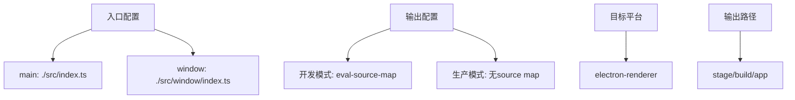

**Diagram sources**
- [webpack.config.js](file://app/webpack.config.js#L10-L30)

**Section sources**
- [webpack.config.js](file://app/webpack.config.js#L1-L130)

### 模块加载与优化策略
系统配置了多种模块加载规则，支持TypeScript、SCSS、模板文件和静态资源的处理。生产环境下使用esbuild进行代码压缩优化。

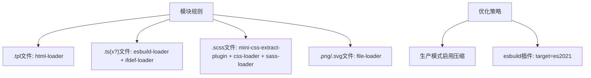

**Diagram sources**
- [webpack.config.js](file://app/webpack.config.js#L60-L100)

**Section sources**
- [webpack.config.js](file://app/webpack.config.js#L1-L130)

### 多环境构建配置
针对不同使用场景，项目提供了多个Webpack配置文件：
- `webpack.desktop.js`：桌面应用构建配置
- `webpack.mobile.js`：移动端构建配置
- `webpack.export.js`：导出功能构建配置

各配置通过ifdef-loader在编译时注入环境变量，实现条件编译。

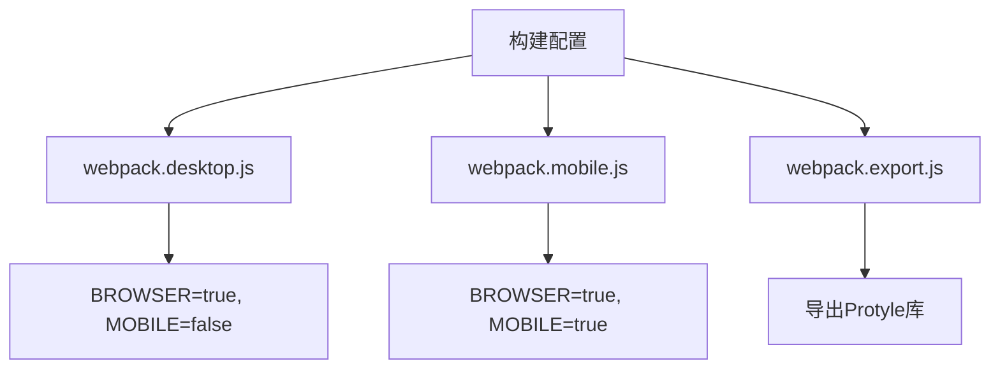

**Diagram sources**
- [webpack.desktop.js](file://app/webpack.desktop.js#L1-L128)
- [webpack.mobile.js](file://app/webpack.mobile.js#L1-L129)
- [webpack.export.js](file://app/webpack.export.js#L1-L102)

**Section sources**
- [webpack.desktop.js](file://app/webpack.desktop.js#L1-L128)
- [webpack.mobile.js](file://app/webpack.mobile.js#L1-L129)
- [webpack.export.js](file://app/webpack.export.js#L1-L102)

## 桌面应用打包配置

思源笔记使用electron-builder进行桌面应用打包，针对不同操作系统提供了专门的配置文件。

### 通用打包配置
`electron-builder.yml`文件定义了通用的打包参数，包括应用名称、应用ID、版权信息等。

```yaml
productName: "SiYuan"
appId: "org.b3log.siyuan"
asar: false
compression: "store"
copyright: "© 2024 Yunnan Liandi Technology Co., Ltd."
```

**Section sources**
- [electron-builder.yml](file://app/electron-builder.yml#L1-L5)

### Windows平台配置
Windows平台的打包配置包含图标、额外资源、权限设置和安装程序选项。

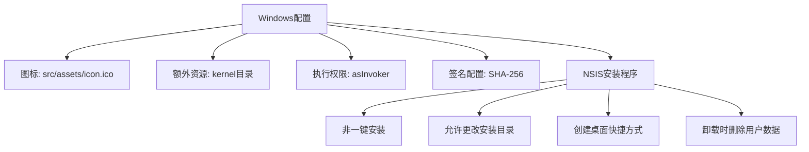

**Diagram sources**
- [electron-builder.yml](file://app/electron-builder.yml#L10-L40)

**Section sources**
- [electron-builder.yml](file://app/electron-builder.yml#L1-L74)

### macOS平台配置
macOS平台有独立的配置文件，分别针对Intel和Apple Silicon架构。

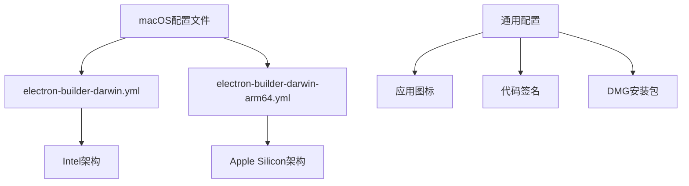

**Diagram sources**
- [electron-builder-darwin.yml](file://app/electron-builder-darwin.yml)
- [electron-builder-darwin-arm64.yml](file://app/electron-builder-darwin-arm64.yml)

**Section sources**
- [electron-builder-darwin.yml](file://app/electron-builder-darwin.yml)
- [electron-builder-darwin-arm64.yml](file://app/electron-builder-darwin-arm64.yml)

### Linux平台配置
Linux平台同样提供针对不同架构的配置文件。

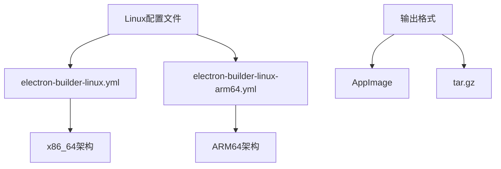

**Diagram sources**
- [electron-builder-linux.yml](file://app/electron-builder-linux.yml)
- [electron-builder-linux-arm64.yml](file://app/electron-builder-linux-arm64.yml)

**Section sources**
- [electron-builder-linux.yml](file://app/electron-builder-linux.yml)
- [electron-builder-linux-arm64.yml](file://app/electron-builder-linux-arm64.yml)

## 容器镜像构建

思源笔记通过Dockerfile定义了容器镜像的构建过程，采用多阶段构建优化镜像大小。

### Dockerfile结构分析
Docker构建过程分为三个阶段：Node构建阶段、Go构建阶段和最终镜像阶段。

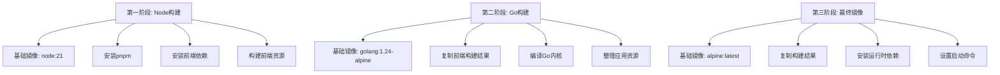

**Diagram sources**
- [Dockerfile](file://Dockerfile#L1-L53)

**Section sources**
- [Dockerfile](file://Dockerfile#L1-L53)

### 构建参数与环境变量
Docker构建过程中设置了多个环境变量和构建参数。

```yaml
ENV TZ=Asia/Shanghai
ENV HOME=/home/siyuan
ENV RUN_IN_CONTAINER=true
EXPOSE 6806
ENTRYPOINT ["/opt/siyuan/entrypoint.sh"]
CMD ["/opt/siyuan/kernel"]
```

**Section sources**
- [Dockerfile](file://Dockerfile#L45-L53)

## 自动化构建脚本分析

项目提供了针对不同操作系统的构建脚本，实现了自动化编译任务。

### Linux构建脚本
`linux-build.sh`脚本负责Linux平台的完整构建流程。

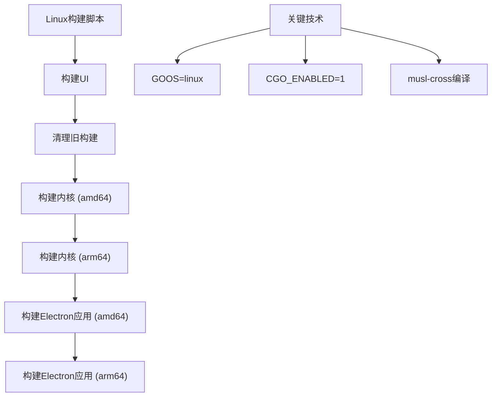

**Diagram sources**
- [linux-build.sh](file://scripts/linux-build.sh#L1-L39)

**Section sources**
- [linux-build.sh](file://scripts/linux-build.sh#L1-L39)

### macOS构建脚本
`darwin-build.sh`脚本负责macOS平台的构建。

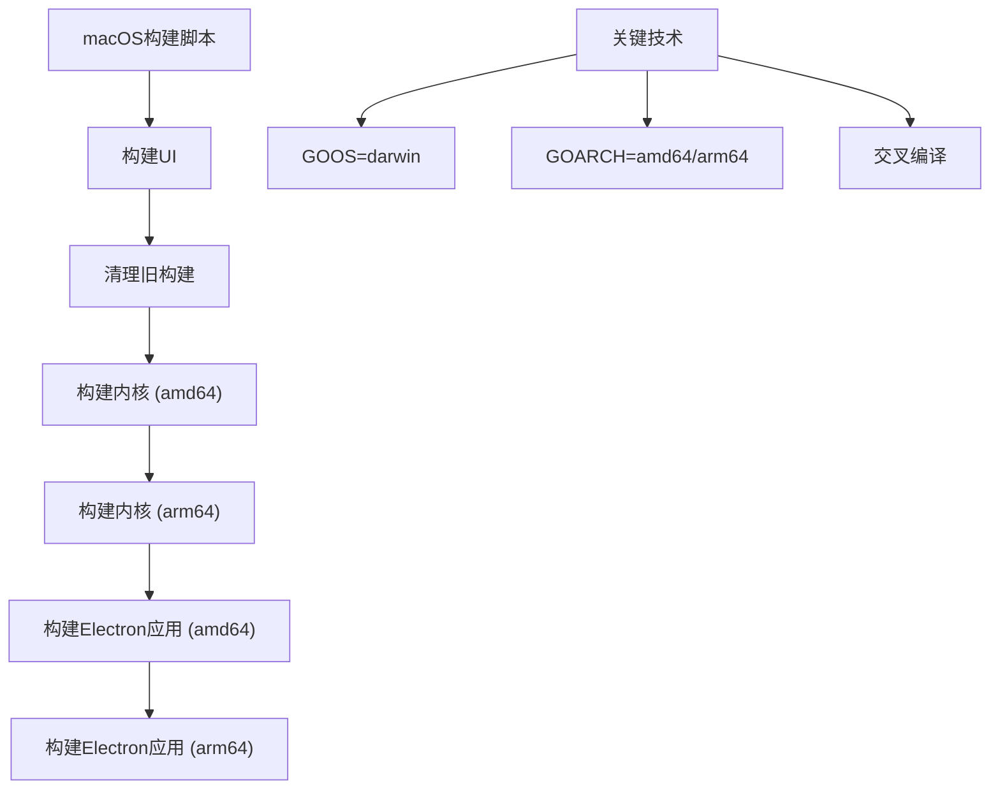

**Diagram sources**
- [darwin-build.sh](file://scripts/darwin-build.sh#L1-L38)

**Section sources**
- [darwin-build.sh](file://scripts/darwin-build.sh#L1-L38)

### Windows构建脚本
`win-build.bat`批处理文件负责Windows平台的构建。

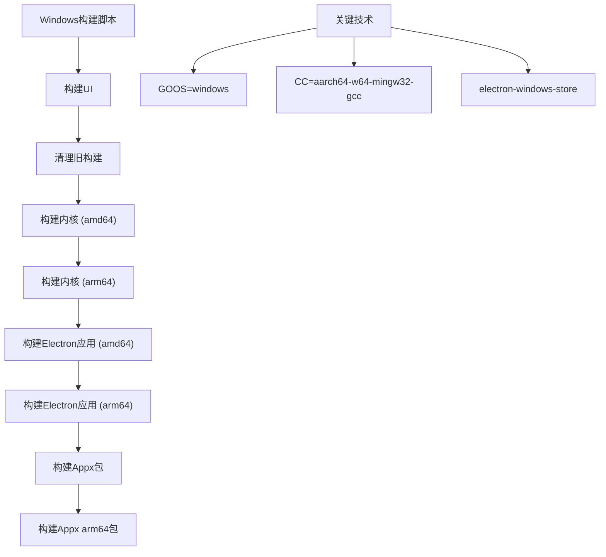

**Diagram sources**
- [win-build.bat](file://scripts/win-build.bat#L1-L81)

**Section sources**
- [win-build.bat](file://scripts/win-build.bat#L1-L81)

## CI/CD流程

思源笔记通过GitHub Actions实现了完整的CI/CD流程。

### 持续集成工作流
`.github/workflows/cd.yml`定义了持续集成流程。

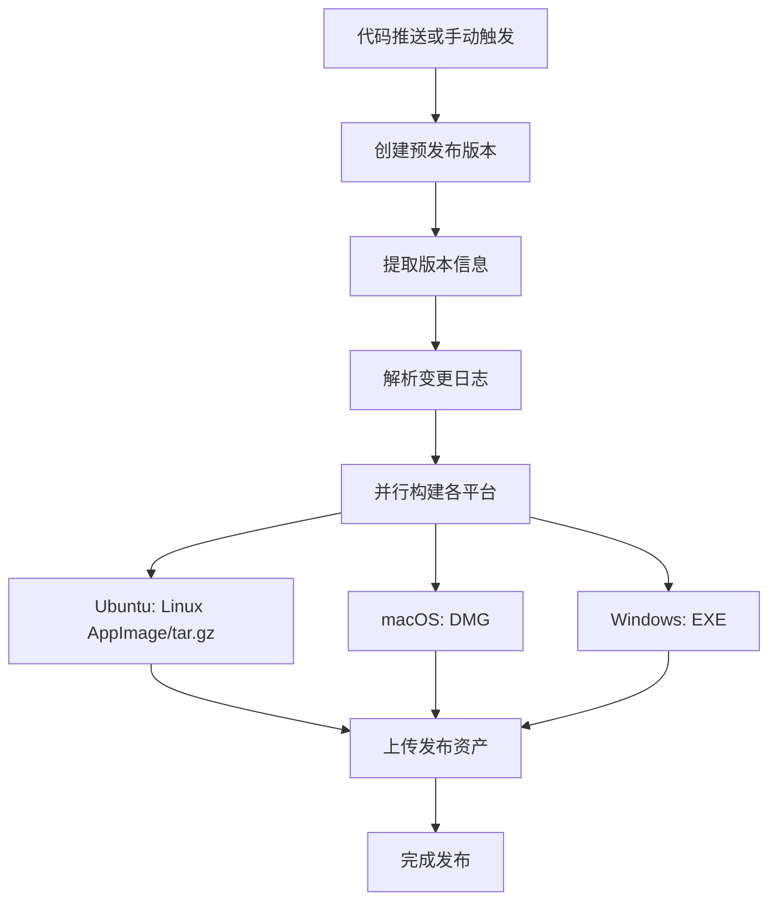

**Diagram sources**
- [.github/workflows/cd.yml](file://.github/workflows/cd.yml#L1-L241)

**Section sources**
- [.github/workflows/cd.yml](file://.github/workflows/cd.yml#L1-L241)

### 容器镜像发布流程
`.github/workflows/dockerimage.yml`定义了Docker镜像的发布流程。

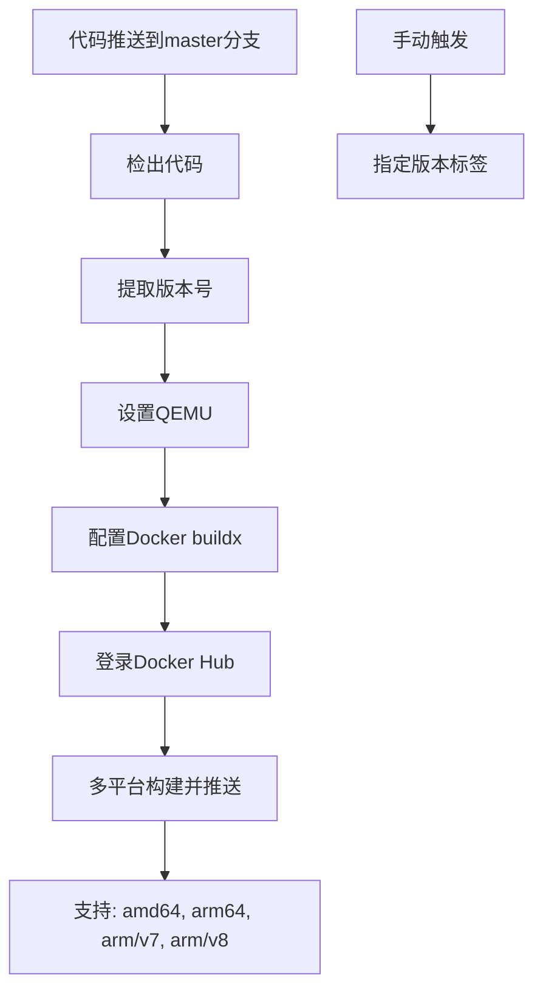

**Diagram sources**
- [.github/workflows/dockerimage.yml](file://.github/workflows/dockerimage.yml#L1-L80)

**Section sources**
- [.github/workflows/dockerimage.yml](file://.github/workflows/dockerimage.yml#L1-L80)

## 部署方式与运维建议

思源笔记支持多种部署方式，各有其适用场景和运维特点。

### 桌面应用部署
桌面应用通过Electron打包为原生应用，提供最佳用户体验。

**优势:**
- 完整的本地功能访问
- 离线使用能力
- 系统级集成

**注意事项:**
- 需要为各平台分别构建
- 更新需要用户手动下载
- 安全签名配置复杂

### 容器化部署
通过Docker容器化部署，适合服务器环境。

**优势:**
- 环境一致性
- 易于扩展和管理
- 支持多架构

**注意事项:**
- 需要维护Docker环境
- 数据持久化配置
- 网络端口映射

### 运维最佳实践
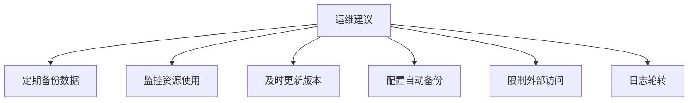

**Section sources**
- [Dockerfile](file://Dockerfile#L1-L53)
- [scripts/*.sh](file://scripts/)
- [app/electron-builder*.yml](file://app/electron-builder*.yml)