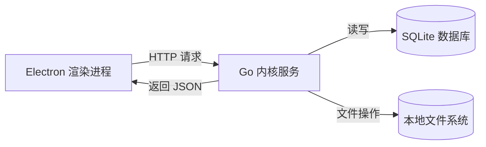
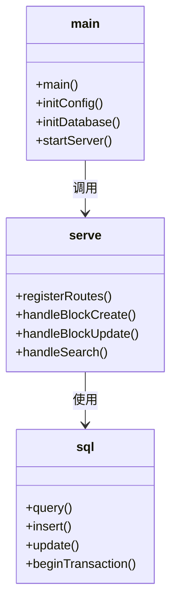
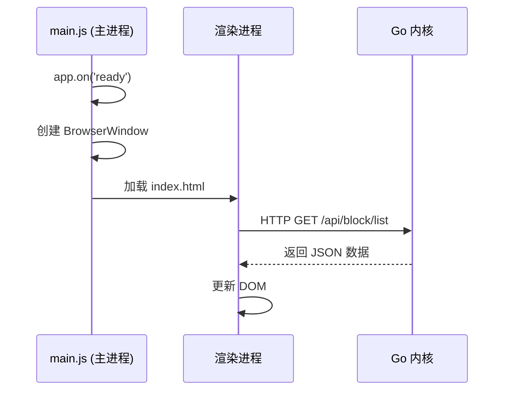
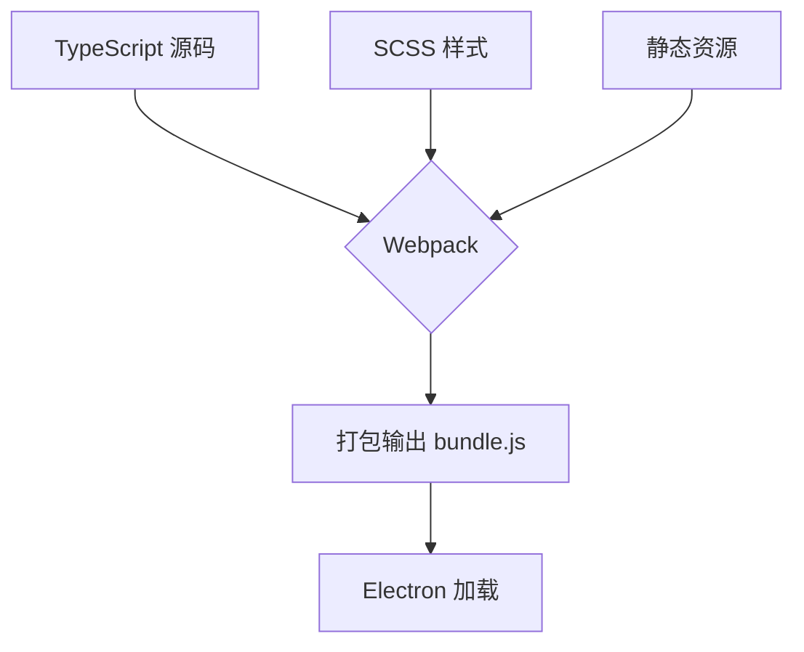
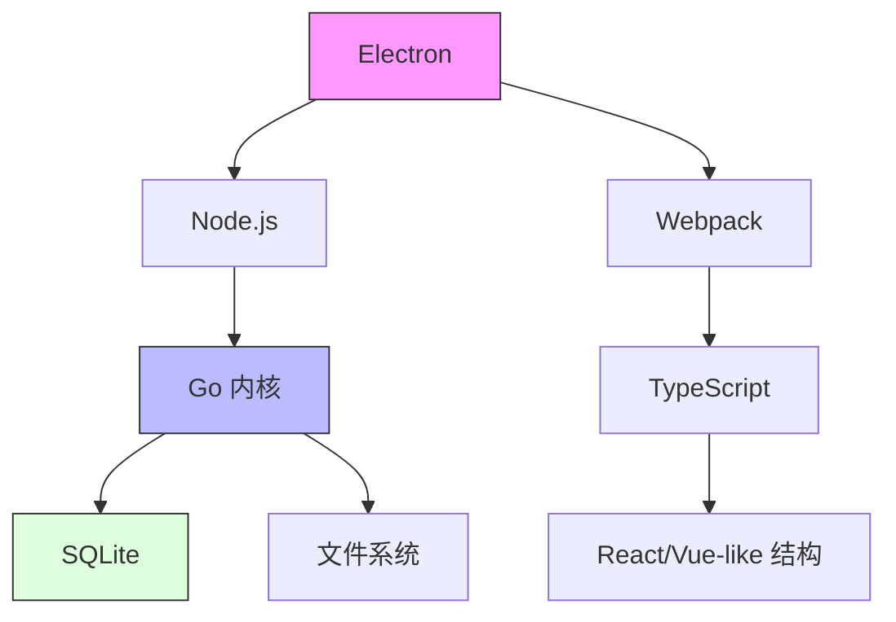

# 架构设计

<cite>
**本文档中引用的文件**
- [main.go](file://kernel/main.go)
- [serve.go](file://kernel/server/serve.go)
- [main.js](file://app/electron/main.js)
- [webpack.config.js](file://app/webpack.config.js)
- [Dockerfile](file://Dockerfile)
- [electron-builder.yml](file://app/electron-builder.yml)
</cite>

## 目录
1. [引言](#引言)
2. [项目结构](#项目结构)
3. [核心组件](#核心组件)
4. [架构概述](#架构概述)
5. [详细组件分析](#详细组件分析)
6. [依赖分析](#依赖分析)
7. [性能考虑](#性能考虑)
8. [故障排除指南](#故障排除指南)
9. [结论](#结论)

## 引言
思源笔记是一款基于微内核架构的本地优先知识管理工具，采用前后端分离的设计模式。其核心服务由 Go 语言编写，作为轻量级 HTTP 服务器运行，负责数据存储、业务逻辑处理和 API 提供；前端则基于 Electron 框架构建桌面应用界面，通过 HTTP API 与后端通信。该架构实现了高内聚、低耦合，提升了系统的可维护性与扩展性。

## 项目结构
思源笔记的项目结构清晰地划分为前端（`app`）与后端（`kernel`）两大模块：

- `app/`：包含 Electron 主进程代码、前端资源、Webpack 构建配置及打包脚本。
- `kernel/`：Go 编写的内核服务，包括 HTTP 服务、路由注册、数据库操作、文件系统管理等核心功能。
- 根目录下还包含容器化部署文件（Dockerfile）和桌面应用打包配置（electron-builder.yml）。

这种分层结构支持独立开发与测试，便于团队协作。

```mermaid
graph TB
subgraph "前端 (Electron)"
A[main.js] --> B[渲染进程]
B --> C[HTML/CSS/JS]
C --> D[Webpack 打包]
end
subgraph "后端 (Go Kernel)"
E[main.go] --> F[HTTP Server]
F --> G[API 路由]
G --> H[SQLite 数据库]
end
A < --> |IPC + HTTP| E
```

**图示来源**
- [main.js](file://app/electron/main.js)
- [main.go](file://kernel/main.go)

**本节来源**
- [app/electron/main.js](file://app/electron/main.js)
- [kernel/main.go](file://kernel/main.go)

## 核心组件
思源笔记的核心组件包括：
- **Go 内核服务**：以 `main.go` 为入口，启动 HTTP 服务并监听本地端口。
- **Electron 主进程**：由 `main.js` 控制，负责窗口创建、生命周期管理和原生能力调用。
- **前端渲染层**：基于 TypeScript 和 Webpack 构建，实现响应式 UI 展示。
- **SQLite 存储引擎**：用于持久化笔记内容、元数据和用户配置。

这些组件通过明确定义的接口进行交互，确保系统稳定性与可扩展性。

**本节来源**
- [main.go](file://kernel/main.go)
- [main.js](file://app/electron/main.js)

## 架构概述
思源笔记采用微内核架构（Micro-kernel Architecture），其中 Go 编写的 `kernel` 作为核心服务运行，提供 RESTful API 接口。Electron 前端作为“外壳”加载网页界面，并通过 HTTP 客户端调用内核 API 获取数据或执行命令。

整个系统运行在本地回环地址（localhost），保障了数据安全性。前端仅负责展示逻辑，所有敏感操作均交由后端完成。



**图示来源**
- [serve.go](file://kernel/server/serve.go)
- [main.js](file://app/electron/main.js)

**本节来源**
- [kernel/server/serve.go](file://kernel/server/serve.go)

## 详细组件分析

### Go 内核服务分析
Go 内核是思源笔记的核心计算单元，负责处理所有业务逻辑。

#### 启动流程
`main.go` 是内核服务的入口点，其启动过程包括：
1. 初始化配置与日志系统；
2. 加载用户数据目录；
3. 启动 SQLite 数据库连接；
4. 注册 HTTP 路由（通过 `serve.go`）；
5. 启动 HTTP 服务器并监听指定端口。

该服务采用多线程模型处理并发请求，利用 Go 的 goroutine 实现高效异步 I/O。

#### 路由注册机制
`serve.go` 文件定义了所有 API 端点，使用标准 net/http 包注册路由。每个 API 对应一个处理函数，遵循 REST 风格设计，返回 JSON 格式响应。



**图示来源**
- [main.go](file://kernel/main.go)
- [serve.go](file://kernel/server/serve.go)

**本节来源**
- [kernel/main.go](file://kernel/main.go#L1-L100)
- [kernel/server/serve.go](file://kernel/server/serve.go#L10-L80)

### Electron 前端分析
Electron 应用由主进程和渲染进程组成，分工明确。

#### 主进程（main.js）
`main.js` 是 Electron 的主进程入口，职责包括：
- 创建浏览器窗口；
- 管理应用生命周期（启动、关闭、最小化）；
- 处理系统事件（如文件打开、协议处理）；
- 与内核服务建立通信通道。

主进程不直接参与 UI 渲染，而是通过 `BrowserWindow` 加载前端页面。

#### 渲染进程
渲染进程运行在 Chromium 中，负责 UI 展示与用户交互。它通过 `fetch` 或 `axios` 发起 HTTP 请求与 Go 内核通信，获取数据并动态更新视图。

前端使用 TypeScript 开发，结合 Webpack 进行模块打包与代码分割，提升加载性能。



**图示来源**
- [main.js](file://app/electron/main.js)
- [main.go](file://kernel/main.go)

**本节来源**
- [app/electron/main.js](file://app/electron/main.js#L1-L120)

### 前端构建流程分析
前端使用 Webpack 实现模块化构建，支持代码分割、懒加载和热更新。

`webpack.config.js` 配置了以下关键功能：
- 入口：`src/index.ts`
- 输出：压缩后的 JS/CSS 文件
- Loader：处理 TypeScript、SCSS、图片等资源
- Plugin：生成 HTML、清理输出目录
- Mode：区分 development 与 production 构建

构建产物被嵌入 Electron 应用中，确保离线可用性。



**图示来源**
- [webpack.config.js](file://app/webpack.config.js)

**本节来源**
- [app/webpack.config.js](file://app/webpack.config.js#L1-L200)

## 依赖分析
思源笔记的依赖关系清晰，前后端解耦良好。



**图示来源**
- [package.json](file://app/package.json)
- [go.mod](file://kernel/go.mod)

**本节来源**
- [app/package.json](file://app/package.json)
- [kernel/go.mod](file://kernel/go.mod)

## 性能考虑
- **本地服务优势**：Go 内核运行于本地，延迟极低，响应迅速。
- **多线程处理**：Go 的 goroutine 支持高并发请求处理，避免阻塞主线程。
- **前端优化**：Webpack 的 Tree Shaking 与 Code Splitting 减少初始加载体积。
- **缓存机制**：前端对常用数据进行内存缓存，减少重复请求。

尽管 HTTP 通信引入一定开销，但本地网络环境下的性能损耗可忽略不计。

## 故障排除指南
常见问题及解决方案：
- **内核未启动**：检查 `main.go` 是否正常运行，确认端口未被占用。
- **前端无法连接**：验证 Electron 是否正确传递启动参数给内核。
- **构建失败**：检查 `webpack.config.js` 配置是否正确，依赖是否完整安装。
- **数据丢失**：确保 SQLite 数据库路径正确且有写权限。

建议启用日志记录以便追踪错误源头。

**本节来源**
- [main.go](file://kernel/main.go)
- [main.js](file://app/electron/main.js)
- [webpack.config.js](file://app/webpack.config.js)

## 结论
思源笔记的微内核架构设计合理，具备良好的可维护性、可扩展性和安全性。Go 内核提供稳定高效的后端服务，Electron 前端实现跨平台 UI 展示，两者通过 HTTP API 解耦通信。Webpack 构建流程保障了前端工程化质量，而 Dockerfile 与 electron-builder.yml 则支持自动化部署与发布。

未来可通过增加 WebSocket 支持实现实时同步，进一步提升用户体验。