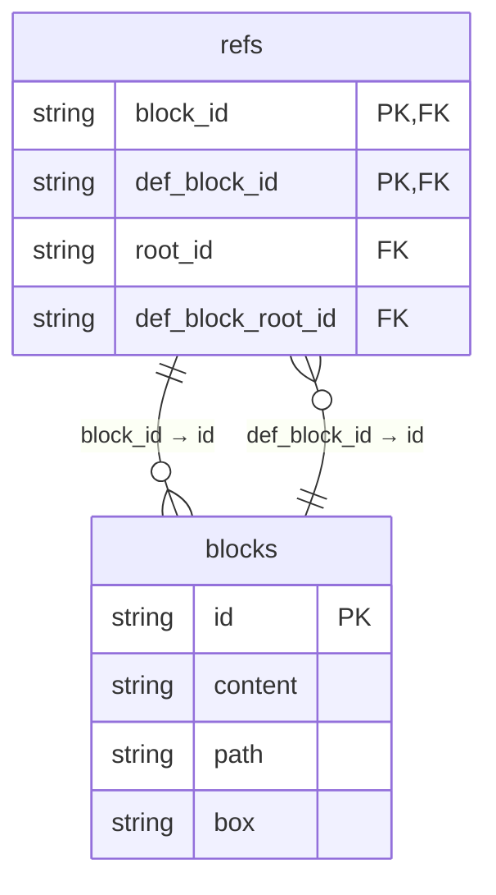
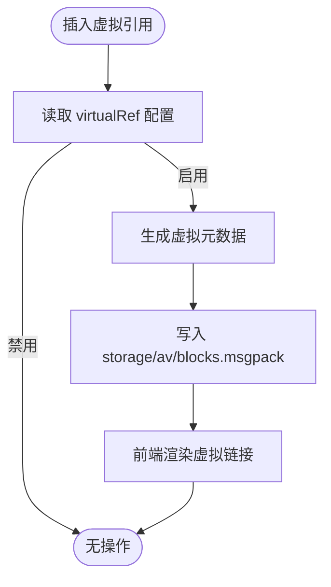

# 块级引用与双向链接

<cite>
**本文档中引用的文件**
- [block_ref_query.go](file://kernel/sql/block_ref_query.go)
- [block.go](file://kernel/model/block.go)
- [util.ts](file://app/src/layout/dock/util.ts)
- [config.d.ts](file://app/src/types/config.d.ts)
- [block.ts](file://app/src/menus/block.ts)
</cite>

## 目录
1. [引言](#引言)
2. [块级引用的工作机制](#块级引用的工作机制)
3. [后端引用关系存储结构](#后端引用关系存储结构)
4. [双向链接面板的实现原理](#双向链接面板的实现原理)
5. [虚拟引用机制解析](#虚拟引用机制解析)
6. [知识图谱构建与应用场景](#知识图谱构建与应用场景)
7. [潜在问题与优化建议](#潜在问题与优化建议)
8. [结论](#结论)

## 引言
思源笔记通过块级引用（Block Ref）和双向链接（Backlink）系统，实现了强大的知识关联能力。用户可以在不同文档之间建立精确到段落级别的引用关系，系统自动维护反向链接，并支持上下文预览与跳转。该机制不仅提升了信息复用效率，还为构建个人知识网络提供了基础支撑。

## 块级引用的工作机制
当用户在编辑器中插入一个块引用时，前端首先生成带有特定 `data-type="ref"` 属性的 DOM 元素。此过程由 Protyle 编辑器组件处理，确保引用标记符合语义化规范。随后，系统调用 `/api/block/transferBlockRef` 接口完成引用关系的持久化操作。

在菜单交互层面，如重命名或转移引用目标时，会触发相应的事件监听器，通过 `fetchPost` 方法向后端发送请求，更新引用指向的目标块 ID。这一流程保证了引用关系的动态可维护性。

**Section sources**
- [block.ts](file://app/src/menus/block.ts#L29-L43)
- [util.ts](file://app/src/layout/dock/util.ts#L18-L23)

## 后端引用关系存储结构
思源笔记使用 SQLite 数据库存储所有块引用关系，核心表为 `refs`，其字段包括：
- `block_id`: 引用来源块 ID
- `def_block_id`: 被引用的目标块 ID
- `root_id`: 来源文档根块 ID
- `def_block_root_id`: 目标文档根块 ID

每当创建新的块引用时，系统执行 `INSERT INTO refs` 操作，记录完整的引用路径信息。同时，为提升查询性能，数据库对关键字段建立了复合索引。

引用计数功能通过 SQL 聚合函数实现。例如，`QueryRefCount()` 函数用于统计指定块被引用的次数；`QueryRootChildrenRefCount()` 则计算某文档内各子块的引用频率，支持精细化的内容热度分析。

**Diagram sources**
- [block_ref_query.go](file://kernel/sql/block_ref_query.go#L98-L141)
- [block.go](file://kernel/model/block.go#L110-L169)

## 双向链接面板的实现原理
双向链接面板通过定期调用 `QueryRefsByDefID()` API 获取当前块的所有引用来源。该函数根据参数决定是否包含子块引用，从而实现细粒度的上下文展示。

面板数据渲染采用懒加载策略，仅在用户展开某个引用项时才加载其上下文内容。点击链接可直接跳转至对应位置，并高亮显示相关文本。此外，系统支持按文档、按块两种视图模式切换，便于用户从宏观和微观两个维度审视知识连接。

为了防止循环引用导致的无限递归，系统在遍历时限制最大深度，并通过缓存机制避免重复查询。

**Section sources**
- [block_ref_query.go](file://kernel/sql/block_ref_query.go#L412-L457)
- [util.ts](file://app/src/layout/dock/util.ts#L18-L23)

## 虚拟引用机制解析
虚拟引用（Virtual Ref）是一种轻量级的跨笔记本关联机制，它不实际复制内容，而是通过元数据标记实现逻辑关联。用户可通过配置启用以下虚拟引用类型：
- **virtualRefAlias**: 是否显示别名
- **virtualRefAnchor**: 是否锚定到具体位置
- **virtualRefDoc**: 是否以文档为单位关联
- **virtualRefName**: 是否显示名称标签

这些选项定义于前端配置模型中，允许用户自定义虚拟引用的表现形式。后端通过 `UpsertBlockRel()` 函数将虚拟关系写入独立的 `blocks.msgpack` 文件，避免污染主引用表，从而保障性能与数据隔离。

**Diagram sources**
- [config.d.ts](file://app/src/types/config.d.ts#L1271-L1283)
- [mirror.go](file://kernel/av/mirror.go#L167-L208)

## 知识图谱构建与应用场景
利用块级引用和双向链接，用户可以逐步构建个性化的知识图谱。典型应用包括：
- **文献综述**：将研究主题拆分为多个块，跨文档引用关键论点
- **项目管理**：任务块引用需求文档、会议记录等原始资料
- **学习笔记**：概念块链接至实例、练习题和扩展阅读

系统提供的“引用关系图”功能可视化展示了节点间的连接密度，帮助识别核心知识点。结合搜索功能，可快速定位某一思想的所有衍生讨论，极大提升信息发现效率。

## 潜在问题与优化建议
尽管当前设计已较为成熟，但仍存在一些挑战：
- **循环引用检测不足**：现有逻辑未完全覆盖容器块及其子块的引用计数（见 issue #13396）
- **大规模数据性能瓶颈**：随着引用数量增长，`refs` 表的 JOIN 查询可能变慢
- **虚拟引用缺乏版本控制**：`blocks.msgpack` 文件变更难以追溯

优化方向建议：
1. 在 `CheckBlockRef` 中补充对容器块子块的递归检查
2. 对高频查询字段增加覆盖索引，或引入内存缓存层
3. 将虚拟引用数据迁移至 SQLite，利用事务机制保障一致性

**Section sources**
- [block.go](file://kernel/model/block.go#L110-L169)
- [block_ref_query.go](file://kernel/sql/block_ref_query.go#L140-L177)

## 结论
思源笔记的块级引用与双向链接系统，通过前后端协同设计，实现了高效、灵活的知识关联能力。其基于 SQLite 的引用存储方案兼顾了性能与可维护性，而虚拟引用机制则拓展了跨笔记本协作的可能性。未来可通过增强循环检测、优化查询性能等方式进一步提升用户体验，使其成为更强大的知识管理工具。