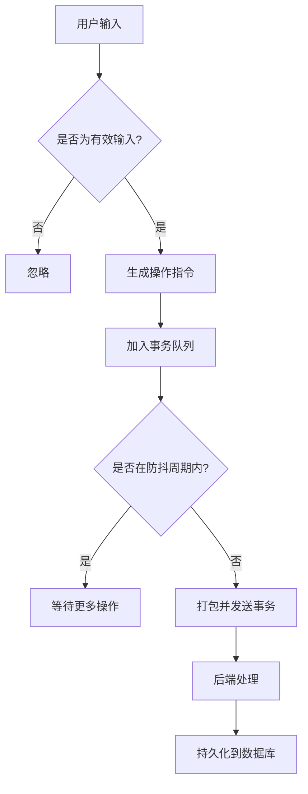
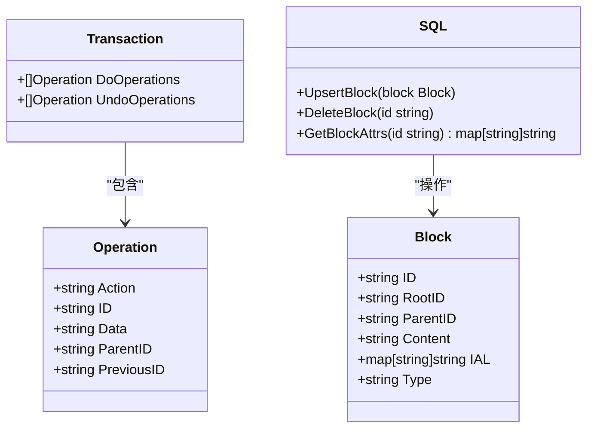
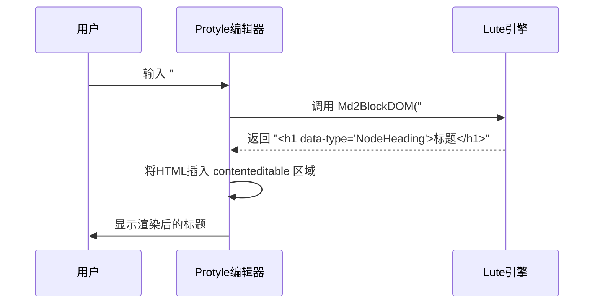

# 块编辑与管理

<cite>
**本文档引用的文件**
- [index.ts](file://app/src/protyle/index.ts)
- [method.ts](file://app/src/protyle/method.ts)
- [block.go](file://kernel/api/block.go)
- [block_op.go](file://kernel/api/block_op.go)
- [block.go](file://kernel/model/block.go)
- [blockial.go](file://kernel/model/blockial.go)
- [genID.ts](file://app/src/util/genID.ts)
- [wysiwyg/index.ts](file://app/src/protyle/wysiwyg/index.ts)
- [wysiwyg/transaction.ts](file://app/src/protyle/wysiwyg/transaction.ts)
- [protyle.d.ts](file://app/src/types/protyle.d.ts)
</cite>

## 目录
1. [引言](#引言)
2. [前端块操作机制](#前端块操作机制)
3. [后端API与数据库交互](#后端api与数据库交互)
4. [WYSIWYG编辑器与Lute引擎](#wysiwyg编辑器与lute引擎)
5. [块ID生成与属性存储](#块id生成与属性存储)
6. [版本控制与事务处理](#版本控制与事务处理)
7. [常见问题与性能优化](#常见问题与性能优化)

## 引言

思源笔记中的“块”（Block）是其核心内容单元，支持高度灵活的编辑和管理功能。每个块可以独立创建、编辑、删除和移动，并通过唯一的ID进行标识。系统采用前后端分离架构：前端使用TypeScript实现WYSIWYG（所见即所得）编辑器Protyle，负责用户界面交互；后端基于Go语言提供RESTful API接口，处理业务逻辑并与SQLite数据库交互。Markdown语法解析由专用的Lute引擎完成，确保格式准确性和一致性。本文将深入剖析这一机制的技术实现细节。

## 前端块操作机制

### 光标定位与内容输入

在前端UI中，块的编辑始于光标定位。当用户点击或通过键盘导航到某个块时，`focusBlock`函数被调用，它利用`getEditorRange`获取当前选区范围，并通过`setInsertWbrHTML`插入一个不可见的占位符（WBR），以精确控制光标位置。内容输入响应则依赖于`contenteditable`属性为`true`的`div.protyle-wysiwyg`元素。该元素绑定了一系列事件监听器，其中`input`事件处理器会捕获用户的每一次按键操作。对于特殊字符如`<`, `>`, `&`，系统会进行转义处理，防止破坏DOM结构。此外，`escapeInline`函数专门处理在行内元素（如链接、引用）末尾输入文本的情况，确保新输入的内容被视为普通文本而非行内标记的一部分。

**Section sources**
- [wysiwyg/index.ts](file://app/src/protyle/wysiwyg/index.ts#L100-L150)
- [wysiwyg/index.ts](file://app/src/protyle/wysiwyg/index.ts#L200-L250)

### 实时保存逻辑

实时保存并非对每次击键都立即写入磁盘，而是通过“事务”（Transaction）机制批量处理。当用户执行编辑操作时，相关指令（如插入、更新、删除）会被封装成一个`IOperation`对象，并推入一个待处理队列。`transaction`函数负责管理这个队列，它利用`setTimeout`进行防抖（debounce），将短时间内连续发生的多个操作合并为一次网络请求发送给后端。这不仅减少了I/O开销，也避免了因频繁保存导致的性能瓶颈。只有当操作间隔超过预设的超时时间（`Constants.TIMEOUT_INPUT`）时，累积的事务才会被提交。

**Diagram sources**
- [wysiwyg/transaction.ts](file://app/src/protyle/wysiwyg/transaction.ts#L1270-L1365)

## 后端API与数据库交互

### 增删改查请求处理

后端API位于`kernel/api`目录下，以Gin框架构建。针对块的操作有两类主要API：
1.  **查询类API**：如`getBlockDOM`、`getBlockKramdown`，它们接收块ID作为参数，从文件系统加载对应的`.sy`文件，解析为AST树，然后根据需要提取DOM片段或纯Markdown文本，最后通过`c.JSON`返回JSON响应。
2.  **修改类API**：如`appendBlock`、`updateBlock`、`deleteBlock`，这些API不直接返回数据，而是接收包含操作详情的JSON体。它们会创建一个`model.Transaction`对象，其中包含`DoOperations`（正向操作）和可选的`UndoOperations`（逆向操作）。所有修改类API最终都会调用`model.PerformTransactions`来执行这些事务。

**Section sources**
- [block.go](file://kernel/api/block.go#L500-L600)
- [block_op.go](file://kernel/api/block_op.go#L800-L900)

### 与SQLite数据库的交互

事务的执行最终会触发与SQLite数据库的交互。`model.PerformTransactions`函数会遍历事务列表，对每个操作进行处理。例如，`insert`操作会调用`sql.UpsertBlock`将新的块记录插入`blocks`表；`update`操作会更新现有记录；`delete`操作则将其标记为已删除或直接移除。除了主内容表，系统还维护着`attributes`表用于存储块的IAL（内联属性列表）元数据，以及`refs`表用于管理块之间的引用关系。所有的数据库操作都被包装在事务中，以保证数据的一致性。

**Diagram sources**
- [block.go](file://kernel/model/block.go#L20-L50)
- [block_op.go](file://kernel/api/block_op.go#L100-L150)

## WYSIWYG编辑器与Lute引擎

### Protyle编辑器初始化

`Protyle`类是前端WYSIWYG编辑器的核心。在构造函数中，它会初始化一系列子组件，如`WYSIWYG`（负责内容渲染）、`Toolbar`（工具栏）、`Scroll`（滚动管理）和`Hint`（提示功能）。最关键的是，它会创建一个`Lute`实例，并根据配置项设置其行为，例如是否启用列表样式、段落首行缩进等。这个`Lute`实例随后被传递给各个需要解析或渲染Markdown的模块。

**Section sources**
- [index.ts](file://app/src/protyle/index.ts#L51-L100)

### Markdown解析与实时渲染

Protyle编辑器的实时渲染流程如下：
1.  用户输入原始Markdown文本。
2.  文本通过`Lute`引擎的`Md2BlockDOM`方法被解析成一个符合思源特定规范的HTML DOM字符串。此过程严格遵循Markdown标准，并处理扩展语法（如块引用、属性列表）。
3.  生成的DOM字符串被注入到`contenteditable`区域。
4.  对于代码块、数学公式等特殊内容，Protyle会调用相应的静态方法（如`Protyle.highlightRender`、`Protyle.mathRender`）进行二次渲染，将其转换为高亮的代码或可交互的公式。

这种设计确保了用户看到的始终是经过精确解析和美化后的结果，实现了真正的“所见即所得”。

**Diagram sources**
- [index.ts](file://app/src/protyle/index.ts#L120-L130)
- [method.ts](file://app/src/protyle/method.ts#L13-L35)

## 块ID生成与属性存储

### 块ID生成策略

每个块的唯一ID由前端在创建时生成。`genUUID`函数是ID生成的核心，它结合了时间戳和加密安全的随机数。具体实现是通过`window.crypto.getRandomValues`获取一个随机的`Uint32Array`，然后利用位运算和十六进制转换，生成一个类似`xxxxxxxx-xxxx-4xxx-yxxx-xxxxxxxxxxxx`格式的UUID v4。这种算法保证了ID在全球范围内的极低碰撞概率，是分布式系统中标识实体的理想选择。

**Section sources**
- [genID.ts](file://app/src/util/genID.ts#L1-L4)

### 属性存储格式（IAL）

块的元数据（如别名、备注、标签、折叠状态）通过“内联属性列表”（Inline Attribute List, IAL）进行存储。在内部数据结构中，IAL是一个`map[string]string`类型的字典。当块被序列化为Markdown时，IAL会以`{attr1="value1" attr2="value2"}`的形式附加在块的末尾。例如，一个带有别名和图标的块可能表示为`# 我的标题 {alias="标题" icon="icon.png"}`。后端在解析时会提取这些属性并存入数据库的`attributes`表，供快速查询和索引。

**Section sources**
- [blockial.go](file://kernel/model/blockial.go#L100-L120)

## 版本控制与事务处理

### 事务模型

思源笔记的版本控制建立在“事务”模型之上。每一个用户操作（如输入一个字符、拖动一个块）都被视为一个原子性的事务。每个事务包含一个`do`操作栈和一个`undo`操作栈。`do`栈记录了要执行的动作，而`undo`栈则记录了如何撤销该动作。例如，插入一个块的`do`操作是`insert`，其对应的`undo`操作就是`delete`。`Protyle.undo`对象负责管理这些事务栈，实现了无限次的撤销（Undo）和重做（Redo）功能。

### 冲突解决

在多设备同步场景下，编辑冲突是不可避免的。思源笔记目前主要依赖“最后写入获胜”（Last Write Wins）的简单策略。由于每个块的更新都带有时间戳（`updated`字段），当发生冲突时，系统会选择时间戳最新的版本。更复杂的冲突解决（如操作转换OT）尚未实现，因此建议用户避免在不同设备上同时编辑同一文档的相同部分。

**Section sources**
- [wysiwyg/transaction.ts](file://app/src/protyle/wysiwyg/transaction.ts#L1270-L1365)
- [block.go](file://kernel/model/block.go#L100-L110)

## 常见问题与性能优化

### 内容丢失的预防

尽管有实时保存机制，但在极端情况下（如程序崩溃、断电）仍可能发生内容丢失。为了最大限度地降低风险，系统采取了以下措施：
-  **高频自动保存**：通过防抖机制，确保用户停止输入后极短时间内（毫秒级）就将更改提交到后端。
-  **本地缓存**：前端会将未提交的更改暂存在内存中，并在页面刷新或关闭前尝试最后一次保存。
-  **定期快照**：系统会定期创建文档的历史快照，即使当前版本损坏，也可以从历史记录中恢复。

### 大规模文档的渲染延迟处理

当文档包含数千个块时，一次性渲染所有内容会导致严重的卡顿。为此，思源笔记采用了“动态加载”（Dynamic Loading）策略：
-  **按需加载**：初始只加载文档根节点及其直接子节点。
-  **懒加载**：当用户滚动到文档的其他部分，或手动展开一个折叠的标题时，再通过`fetchPost("/api/filetree/getDoc", ...)`异步请求并渲染相应的内容块。
-  **虚拟滚动**：对于长列表或表格，仅渲染视口内可见的行，极大地减少了DOM节点的数量，从而提升了滚动流畅度。

**Section sources**
- [index.ts](file://app/src/protyle/index.ts#L300-L350)
- [block.go](file://kernel/api/block.go#L100-L150)