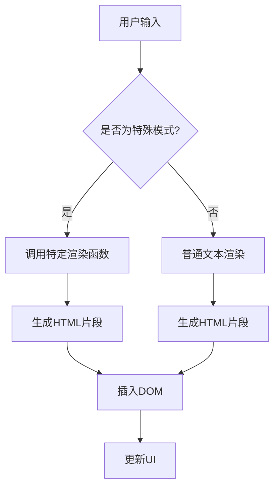
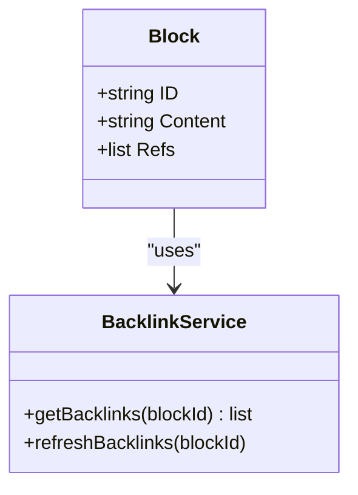

# 核心功能

<cite>
**本文档引用的文件**
- [Protyle.ts](file://app/src/protyle/index.ts)
- [block.go](file://kernel/sql/block.go)
- [block.go](file://kernel/model/block.go)
- [blockRender.ts](file://app/src/protyle/render/blockRender.ts)
- [transaction.ts](file://app/src/protyle/wysiwyg/transaction.ts)
- [renderBacklink.ts](file://app/src/protyle/wysiwyg/renderBacklink.ts)
- [block_ref_query.go](file://kernel/sql/block_ref_query.go)
- [backlink.go](file://kernel/model/backlink.go)
</cite>

## 目录
1. [块（Block）作为最小编辑单元](#块block作为最小编辑单元)
2. [所见即所得（WYSIWYG）Markdown编辑器（Protyle）](#所见即所得wysiwyg-markdown编辑器protyle)
3. [块级引用（Block Ref）和双向链接（Backlink）](#块级引用block-ref和双向链接backlink)
4. [笔记本（Notebook）和文档（Document）管理](#笔记本notebook和文档document管理)

## 块（Block）作为最小编辑单元

思源笔记的核心数据结构是“块”（Block），它被设计为内容组织和复用的最小单元。每个块都是一个独立的内容片段，可以包含文本、代码、数学公式、嵌入内容等多种元素。

在后端，`kernel/sql/block.go` 文件定义了 `Block` 结构体，其中包含了如 `ID`, `ParentID`, `RootID`, `Content`, `Type` 等关键字段。`ID` 是块的唯一标识符，`ParentID` 和 `RootID` 定义了块的层级关系，`Content` 存储实际内容，而 `Type` 则区分了段落、标题、列表项等不同类型的块。

前端通过 `app/src/protyle/index.ts` 中的 `Protyle` 类来管理和渲染这些块。当用户进行编辑时，操作会以事务（Transaction）的形式发送到后端。例如，在 `app/src/protyle/wysiwyg/transaction.ts` 文件中，`updateTransaction` 函数负责处理对单个块的更新操作，确保变更能够正确地同步到数据库。

这种基于块的设计理念使得内容可以被高度复用。用户可以在不同的文档中引用同一个块，实现信息的动态关联和同步更新，从而构建一个相互连接的知识网络。

**Section sources**
- [block.go](file://kernel/sql/block.go#L36-L58)
- [Protyle.ts](file://app/src/protyle/index.ts#L51-L516)
- [transaction.ts](file://app/src/protyle/wysiwyg/transaction.ts#L700-L709)

## 所见即所得（WYSIWYG）Markdown编辑器（Protyle）

Protyle 是思源笔记的所见即所得 Markdown 编辑器，它实现了实时渲染、行内块插入和格式工具栏交互等功能。

### 实时渲染与行内块插入

Protyle 的核心在于其实时渲染能力。当用户输入内容时，编辑器会立即解析 Markdown 语法并将其转换为可视化的 HTML 元素。这一过程由 `app/src/protyle/wysiwyg/input.ts` 文件中的 `input` 函数驱动。该函数监听用户的输入事件，捕获当前光标位置，并根据输入内容调用 Lute 引擎进行即时渲染。

对于行内块插入，如代码块、数学公式或嵌入查询，系统通过特定的触发机制（如输入三个反引号 ``` 或 `/` 命令）来激活。一旦检测到这些模式，编辑器会调用相应的渲染函数，例如 `highlightRender` 用于代码高亮，`mathRender` 用于数学公式渲染，并将结果直接插入到 DOM 中。



**Diagram sources**
- [input.ts](file://app/src/protyle/wysiwyg/input.ts#L1-L340)

### 格式工具栏交互

格式工具栏提供了丰富的文本样式选项，如加粗、斜体、下划线等。这些功能的实现依赖于 `app/src/protyle/toolbar/Font.ts` 中的 `fontEvent` 函数。当用户点击工具栏按钮时，该函数会获取当前选区范围，并应用相应的 CSS 类或 HTML 标签来改变文本外观。所有更改都会被记录为事务，以便支持撤销/重做操作。

**Section sources**
- [input.ts](file://app/src/protyle/wysiwyg/input.ts#L1-L340)
- [Font.ts](file://app/src/protyle/toolbar/Font.ts#L1-L100)

## 块级引用（Block Ref）和双向链接（Backlink）

块级引用和双向链接是构建知识网络的关键功能。

### 功能原理

块级引用允许用户在一个块中引用另一个块的内容。当被引用的块内容发生变化时，所有引用点都会自动更新。这一机制在后端通过 `kernel/sql/block_ref_query.go` 文件中的 `QueryRefsByDefID` 函数实现，该函数根据目标块 ID 查询所有引用它的块。

双向链接则在此基础上更进一步，不仅显示“谁引用了我”，还提供了一个反链面板来展示所有指向当前块的链接。`kernel/model/backlink.go` 文件中的 `GetBacklinkDoc` 函数负责从数据库中检索这些反向链接，并按文档结构进行排序和过滤。

### 使用方法

用户可以通过快捷键或命令菜单创建块级引用。在编辑器中，引用通常以 `[[]]` 语法表示。双击引用可以跳转到源块，右键菜单则提供了更多操作选项，如打开反链面板、查看上下文等。



**Diagram sources**
- [block_ref_query.go](file://kernel/sql/block_ref_query.go#L412-L457)
- [backlink.go](file://kernel/model/backlink.go#L40-L85)

**Section sources**
- [block_ref_query.go](file://kernel/sql/block_ref_query.go#L412-L457)
- [backlink.go](file://kernel/model/backlink.go#L40-L85)

## 笔记本（Notebook）和文档（Document）管理

思源笔记采用笔记本和文档的层级文件系统来组织内容。

### 层级文件系统

笔记本相当于顶级文件夹，用于分类管理多个文档。每个文档本质上是一个由多个块组成的树状结构，其根节点即为文档本身。`kernel/model/block.go` 文件中的 `Block` 结构体定义了 `Box` 字段，它代表了笔记本的 ID，从而建立了文档与笔记本之间的归属关系。

### 操作实现

创建、重命名、移动和删除文档的操作均由后端 API 处理。例如，`kernel/api/filetree.go` 提供了 `CreateFile`, `RenameFile`, `MoveFile`, `DeleteFile` 等接口。前端通过 `fetchPost` 调用这些 API，并在成功响应后更新本地 UI 状态。

这些功能协同工作，确保了用户界面与后端数据的一致性。例如，当用户重命名一个文档时，前端会发送请求，后端更新数据库记录，并广播“rename”消息给所有相关的 `Protyle` 实例，触发它们更新标题显示。

**Section sources**
- [block.go](file://kernel/model/block.go#L38-L71)
- [filetree.go](file://kernel/api/filetree.go#L1-L100)