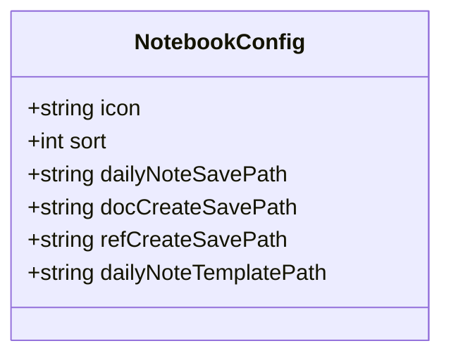
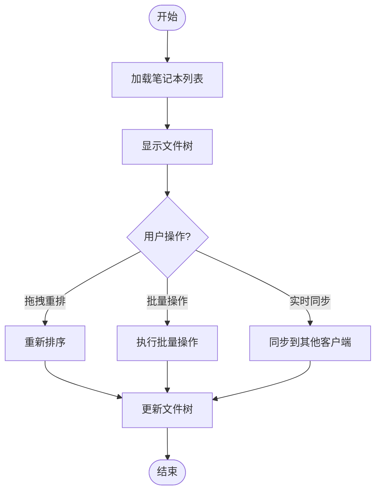
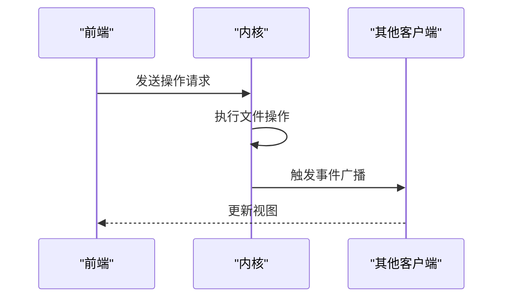
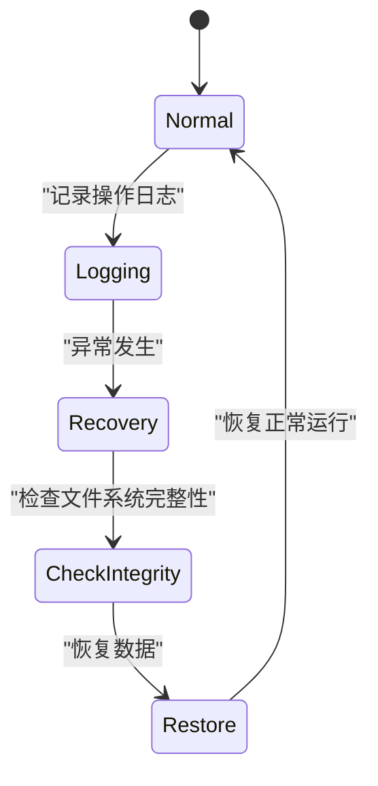

# 笔记本与文件管理

<cite>
**本文档引用的文件**
- [fileTree.ts](file://app/src/config/fileTree.ts)
- [config.d.ts](file://app/src/types/config.d.ts)
- [Files.ts](file://app/src/layout/dock/Files.ts)
- [MobileFiles.ts](file://app/src/mobile/dock/MobileFiles.ts)
- [notebook.go](file://kernel/model/notebook.go)
- [file.go](file://kernel/model/file.go)
- [filetree.go](file://kernel/api/filetree.go)
- [notebook.go](file://kernel/api/notebook.go)
- [queue.go](file://kernel/sql/queue.go)
- [runtime.go](file://kernel/util/runtime.go)
</cite>

## 目录
1. [笔记本作为知识库容器](#笔记本作为知识库容器)
2. [配置文件结构与可定制项](#配置文件结构与可定制项)
3. [文件树组件功能](#文件树组件功能)
4. [文档操作流程](#文档操作流程)
5. [本地优先架构下的可靠性保障](#本地优先架构下的可靠性保障)
6. [高级使用技巧](#高级使用技巧)
7. [性能调优策略](#性能调优策略)

## 笔记本作为知识库容器

思源笔记中的笔记本（Notebook）是独立的知识库容器，每个笔记本都对应一个独立的数据目录。用户可以创建多个笔记本来组织不同类型的知识内容，实现信息的有效隔离和分类管理。笔记本不仅提供了数据存储的基本单元，还支持自定义图标、排序方式等个性化设置，增强了用户的使用体验。

**Section sources**
- [notebook.go](file://kernel/model/notebook.go#L1-L50)
- [notebook.go](file://kernel/api/notebook.go#L1-L50)

## 配置文件结构与可定制项

笔记本的配置文件 `notebook.json` 包含了多种可定制项，如图标、排序方式等。这些配置项允许用户根据个人偏好调整笔记本的行为和外观。例如，用户可以通过修改配置文件中的 `icon` 字段来更改笔记本的图标，通过调整 `sort` 字段来改变文档的排序规则。

**Diagram sources**
- [notebook.go](file://kernel/model/notebook.go#L100-L150)
- [notebook.go](file://kernel/api/notebook.go#L100-L150)

**Section sources**
- [notebook.go](file://kernel/model/notebook.go#L100-L150)
- [notebook.go](file://kernel/api/notebook.go#L100-L150)

## 文件树组件功能

文件树组件展示了多级目录结构，支持拖拽重排、批量操作和实时同步。用户可以通过点击展开或折叠目录，方便地浏览和管理文档。此外，文件树组件还支持通过路径快速定位文档，提高了工作效率。

**Diagram sources**
- [Files.ts](file://app/src/layout/dock/Files.ts#L100-L200)
- [MobileFiles.ts](file://app/src/mobile/dock/MobileFiles.ts#L100-L200)

**Section sources**
- [Files.ts](file://app/src/layout/dock/Files.ts#L100-L200)
- [MobileFiles.ts](file://app/src/mobile/dock/MobileFiles.ts#L100-L200)

## 文档操作流程

创建、重命名、移动、删除文档时，前端发送请求至内核，内核执行相应的文件操作，并触发事件广播以更新其他客户端的视图。这一过程确保了所有客户端之间的数据一致性。

**Diagram sources**
- [filetree.go](file://kernel/api/filetree.go#L100-L150)
- [file.go](file://kernel/model/file.go#L100-L150)

**Section sources**
- [filetree.go](file://kernel/api/filetree.go#L100-L150)
- [file.go](file://kernel/model/file.go#L100-L150)

## 本地优先架构下的可靠性保障

在本地优先架构下，思源笔记通过操作日志记录和异常恢复机制来保障文件系统的可靠性。每次文件操作都会被记录下来，以便在发生异常时进行恢复。此外，系统还会定期检查文件系统的完整性，确保数据的安全性。

**Diagram sources**
- [runtime.go](file://kernel/util/runtime.go#L100-L150)
- [queue.go](file://kernel/sql/queue.go#L100-L150)

**Section sources**
- [runtime.go](file://kernel/util/runtime.go#L100-L150)
- [queue.go](file://kernel/sql/queue.go#L100-L150)

## 高级使用技巧

### 通过路径快速定位文档

用户可以通过输入文档的完整路径快速定位到目标文档，极大地提升了查找效率。此功能特别适用于拥有大量文档的大型项目。

### 利用模板批量生成内容

思源笔记支持利用模板批量生成内容，用户只需定义好模板，即可一键生成多个具有相同结构的文档，节省了大量的重复劳动。

**Section sources**
- [fileTree.ts](file://app/src/config/fileTree.ts#L100-L150)
- [config.d.ts](file://app/src/types/config.d.ts#L100-L150)

## 性能调优策略

对于大文件夹下的性能问题，思源笔记提供了一系列优化策略。例如，限制最大列出的文档数量、启用懒加载机制等，有效减少了内存占用和提高了响应速度。

**Section sources**
- [fileTree.ts](file://app/src/config/fileTree.ts#L150-L200)
- [config.d.ts](file://app/src/types/config.d.ts#L150-L200)