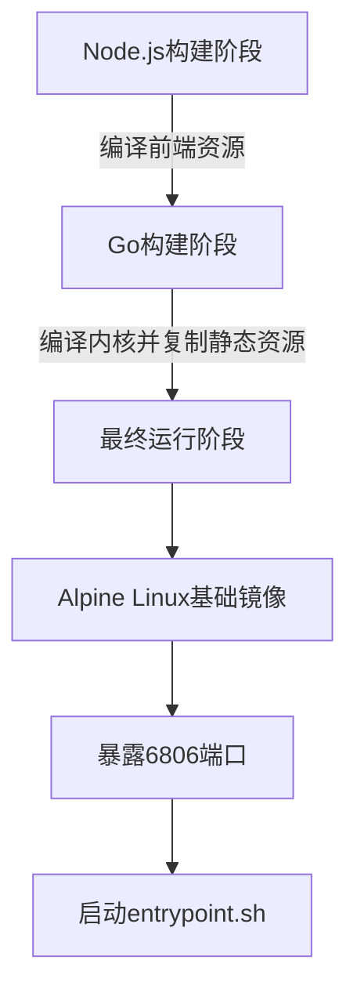
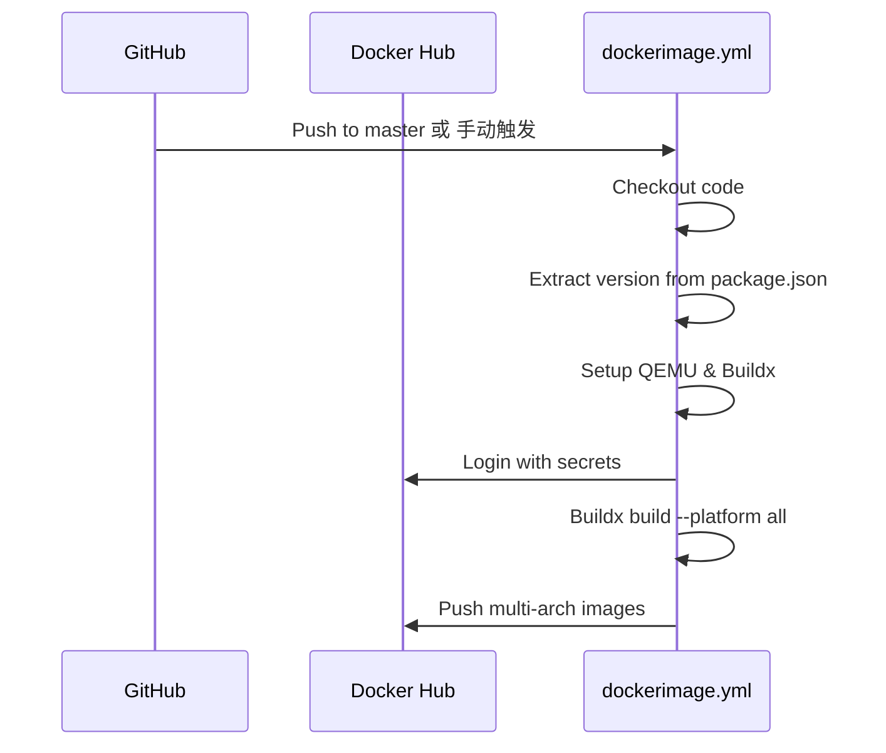

# 部署与分发

<cite>
**本文档中引用的文件**
- [Dockerfile](file://Dockerfile)
- [electron-builder.yml](file://app/electron-builder.yml)
- [linux-build.sh](file://scripts/linux-build.sh)
- [win-build.bat](file://scripts/win-build.bat)
- [darwin-build.sh](file://scripts/darwin-build.sh)
- [dockerimage.yml](file://.github/workflows/dockerimage.yml)
- [cd.yml](file://.github/workflows/cd.yml)
</cite>

## 目录
1. [简介](#简介)
2. [容器化部署](#容器化部署)
3. [桌面应用打包](#桌面应用打包)
4. [构建脚本详解](#构建脚本详解)
5. [CI/CD集成](#cicd集成)

## 简介
本文档详细介绍了思源笔记（SiYuan）从源码到可交付产品的完整部署与分发流程。内容涵盖使用Docker进行容器化部署、通过Electron打包跨平台桌面应用程序、各平台专用构建脚本的执行逻辑，以及基于GitHub Actions的持续集成与持续部署（CI/CD）自动化工作流。文档旨在为开发者和高级用户提供全面的构建与发布指南。

## 容器化部署

### Docker镜像构建与运行
思源笔记提供了完整的Dockerfile，用于构建可在任何支持Docker的环境中运行的容器化实例。该Dockerfile采用多阶段构建策略，确保最终镜像的轻量化和安全性。



**关键配置说明：**

- **端口映射**：容器默认暴露`6806`端口，这是思源笔记Web服务的监听端口。在运行容器时，需将主机端口映射到此端口，例如使用`-p 6806:6806`。
- **数据持久化**：为了确保用户数据不因容器销毁而丢失，必须将容器内的数据目录挂载到主机。通常需要挂载`/opt/siyuan/workspace`目录，以持久化用户的笔记库。
- **环境变量**：
  - `TZ=Asia/Shanghai`：设置容器时区为中国上海。
  - `HOME=/home/siyuan`：定义用户主目录。
  - `RUN_IN_CONTAINER=true`：标识应用正在容器内运行。

**构建与运行示例：**
```bash
# 构建镜像
docker build -t siyuan-note/siyuan:latest .

# 运行容器（包含端口映射和卷挂载）
docker run -d \
  --name siyuan \
  -p 6806:6806 \
  -v /path/to/your/data:/opt/siyuan/workspace \
  siyuan-note/siyuan:latest
```

**Section sources**
- [Dockerfile](file://Dockerfile#L1-L53)

## 桌面应用打包

### Electron打包配置
思源笔记使用Electron框架打包为原生桌面应用程序。其核心配置文件是`electron-builder.yml`，该文件定义了针对不同操作系统的打包规则。

**主要配置项解析：**

- **通用配置**：
  - `productName`: 应用程序名称 "SiYuan"。
  - `appId`: 唯一的应用ID "org.b3log.siyuan"。
  - `artifactName`: 输出安装包的命名模板 `${version}-${os}.${ext}`。
  - `extraMetadata.main`: 指定Electron的入口文件为 `electron/main.js`。

- **Windows (win) 配置**：
  - `icon`: 设置应用图标为 `src/assets/icon.ico`。
  - `extraResources`: 将`kernel`目录作为额外资源包含，其中包含后端内核可执行文件。
  - `target`: 打包目标为 `nsis` (Nullsoft Scriptable Install System)，生成标准的Windows安装程序。

- **NSIS安装程序配置**：
  - `oneClick`: `false`，表示非一键安装，允许用户选择安装路径。
  - `perMachine`: `false`，表示为当前用户安装，而非所有用户。
  - `allowToChangeInstallationDirectory`: `true`，允许用户更改安装目录。
  - `createDesktopShortcut` 和 `createStartMenuShortcut`: 均为 `true`，自动创建桌面和开始菜单快捷方式。

- **额外资源 (extraResources)**：
  此部分列出了打包时需要包含的所有静态资源，包括：
  - `changelogs`: 更新日志。
  - `stage`: Web应用的核心文件。
  - `guide`: 入门指南。
  - `appearance`: 主题、语言包、表情等外观资源。
  - `pandoc.zip`: Pandoc转换工具的压缩包。

**Section sources**
- [electron-builder.yml](file://app/electron-builder.yml#L1-L74)

## 构建脚本详解

### 跨平台构建脚本
项目根目录下的`scripts/`文件夹包含了针对不同操作系统的构建脚本，这些脚本自动化了从代码编译到应用打包的全过程。

#### Linux构建脚本 (linux-build.sh)
该脚本负责在Linux环境下构建思源笔记。

**执行流程：**
1.  **构建UI**: 进入`app`目录，使用pnpm安装依赖并执行`build`命令，生成前端静态资源。
2.  **清理旧构建**: 删除之前生成的`build`和`kernel-linux*`目录，确保构建环境干净。
3.  **构建内核 (Kernel)**:
    - 使用CGO和musl交叉编译器，分别构建适用于amd64和arm64架构的静态链接内核二进制文件 (`SiYuan-Kernel`)。
    - 内核使用Go语言编写，是应用的后端服务。
4.  **构建Electron应用**:
    - 回到`app`目录，调用`pnpm run dist-linux`和`pnpm run dist-linux-arm64`，利用`electron-builder`生成适用于x64和ARM64架构的`.AppImage`或`.tar.gz`格式的安装包。

**Section sources**
- [linux-build.sh](file://scripts/linux-build.sh#L1-L39)

#### Windows构建脚本 (win-build.bat)
该批处理脚本用于在Windows环境下构建应用。

**执行流程：**
1.  **构建UI**: 与Linux脚本类似，先构建前端资源。
2.  **清理旧构建**: 删除`build`和`kernel*`目录。
3.  **构建内核 (Kernel)**:
    - 使用MinGW-w64 GCC编译器，分别构建适用于amd64和arm64架构的Windows可执行文件 (`SiYuan-Kernel.exe`)。
    - 使用`goversioninfo`工具为Windows可执行文件嵌入版本信息和图标。
4.  **构建Electron应用**:
    - 调用`pnpm run dist`和`pnpm run dist-arm64`生成Windows安装包（通常是`.exe`或`.msi`）。
5.  **构建AppX包**:
    - 脚本还包含使用`electron-windows-store`工具生成Microsoft Store专用的AppX安装包的步骤，但此功能默认被注释或需要特定配置才能启用。

**Section sources**
- [win-build.bat](file://scripts/win-build.bat#L1-L81)

#### macOS构建脚本 (darwin-build.sh)
该脚本用于在macOS环境下构建应用。

**执行流程：**
1.  **构建UI**: 构建前端资源。
2.  **清理旧构建**: 清理`build`和`kernel-darwin*`目录。
3.  **构建内核 (Kernel)**:
    - 使用Go的内置编译器，分别构建适用于amd64和arm64 (Apple Silicon) 架构的macOS可执行文件 (`SiYuan-Kernel`)。
4.  **构建Electron应用**:
    - 调用`pnpm run dist-darwin`和`pnpm run dist-darwin-arm64`，生成macOS的`.dmg`磁盘映像安装包。

**Section sources**
- [darwin-build.sh](file://scripts/darwin-build.sh#L1-L38)

## CI/CD集成

### GitHub Actions自动化工作流
思源笔记利用GitHub Actions实现了高度自动化的CI/CD流程，主要由两个核心工作流文件驱动。

#### Docker镜像发布工作流 (dockerimage.yml)
此工作流负责构建和推送Docker镜像到Docker Hub。

**触发条件**：
- 推送至`master`分支。
- 手动触发（`workflow_dispatch`），允许指定自定义镜像标签。

**工作流流程**：
1.  **检出代码**：获取仓库及其子模块。
2.  **提取版本号**：从`app/package.json`中读取版本信息。
3.  **准备环境**：设置QEMU和Docker Buildx，以支持多平台构建。
4.  **登录Docker Hub**：使用仓库密钥进行身份验证。
5.  **构建并推送**：使用Docker Buildx同时为`linux/amd64`, `linux/arm64`, `linux/arm/v7`, `linux/arm/v8`四个平台构建镜像，并推送到Docker Hub，同时打上`latest`和具体版本标签。



**Diagram sources**
- [dockerimage.yml](file://.github/workflows/dockerimage.yml#L1-L80)

**Section sources**
- [dockerimage.yml](file://.github/workflows/dockerimage.yml#L1-L80)

#### 持续交付工作流 (cd.yml)
此工作流负责为每个Git标签（特别是`*-dev*`标签）创建预发布版本，并自动构建和上传所有平台的安装包。

**工作流流程**：
1.  **创建发布 (create_release job)**：
    - 根据`package.json`中的版本号和提交信息，自动生成一个带有时间戳的预发布版本。
    - 使用Python脚本`parse-changelog.py`解析并生成更新日志内容。
2.  **并行构建 (build job)**：
    - 使用矩阵策略（matrix strategy），在不同的GitHub托管运行器（Ubuntu, macOS, Windows）上并行执行构建任务。
    - 每个任务独立完成以下步骤：
        a. 设置Go、Node.js等环境。
        b. 构建前端UI。
        c. 构建对应平台的Go内核。
        d. 使用`electron-builder`打包成最终的桌面应用安装包（如`.AppImage`, `.dmg`, `.exe`）。
3.  **上传资产**：将每个平台生成的安装包作为资产上传到之前创建的GitHub Release中。

此工作流极大地简化了多平台发布的复杂性，确保了所有安装包的一致性和可追溯性。

**Section sources**
- [cd.yml](file://.github/workflows/cd.yml#L1-L241)