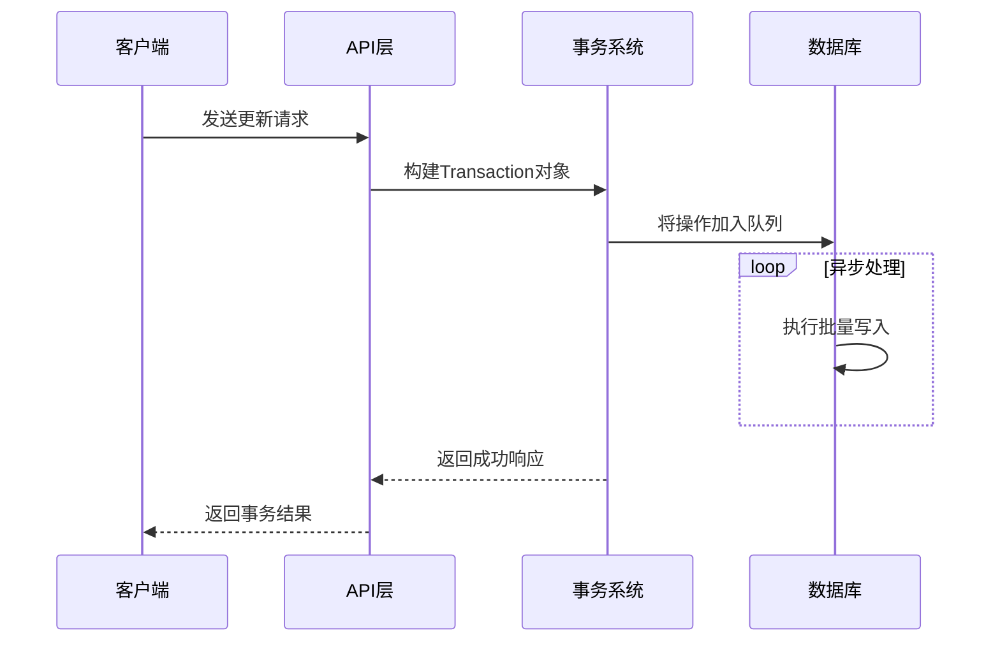

# 块操作API

<cite>
**本文档引用的文件**   
- [block.go](file://kernel/api/block.go)
- [block_op.go](file://kernel/api/block_op.go)
- [transaction.go](file://kernel/model/transaction.go)
- [model/block.go](file://kernel/model/block.go)
- [sql/block.go](file://kernel/sql/block.go)
- [API.md](file://API.md)
</cite>

## 目录
1. [简介](#简介)
2. [核心概念](#核心概念)
3. [创建块](#创建块)
4. [读取块](#读取块)
5. [更新块](#更新块)
6. [删除块](#删除块)
7. [移动块](#移动块)
8. [事务处理与版本控制](#事务处理与版本控制)
9. [块级引用与嵌入内容](#块级引用与嵌入内容)
10. [属性（IAL）处理](#属性ial处理)
11. [代码示例](#代码示例)

## 简介
本文档深入解析思源笔记（SiYuan）中关于内容块（Block）操作的API。这些API是构建、查询和修改笔记内容的核心接口，允许开发者通过HTTP请求对笔记中的任意内容块进行精细化操作。所有API均基于`POST`方法，并遵循统一的返回值格式。

```json
{
  "code": 0,
  "msg": "",
  "data": {}
}
```
其中，`code`为0表示成功，非零表示异常；`msg`在正常情况下为空字符串，异常时返回错误信息；`data`字段的内容根据具体接口而定。

**Section sources**
- [API.md](file://API.md#L0-L10)

## 核心概念
在深入API细节之前，理解几个关键概念至关重要：

*   **块 (Block)**: 思源笔记中最小的内容单元。一个段落、一个标题、一个列表项、一个代码块等都是一个“块”。每个块都有一个全局唯一的ID。
*   **块级引用 (Block Ref)**: 一种将一个块的内容以引用形式嵌入到另一个块中的机制。被引用的块发生变化时，所有引用处会自动同步更新。
*   **内联属性列表 (Inline Attribute List, IAL)**: 一种特殊的语法，用于为块附加元数据。它以 `{:` 开头，`:}` 结尾，可以包含如 `id`, `updated`, `fold` 等属性。
*   **事务 (Transaction)**: 所有对块的修改操作（创建、更新、删除、移动）最终都封装在一个或多个`Transaction`对象中执行。一个`Transaction`包含一组`DoOperations`（正向操作）和`UndoOperations`（逆向操作），确保了操作的原子性和可撤销性。

**Section sources**
- [model/block.go](file://kernel/model/block.go#L38-L71)
- [transaction.go](file://kernel/model/transaction.go#L1770-L1819)

## 创建块
创建新块的操作主要通过`insertBlock`、`prependBlock`和`appendBlock`三个端点实现。

### 插入块 (`/api/block/insertBlock`)
此端点允许在指定位置插入一个新块。

*   **HTTP方法**: `POST`
*   **完整路径**: `/api/block/insertBlock`
*   **请求参数**:
    ```json
    {
      "dataType": "markdown",
      "data": "要插入的内容",
      "nextID": "",
      "previousID": "20211229114650-vrek5x6",
      "parentID": ""
    }
    ```
    *   `dataType`: 要插入的数据类型，可选`markdown`或`dom`。
    *   `data`: 要插入的实际内容。
    *   `nextID`: 下一个块的ID，用于锚定插入位置。
    *   `previousID`: 上一个块的ID，用于锚定插入位置。
    *   `parentID`: 父块的ID，用于锚定插入位置。
*   **优先级**: `nextID` > `previousID` > `parentID`，三者至少需要提供一个。
*   **返回结果**:
    返回一个包含`doOperations`数组的事务。`action.data`是生成的新块的DOM结构，`action.id`是新块的唯一ID。

**Section sources**
- [block_op.go](file://kernel/api/block_op.go#L450-L489)
- [API.md](file://API.md#L626-L675)

### 在前部追加块 (`/api/block/prependBlock`)
此端点将新块作为指定父块的第一个子块插入。

*   **HTTP方法**: `POST`
*   **完整路径**: `/api/block/prependBlock`
*   **请求参数**:
    ```json
    {
      "data": "要插入的内容",
      "dataType": "markdown",
      "parentID": "20220107173950-7f9m1nb"
    }
    ```
    *   `dataType`: 数据类型。
    *   `data`: 要插入的内容。
    *   `parentID`: 父块的ID。
*   **返回结果**: 同`insertBlock`。

**Section sources**
- [block_op.go](file://kernel/api/block_op.go#L355-L384)
- [API.md](file://API.md#L676-L718)

### 在后部追加块 (`/api/block/appendBlock`)
此端点将新块作为指定父块的最后一个子块插入。

*   **HTTP方法**: `POST`
*   **完整路径**: `/api/block/appendBlock`
*   **请求参数**:
    ```json
    {
      "data": "要插入的内容",
      "dataType": "markdown",
      "parentID": "20220107173950-7f9m1nb"
    }
    ```
    参数含义同`prependBlock`。
*   **返回结果**: 同`insertBlock`。

**Section sources**
- [block_op.go](file://kernel/api/block_op.go#L308-L337)
- [API.md](file://API.md#L719-L761)

## 读取块
读取块的API主要用于获取块的内容、结构和相关信息。

### 获取块DOM (`/api/block/getBlockDOM`)
获取指定块的HTML DOM表示。

*   **HTTP方法**: `POST`
*   **完整路径**: `/api/block/getBlockDOM`
*   **请求参数**:
    ```json
    {
      "id": "20211230115020-g02dfx0"
    }
    ```
    *   `id`: 要获取的块的ID。
*   **返回结果**:
    ```json
    {
      "code": 0,
      "msg": "",
      "data": {
        "id": "20211230115020-g02dfx0",
        "dom": "<div data-node-id=\"...\">...</div>"
      }
    }
    ```

**Section sources**
- [block.go](file://kernel/api/block.go#L580-L594)

### 获取块Kramdown (`/api/block/getBlockKramdown`)
获取指定块的Kramdown格式文本。

*   **HTTP方法**: `POST`
*   **完整路径**: `/api/block/getBlockKramdown`
*   **请求参数**:
    ```json
    {
      "id": "20211230115020-g02dfx0",
      "mode": "md"
    }
    ```
    *   `id`: 块ID。
    *   `mode`: 可选`md`（Markdown标记符模式）或`textmark`（文本标记模式）。
*   **返回结果**:
    包含`kramdown`字段的JSON对象。

**Section sources**
- [block.go](file://kernel/api/block.go#L650-L675)

### 获取子块 (`/api/block/getChildBlocks`)
获取指定块的所有直接子块。

*   **HTTP方法**: `POST`
*   **完整路径**: `/api/block/getChildBlocks`
*   **请求参数**:
    ```json
    {
      "id": "20220107173950-7f9m1nb"
    }
    ```
    *   `id`: 父块的ID。
*   **返回结果**:
    返回一个`ChildBlock`对象数组，包含每个子块的ID、类型、内容等信息。

**Section sources**
- [block.go](file://kernel/api/block.go#L700-L714)
- [model/block.go](file://kernel/model/block.go#L580-L629)

## 更新块
更新块是通过`/api/block/updateBlock`端点完成的。

### 更新块 (`/api/block/updateBlock`)
此端点用于修改现有块的内容。

*   **HTTP方法**: `POST`
*   **完整路径**: `/api/block/updateBlock`
*   **请求参数**:
    ```json
    {
      "dataType": "markdown",
      "data": "新的内容",
      "id": "20211230161520-querkps"
    }
    ```
    *   `dataType`: 要更新的数据类型。
    *   `data`: 新的数据内容。
    *   `id`: 要更新的块的ID。
*   **返回结果**:
    返回一个事务，其`doOperations`中的`action`为`update`，`data`为更新后的块DOM。

**Section sources**
- [block_op.go](file://kernel/api/block_op.go#L400-L449)
- [API.md](file://API.md#L762-L803)

## 删除块
删除块是通过`/api/block/deleteBlock`端点完成的。

### 删除块 (`/api/block/deleteBlock`)
此端点用于移除一个块及其所有子块。

*   **HTTP方法**: `POST`
*   **完整路径**: `/api/block/deleteBlock`
*   **请求参数**:
    ```json
    {
      "id": "20211230161520-querkps"
    }
    ```
    *   `id`: 要删除的块的ID。
*   **返回结果**:
    返回一个事务，其`doOperations`中的`action`为`delete`。

**Section sources**
- [block_op.go](file://kernel/api/block_op.go#L780-L799)
- [API.md](file://API.md#L804-L839)

## 移动块
移动块是通过`/api/block/moveBlock`端点完成的。

### 移动块 (`/api/block/moveBlock`)
此端点用于改变一个块在文档树中的位置。

*   **HTTP方法**: `POST`
*   **完整路径**: `/api/block/moveBlock`
*   **请求参数**:
    ```json
    {
      "id": "20230406180530-3o1rqkc",
      "previousID": "20230406152734-if5kyx6",
      "parentID": "20230404183855-woe52ko"
    }
    ```
    *   `id`: 要移动的块的ID。
    *   `previousID`: 目标位置的前一个块ID。
    *   `parentID`: 目标父块的ID。
*   **返回结果**:
    返回一个事务，其`doOperations`中的`action`为`move`。

**Section sources**
- [block_op.go](file://kernel/api/block_op.go#L258-L307)
- [API.md](file://API.md#L840-L884)

## 事务处理与版本控制
所有对块的修改操作都不是直接写入数据库，而是先被封装成一个`Transaction`对象。



**Diagram sources **
- [block_op.go](file://kernel/api/block_op.go#L400-L449)
- [transaction.go](file://kernel/model/transaction.go#L100-L150)

当客户端调用如`updateBlock`的API时：
1.  API层接收请求并验证参数。
2.  根据请求内容，构造一个`Transaction`对象，其中包含一个`Operation`（如`update`）。
3.  该`Transaction`被放入一个异步处理队列。
4.  后台任务从队列中取出`Transaction`，执行实际的文件系统和数据库操作。
5.  操作完成后，通知前端界面刷新。

这种设计实现了操作的异步化和批量化，保证了系统的响应速度和数据一致性。

## 块级引用与嵌入内容
块级引用是思源笔记的核心特性之一。当一个块被引用时，其`IAL`中会记录相关信息。

*   **处理机制**: 当一个被引用的块（定义块）被更新时，系统会遍历所有引用了它的块（引用块）。在`Transaction`的`doUpdate`流程中，会通过`getRefDefIDs`函数收集所有相关的引用关系，并触发引用计数的更新和界面的广播刷新。
*   **嵌入内容**: 嵌入块（Embed Block）是一种特殊的块，它通过`NodeBlockQueryEmbed`节点来展示其他块的内容。当被嵌入的块发生变化时，系统会通过`broadcastTransactions`机制通知所有相关的嵌入块进行重新渲染。

**Section sources**
- [transaction.go](file://kernel/model/transaction.go#L1500-L1550)
- [transaction.go](file://kernel/model/transaction.go#L1700-L1750)

## 属性（IAL）处理
块的属性（IAL）存储在`Block`结构体的`IAL`字段中，是一个`map[string]string`。

*   **读取**: 通过`GetBlockAttrs`函数从缓存或文件树中加载IAL。
*   **更新**: 在`doSetAttrs`操作中，通过`node.SetIALAttr()`和`node.RemoveIALAttr()`方法修改节点的IAL，然后持久化到文件和数据库。
*   **特殊属性**:
    *   `id`: 块的唯一标识符。
    *   `updated`: 块的最后更新时间戳。
    *   `fold`: 对于标题块，表示是否折叠。

**Section sources**
- [model/block.go](file://kernel/model/block.go#L38-L71)
- [transaction.go](file://kernel/model/transaction.go#L1650-L1680)

## 代码示例
以下示例展示了如何使用API构建复杂的内容结构。

```javascript
// 示例：创建一个包含列表和引用的复杂结构
const createComplexStructure = async (parentId) => {
  // 1. 首先创建一个标题
  const headingRes = await fetch('/api/block/appendBlock', {
    method: 'POST',
    headers: { 'Content-Type': 'application/json' },
    body: JSON.stringify({
      parentID: parentId,
      dataType: 'markdown',
      data: '# 我的待办清单'
    })
  });
  const headingId = (await headingRes.json()).data[0].doOperations[0].id;

  // 2. 为标题添加一个列表
  const listRes = await fetch('/api/block/appendBlock', {
    method: 'POST',
    headers: { 'Content-Type': 'application/json' },
    body: JSON.stringify({
      parentID: headingId,
      dataType: 'markdown',
      data: '- [ ] 买牛奶\n- [ ] 写报告'
    })
  });

  // 3. 创建一个独立的说明块
  const noteRes = await fetch('/api/block/insertBlock', {
    method: 'POST',
    headers: { 'Content-Type': 'application/json' },
    body: JSON.stringify({
      previousID: headingId,
      dataType: 'markdown',
      data: '以上是我的今日计划。'
    })
  });
  const noteId = (await noteRes.json()).data[0].doOperations[0].id;

  // 4. 在说明块中创建一个对标题的动态引用
  await fetch('/api/block/updateBlock', {
    method: 'POST',
    headers: { 'Content-Type': 'application/json' },
    body: JSON.stringify({
      id: noteId,
      dataType: 'markdown',
      data: `以上是我的今日计划，详见 [[${headingId}]]。`
    })
  });

  console.log('复杂结构创建完成');
};
```

**Section sources**
- [block_op.go](file://kernel/api/block_op.go#L308-L337)
- [block_op.go](file://kernel/api/block_op.go#L450-L489)
- [block_op.go](file://kernel/api/block_op.go#L400-L449)