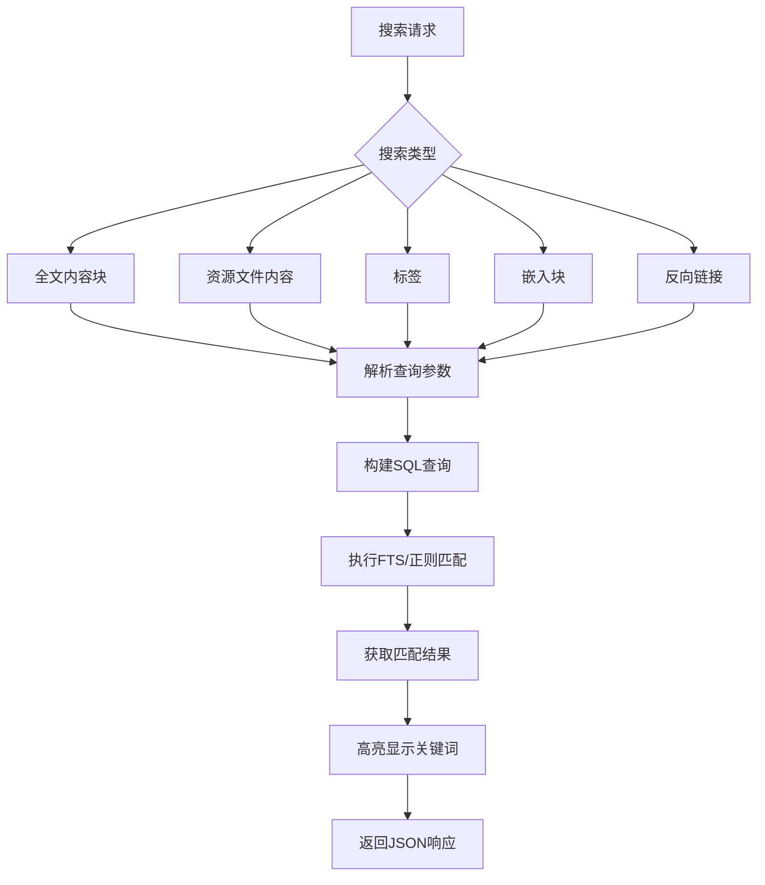
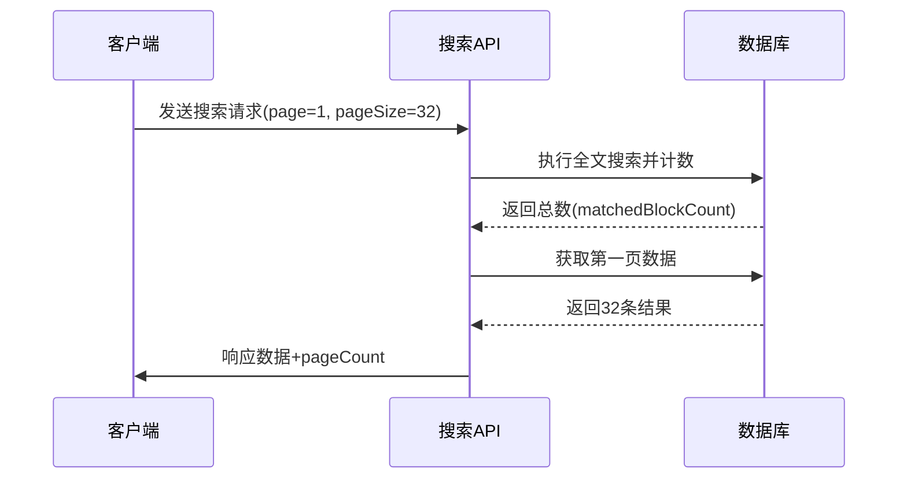
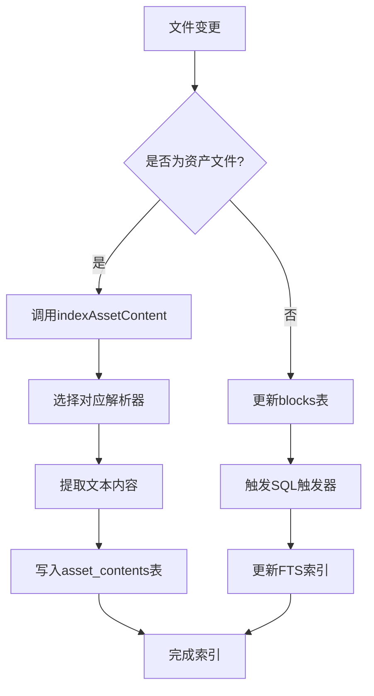

# 搜索服务API

<cite>
**本文档中引用的文件**   
- [search.go](file://kernel/api/search.go)
- [conf.go](file://kernel/conf/search.go)
- [search.go](file://kernel/model/search.go)
- [asset_content.go](file://kernel/model/asset_content.go)
</cite>

## 目录
1. [简介](#简介)
2. [核心搜索功能](#核心搜索功能)
3. [查询参数详解](#查询参数详解)
4. [分页与排序机制](#分页与排序机制)
5. [响应结果结构](#响应结果结构)
6. [后台索引机制](#后台索引机制)
7. [高级查询示例](#高级查询示例)
8. [性能考量与限制](#性能考量与限制)

## 简介
本技术文档详细描述了基于 `kernel/api/search.go` 实现的搜索服务API。该API提供了强大的全文搜索、按标签搜索和按属性搜索功能，支持复杂的查询语法和灵活的过滤选项。文档涵盖了端点定义、查询参数、分页排序机制以及响应数据结构，并深入解析了后台索引如何支持高效检索。

**Section sources**
- [search.go](file://kernel/api/search.go#L1-L492)

## 核心搜索功能
搜索服务API提供以下主要功能端点：

- **全文内容块搜索 (`fullTextSearchBlock`)**：通过关键词在所有内容块中进行搜索。
- **资源文件内容搜索 (`fullTextSearchAssetContent`)**：搜索PDF、Office文档等资源文件中的文本内容。
- **标签搜索 (`searchTag`)**：根据标签名称查找相关的内容块。
- **嵌入块搜索 (`searchEmbedBlock`)**：在嵌入块（如SQL查询结果）中执行搜索。
- **反向链接搜索 (`searchRefBlock`)**：查找引用了特定块的所有其他块。

这些功能共同构成了一个全面的搜索系统，允许用户从多个维度快速定位所需信息。



**Diagram sources **
- [search.go](file://kernel/api/search.go#L1-L492)
- [search.go](file://kernel/model/search.go#L1173-L1345)

**Section sources**
- [search.go](file://kernel/api/search.go#L1-L492)
- [search.go](file://kernel/model/search.go#L1173-L1345)

## 查询参数详解
搜索API接受多种查询参数以实现精确控制：

### 基础查询参数
| 参数 | 类型 | 描述 |
|------|------|------|
| `query` | string | 搜索关键词或查询语句 |
| `method` | int | 查询方法：0=关键字, 1=查询语法, 2=SQL, 3=正则表达式 |
| `types` | map[string]bool | 内容块类型过滤器 |

### 范围与过滤参数
| 参数 | 类型 | 描述 |
|------|------|------|
| `boxes` | []string | 笔记本ID列表，限定搜索范围 |
| `paths` | []string | 文件路径前缀，用于目录筛选 |
| `ignoreFilter` | string | 动态构建的忽略条件，排除特定结果 |

### 高级配置参数
搜索行为受全局配置影响，定义于 `conf.Search` 结构体中：
```go
type Search struct {
    Document      bool // 是否包含文档块
    Heading       bool // 是否包含标题块
    CodeBlock     bool // 是否包含代码块
    CaseSensitive bool // 是否区分大小写
    Limit         int  // 每页最大结果数
    Name          bool // 是否搜索名称字段
    Alias         bool // 是否搜索别名字段
    Memo          bool // 是否搜索备注字段
}
```

**Section sources**
- [search.go](file://kernel/api/search.go#L1-L492)
- [conf.go](file://kernel/conf/search.go#L26-L65)

## 分页与排序机制
API实现了标准的分页和多维度排序功能。

### 分页参数
| 参数 | 默认值 | 描述 |
|------|--------|------|
| `page` | 1 | 当前页码 |
| `pageSize` | 32 | 每页结果数量 |

总页数由 `(matchedCount + pageSize - 1) / pageSize` 计算得出。

### 排序选项
| orderBy值 | 排序方式 |
|----------|---------|
| 0 | 按块类型（默认） |
| 1 | 按创建时间升序 |
| 2 | 按创建时间降序 |
| 3 | 按更新时间升序 |
| 4 | 按更新时间降序 |
| 5 | 按内容顺序（仅按文档分组时） |
| 6 | 按相关度升序 |
| 7 | 按相关度降序 |

相关度排序使用SQLite FTS的rank函数，优先匹配精确名称和别名。



**Diagram sources **
- [search.go](file://kernel/api/search.go#L1-L492)
- [search.go](file://kernel/model/search.go#L1173-L1345)

**Section sources**
- [search.go](file://kernel/api/search.go#L1-L492)
- [search.go](file://kernel/model/search.go#L1173-L1345)

## 响应结果结构
搜索API返回标准化的JSON响应，包含元数据和匹配结果。

### 响应格式
```json
{
  "code": 0,
  "msg": "",
  "data": {
    "blocks": [...],
    "matchedBlockCount": 100,
    "matchedRootCount": 20,
    "pageCount": 4,
    "docMode": false
  }
}
```

### 匹配块数据结构
每个匹配的块包含以下关键字段：
- `id`: 块的唯一标识符
- `content`: 包含高亮标记的匹配内容片段
- `hpath`: 带有笔记本名的层级路径
- `name`, `alias`, `memo`: 可能包含匹配项的元数据字段
- `type`: 块类型（文档、标题、列表等）
- `sort`: 排序权重
- `created`, `updated`: 时间戳
- `RefCount`: 引用计数

关键词通过 `<mark>` 标签高亮显示，便于用户快速识别。

**Section sources**
- [search.go](file://kernel/api/search.go#L1-L492)
- [search.go](file://kernel/model/search.go#L1858-L1863)

## 后台索引机制
搜索服务依赖于高效的后台索引系统来保证查询性能。

### 全文搜索索引
使用SQLite的FTS5（全文搜索）扩展，为内容块建立倒排索引：
- 主表：`blocks_fts` 和 `blocks_fts_case_insensitive`
- 索引字段：content, name, alias, memo, tag, ial
- 支持snippet()函数生成上下文摘要

### 资源文件索引
对于非文本资源（PDF、Office文档），采用异步索引策略：
1. 文件变更时触发索引任务
2. 使用专用解析器提取文本内容
3. 将纯文本存入 `asset_contents_fts_case_insensitive` 表
4. 支持跨文件全文搜索

### 索引维护
- 自动监听文件系统变化
- 支持全量重建 (`ReindexAssetContent`)
- 变更操作加入队列异步处理，避免阻塞主线程



**Diagram sources **
- [asset_content.go](file://kernel/model/asset_content.go#L92-L115)
- [search.go](file://kernel/model/search.go#L1629-L1655)

**Section sources**
- [asset_content.go](file://kernel/model/asset_content.go#L92-L115)
- [search.go](file://kernel/model/search.go#L1629-L1655)

## 高级查询示例
以下是几种复杂查询的实际应用示例：

### 组合条件搜索
```json
{
  "query": "会议纪要",
  "boxes": ["2023-work"],
  "paths": ["/项目A/"],
  "types": {
    "document": true,
    "heading": true
  },
  "method": 0,
  "orderBy": 7,
  "groupBy": 1
}
```
此查询在"2023-work"笔记本的"/项目A/"目录下，搜索包含"会议纪要"的文档和标题块，按相关度降序排列，并按文档分组。

### SQL查询语法
```sql
SELECT * FROM blocks 
WHERE type = 'h' AND content LIKE '%重要%' 
AND created >= '20230101000000'
ORDER BY updated DESC
```
直接执行SQL语句进行高级筛选，适用于复杂业务逻辑。

### 正则表达式搜索
```json
{
  "query": "\\d{4}-\\d{2}-\\d{2}",
  "method": 3,
  "types": {"paragraph": true}
}
```
使用正则表达式匹配日期格式，查找所有段落中的YYYY-MM-DD模式。

**Section sources**
- [search.go](file://kernel/api/search.go#L1-L492)
- [search.go](file://kernel/model/search.go#L1173-L1345)

## 性能考量与限制
### 性能优化措施
- **缓存机制**：频繁访问的块数据被缓存
- **分页加载**：大结果集分页返回，避免内存溢出
- **并发处理**：PDF等大文件解析使用多线程worker池
- **增量更新**：仅索引变更文件，减少I/O开销

### 已知限制
- PDF文件超过1024页或128MB将被忽略
- 非UTF-8编码的文本文件不参与搜索
- 移动平台暂不支持PDF内容索引
- 复杂SQL查询可能影响响应时间

### 最佳实践建议
1. 合理设置`pageSize`，避免一次性获取过多数据
2. 利用`boxes`和`paths`缩小搜索范围
3. 对于精确匹配，优先使用ID搜索而非全文检索
4. 定期维护索引，确保数据一致性

**Section sources**
- [asset_content.go](file://kernel/model/asset_content.go#L92-L115)
- [search.go](file://kernel/model/search.go#L1173-L1345)