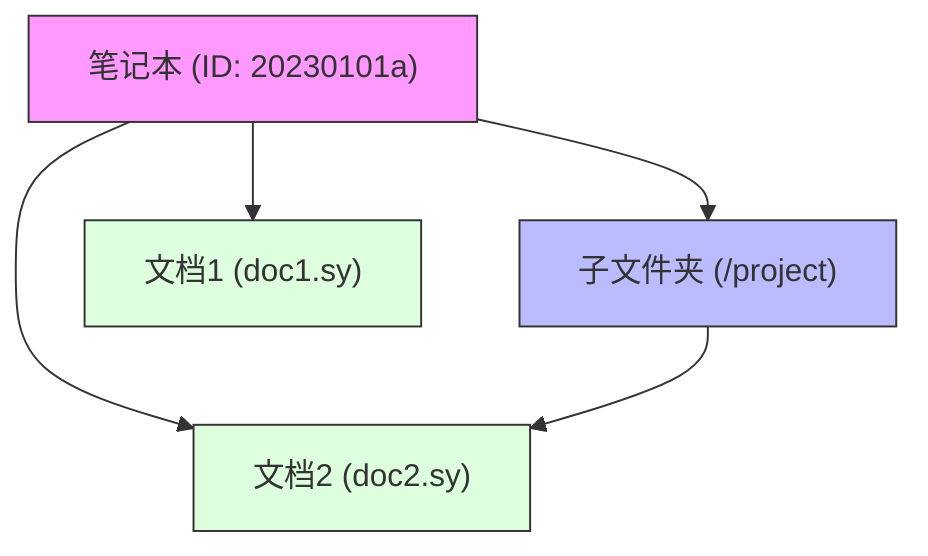

# 笔记本管理API

<cite>
**本文档中引用的文件**
- [notebook.go](file://kernel/api/notebook.go)
- [box.go](file://kernel/model/box.go)
- [box.go](file://kernel/conf/box.go)
</cite>

## 目录
1. [简介](#简介)
2. [核心API端点](#核心api端点)
3. [笔记本配置详解](#笔记本配置详解)
4. [笔记本与文档树关系](#笔记本与文档树关系)
5. [自动化组织知识库示例](#自动化组织知识库示例)

## 简介
笔记本管理API提供了对SiYuan笔记系统中笔记本生命周期的完整控制。通过这些API，用户可以创建、重命名、关闭、删除笔记本，并获取和设置笔记本的详细配置。每个笔记本在系统中以独立的目录形式存在，包含自己的文档树结构和配置文件（conf.json）。该API是自动化组织知识库结构的基础。

## 核心API端点

### 列出笔记本 (lsNotebooks)
列出所有可用的笔记本。

**请求方法**: POST  
**路径**: /api/notebook/lsNotebooks  

**输入参数**:
```json
{
  "flashcard": boolean // 可选，是否只返回闪卡笔记本
}
```

**输出格式**:
```json
{
  "code": int,
  "msg": string,
  "data": {
    "notebooks": [
      {
        "id": string,
        "name": string,
        "icon": string,
        "sort": int,
        "sortMode": int,
        "closed": boolean
      }
    ]
  }
}
```

**Section sources**
- [notebook.go](file://kernel/api/notebook.go#L398-L426)

### 创建笔记本 (createNotebook)
创建一个新的笔记本。

**请求方法**: POST  
**路径**: /api/notebook/createNotebook  

**输入参数**:
```json
{
  "name": string // 笔记本名称
}
```

**输出格式**:
```json
{
  "code": int,
  "msg": string,
  "data": {
    "notebook": {
      "id": string,
      "name": string,
      "icon": string,
      "sort": int,
      "sortMode": int,
      "closed": boolean
    }
  }
}
```

**Section sources**
- [notebook.go](file://kernel/api/notebook.go#L155-L196)
- [box.go](file://kernel/model/box.go#L36-L73)

### 重命名笔记本 (renameNotebook)
重命名指定的笔记本。

**请求方法**: POST  
**路径**: /api/notebook/renameNotebook  

**输入参数**:
```json
{
  "notebook": string, // 笔记本ID
  "name": string      // 新名称
}
```

**输出格式**:
```json
{
  "code": int,
  "msg": string
}
```

**Section sources**
- [notebook.go](file://kernel/api/notebook.go#L88-L117)
- [box.go](file://kernel/model/box.go#L75-L98)

### 关闭笔记本 (closeNotebook)
关闭指定的笔记本。

**请求方法**: POST  
**路径**: /api/notebook/closeNotebook  

**输入参数**:
```json
{
  "notebook": string // 笔记本ID
}
```

**输出格式**:
```json
{
  "code": int,
  "msg": string
}
```

**Section sources**
- [notebook.go](file://kernel/api/notebook.go#L284-L298)
- [box.go](file://kernel/model/box.go#L155-L164)

### 删除笔记本 (removeNotebook)
删除指定的笔记本。

**请求方法**: POST  
**路径**: /api/notebook/removeNotebook  

**输入参数**:
```json
{
  "notebook": string,   // 笔记本ID
  "callback": string    // 可选，回调函数名
}
```

**输出格式**:
```json
{
  "code": int,
  "msg": string
}
```

**Section sources**
- [notebook.go](file://kernel/api/notebook.go#L119-L153)
- [box.go](file://kernel/model/box.go#L102-L153)

### 获取笔记本配置 (getNotebookConf)
获取指定笔记本的配置信息。

**请求方法**: POST  
**路径**: /api/notebook/getNotebookConf  

**输入参数**:
```json
{
  "notebook": string // 笔记本ID
}
```

**输出格式**:
```json
{
  "code": int,
  "msg": string,
  "data": {
    "box": string,
    "name": string,
    "conf": {
      "name": string,
      "sort": int,
      "icon": string,
      "closed": boolean,
      "refCreateSaveBox": string,
      "refCreateSavePath": string,
      "docCreateSaveBox": string,
      "docCreateSavePath": string,
      "dailyNoteSavePath": string,
      "dailyNoteTemplatePath": string,
      "sortMode": int
    }
  }
}
```

**Section sources**
- [notebook.go](file://kernel/api/notebook.go#L300-L348)

### 设置笔记本配置 (setNotebookConf)
设置指定笔记本的配置信息。

**请求方法**: POST  
**路径**: /api/notebook/setNotebookConf  

**输入参数**:
```json
{
  "notebook": string, // 笔记本ID
  "conf": {
    "name": string,
    "sort": int,
    "icon": string,
    "closed": boolean,
    "refCreateSaveBox": string,
    "refCreateSavePath": string,
    "docCreateSaveBox": string,
    "docCreateSavePath": string,
    "dailyNoteSavePath": string,
    "dailyNoteTemplatePath": string,
    "sortMode": int
  }
}
```

**输出格式**:
```json
{
  "code": int,
  "msg": string,
  "data": {
    "name": string,
    "sort": int,
    "icon": string,
    "closed": boolean,
    "refCreateSaveBox": string,
    "refCreateSavePath": string,
    "docCreateSaveBox": string,
    "docCreateSavePath": string,
    "dailyNoteSavePath": string,
    "dailyNoteTemplatePath": string,
    "sortMode": int
  }
}
```

**Section sources**
- [notebook.go](file://kernel/api/notebook.go#L350-L396)

## 笔记本配置详解
笔记本的配置存储在其根目录下的`.siyuan/conf.json`文件中，主要包含以下可配置项：

| 配置项 | 类型 | 描述 |
|-------|------|------|
| name | string | 笔记本名称 |
| sort | int | 排序字段 |
| icon | string | 图标 |
| closed | bool | 是否处于关闭状态 |
| refCreateSaveBox | string | 块引时新建文档存储笔记本 |
| refCreateSavePath | string | 块引时新建文档存储路径 |
| docCreateSaveBox | string | 新建文档存储笔记本 |
| docCreateSavePath | string | 新建文档存储路径 |
| dailyNoteSavePath | string | 新建日记存储路径 |
| dailyNoteTemplatePath | string | 新建日记使用的模板路径 |
| sortMode | int | 排序方式 |

**Diagram sources**
- [box.go](file://kernel/conf/box.go#L21-L33)

## 笔记本与文档树关系
在SiYuan系统中，每个笔记本对应一个独立的文档树结构。笔记本是文档树的根容器，所有的文档和子文件夹都存在于笔记本的目录下。这种设计实现了数据的物理隔离，确保了不同知识领域的完全分离。



**Diagram sources**
- [box.go](file://kernel/model/box.go#L50-L61)

## 自动化组织知识库示例
以下示例展示了如何通过API自动化组织知识库结构：

```python
import requests
import json

# 创建新的项目笔记本
def create_project_notebook(project_name):
    response = requests.post('http://localhost:6806/api/notebook/createNotebook', 
                           json={'name': project_name})
    result = response.json()
    if result['code'] == 0:
        notebook_id = result['data']['notebook']['id']
        
        # 设置笔记本配置
        config = {
            "name": project_name,
            "docCreateSavePath": f"/{project_name}/drafts",
            "dailyNoteSavePath": f"/{project_name}/daily/{{{{now | date \"YYYY/MM\"}}}}/{{{{now | date \"YYYY-MM-DD\"}}}}",
            "sortMode": 5  # 按自定义顺序排序
        }
        
        requests.post('http://localhost:6806/api/notebook/setNotebookConf',
                     json={'notebook': notebook_id, 'conf': config})
        
        return notebook_id
    else:
        raise Exception(f"创建笔记本失败: {result['msg']}")

# 使用示例
try:
    project_id = create_project_notebook("人工智能研究")
    print(f"成功创建项目笔记本，ID: {project_id}")
except Exception as e:
    print(str(e))
```

此示例演示了如何创建一个名为"人工智能研究"的新笔记本，并自动配置其文档存储路径和每日笔记路径，实现知识库的自动化组织。

**Section sources**
- [notebook.go](file://kernel/api/notebook.go)
- [box.go](file://kernel/model/box.go)
- [box.go](file://kernel/conf/box.go)