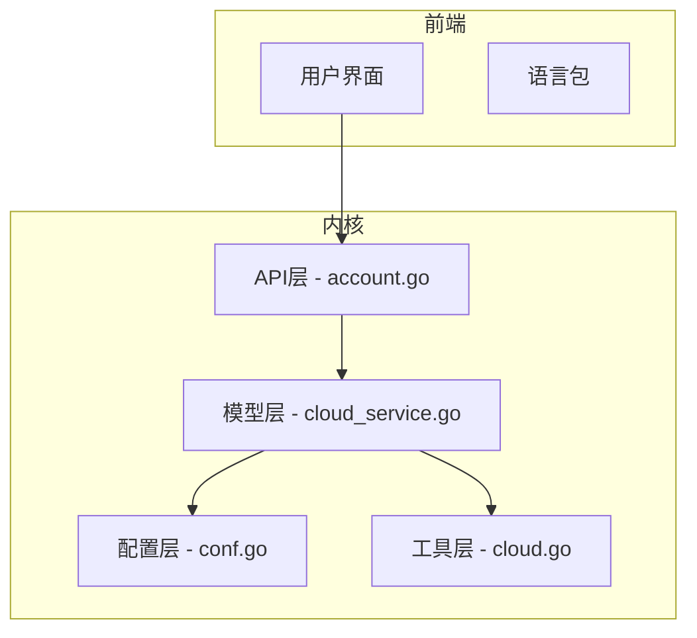
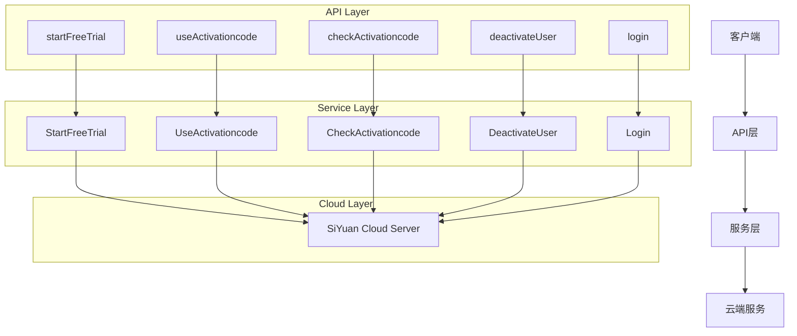
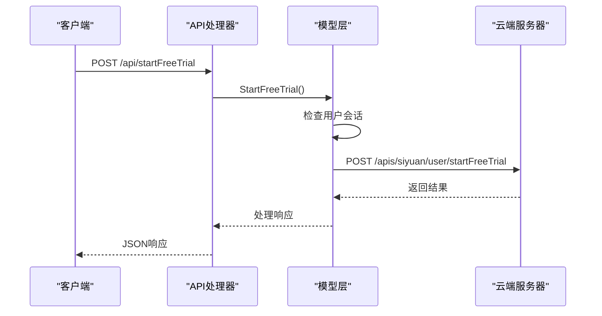
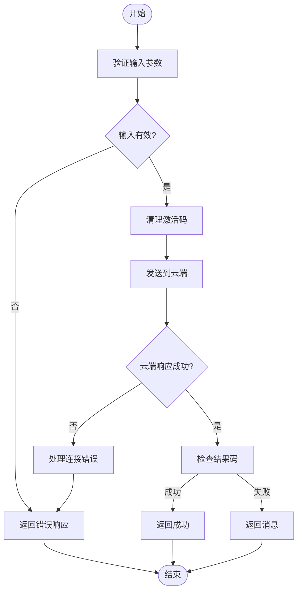
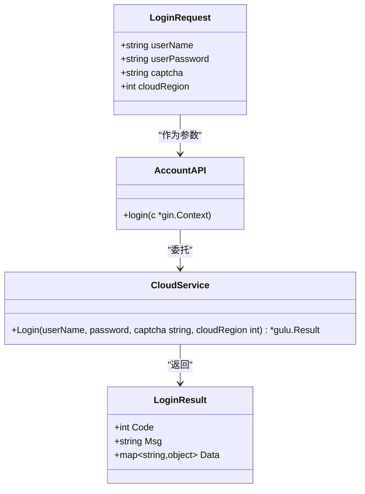
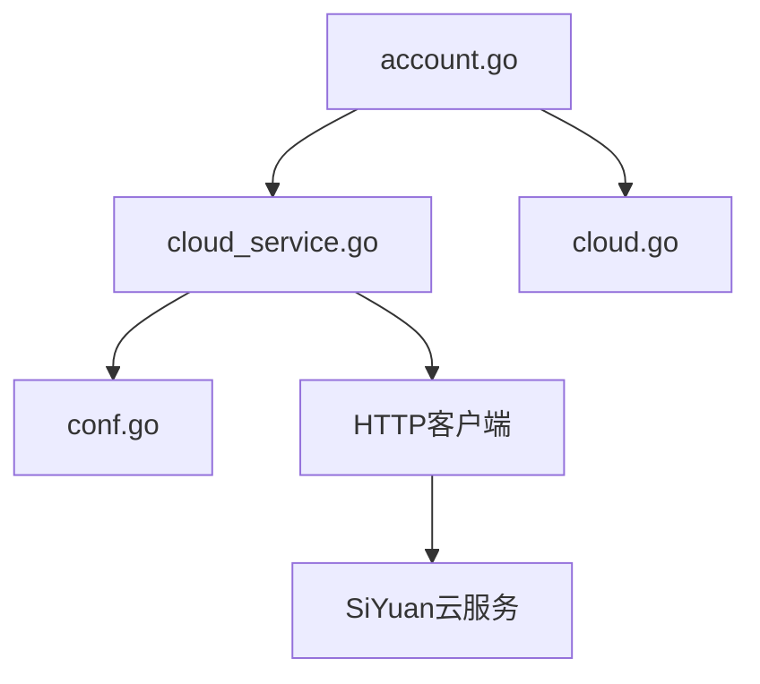

# 账户管理API

<cite>
**本文档中引用的文件**
- [account.go](file://kernel/api/account.go)
- [cloud_service.go](file://kernel/model/cloud_service.go)
- [conf.go](file://kernel/model/conf.go)
- [lang.go](file://kernel/conf/lang.go)
- [cloud.go](file://kernel/util/cloud.go)
</cite>

## 目录
1. [简介](#简介)
2. [项目结构](#项目结构)
3. [核心组件](#核心组件)
4. [架构概述](#架构概述)
5. [详细组件分析](#详细组件分析)
6. [依赖分析](#依赖分析)
7. [性能考虑](#性能考虑)
8. [故障排除指南](#故障排除指南)
9. [结论](#结论)

## 简介
本文档系统性地记录了思源笔记账户管理相关的API端点，包括获取账户信息、登录状态验证、订阅状态查询等功能。文档基于`kernel/api/account.go`文件，详细说明了每个端点的HTTP方法、URL路径、请求头（如Authentication）、请求体和响应体的JSON结构。同时解释了这些API如何与后端认证系统集成，并提供了curl示例来演示如何安全地调用这些接口。讨论了相关错误码及其处理方式，以及在客户端实现时的最佳实践。

## 项目结构
思源笔记的项目结构清晰地划分了前端资源、内核逻辑和配置文件。账户管理功能主要位于`kernel/api/`目录下的`account.go`文件中，该文件定义了所有与用户账户相关的API端点。这些端点通过调用`kernel/model/cloud_service.go`中的业务逻辑函数来实现具体功能，而用户配置信息则存储在`kernel/model/conf.go`中。

**图表来源**
- [account.go](file://kernel/api/account.go)
- [cloud_service.go](file://kernel/model/cloud_service.go)
- [conf.go](file://kernel/model/conf.go)
- [cloud.go](file://kernel/util/cloud.go)

**章节来源**
- [account.go](file://kernel/api/account.go)
- [cloud_service.go](file://kernel/model/cloud_service.go)

## 核心组件
账户管理API的核心组件包括五个主要端点：`startFreeTrial`、`useActivationcode`、`checkActivationcode`、`deactivateUser`和`login`。这些函数均位于`kernel/api/account.go`文件中，负责处理来自客户端的HTTP请求并返回相应的结果。每个端点都遵循统一的响应格式，使用`gulu.Ret.NewResult()`创建结果对象，并通过`defer c.JSON(http.StatusOK, ret)`确保响应被正确序列化为JSON格式发送给客户端。

**章节来源**
- [account.go](file://kernel/api/account.go#L1-L97)

## 架构概述
思源笔记的账户管理系统采用分层架构设计，将API接口、业务逻辑和数据访问分离。API层负责接收和解析HTTP请求；业务逻辑层处理具体的账户操作，如登录验证、激活码使用等；数据访问层则通过HTTP客户端与云端服务器通信，获取或更新用户信息。这种设计提高了代码的可维护性和可测试性，同时也便于未来的功能扩展。

**图表来源**
- [account.go](file://kernel/api/account.go)
- [cloud_service.go](file://kernel/model/cloud_service.go)

## 详细组件分析

### 启动免费试用分析
`startFreeTrial`端点允许已登录用户启动免费试用。该功能首先检查是否存在有效的用户会话，然后向云端服务器发送POST请求以激活试用权限。

#### 序列图

**图表来源**
- [account.go](file://kernel/api/account.go#L10-L18)
- [cloud_service.go](file://kernel/model/cloud_service.go#L101-L124)

**章节来源**
- [account.go](file://kernel/api/account.go#L10-L18)
- [cloud_service.go](file://kernel/model/cloud_service.go#L101-L124)

### 使用激活码分析
`useActivationcode`端点用于兑换产品激活码。它接收包含激活码的JSON请求体，经过清理和验证后提交给云端进行处理。

#### 流程图

**图表来源**
- [account.go](file://kernel/api/account.go#L20-L33)
- [cloud_service.go](file://kernel/model/cloud_service.go#L567-L589)

**章节来源**
- [account.go](file://kernel/api/account.go#L20-L33)
- [cloud_service.go](file://kernel/model/cloud_service.go#L567-L589)

### 登录功能分析
`login`端点实现了完整的用户登录流程，支持用户名密码认证及验证码机制。此功能还允许指定云服务区域，以便连接到不同地理位置的服务器。

#### 类图

**图表来源**
- [account.go](file://kernel/api/account.go#L70-L97)
- [cloud_service.go](file://kernel/model/cloud_service.go#L619-L658)

**章节来源**
- [account.go](file://kernel/api/account.go#L70-L97)
- [cloud_service.go](file://kernel/model/cloud_service.go#L619-L658)

## 依赖分析
账户管理模块依赖于多个内部组件和外部服务。主要依赖关系包括：
- `kernel/model/cloud_service.go` 提供核心业务逻辑
- `kernel/util/cloud.go` 确定云服务器地址
- `kernel/model/conf.go` 存储用户配置和语言设置
- 外部云服务提供身份验证和订阅管理功能

**图表来源**
- [account.go](file://kernel/api/account.go)
- [cloud_service.go](file://kernel/model/cloud_service.go)
- [conf.go](file://kernel/model/conf.go)
- [cloud.go](file://kernel/util/cloud.go)

**章节来源**
- [account.go](file://kernel/api/account.go)
- [cloud_service.go](file://kernel/model/cloud_service.go)
- [conf.go](file://kernel/model/conf.go)
- [cloud.go](file://kernel/util/cloud.go)

## 性能考虑
账户管理API的设计充分考虑了性能因素。所有网络请求均设置了30秒超时限制，防止长时间挂起。对于频繁调用的配置读取操作，采用了同步锁保护共享资源，避免竞态条件。此外，敏感信息如用户凭证在内存中仅保留必要时间，并在不再需要时及时清除，减少潜在的安全风险。

## 故障排除指南
当遇到账户管理API调用失败时，请参考以下常见问题及解决方案：

1. **连接超时错误**：检查网络连接是否正常，确认防火墙未阻止对云服务的访问。
2. **无效用户错误**：确保用户已成功登录且会话未过期。
3. **激活码无效**：验证激活码格式正确，注意区分大小写并移除前后空格。
4. **区域设置问题**：如果无法连接到云服务，请尝试切换云服务区域设置。
5. **语言显示异常**：确认`conf.Lang`字段值与可用语言包匹配。

**章节来源**
- [cloud_service.go](file://kernel/model/cloud_service.go)
- [conf.go](file://kernel/model/conf.go)

## 结论
思源笔记的账户管理API提供了一套完整且安全的用户认证和订阅管理功能。通过清晰的分层架构和严谨的错误处理机制，保证了系统的稳定性和可靠性。开发者可以基于本文档提供的信息轻松集成这些API到自己的应用中，为用户提供流畅的账户体验。