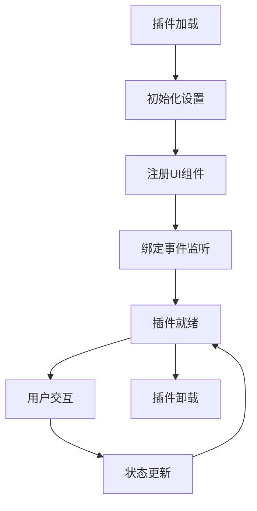

# 🏗️ 项目架构概述

## 📋 项目基本信息

### 技术栈
- **构建工具**: Vite 5.x (高性能构建工具)
- **前端框架**: Svelte 4.x (轻量级响应式框架)
- **开发语言**: TypeScript (类型安全)
- **样式方案**: SCSS (CSS预处理器)
- **包管理器**: pnpm (推荐)
- **目标平台**: 思源笔记 (SiYuan)

### 插件特性
- ✅ 热重载开发
- ✅ 符号链接部署
- ✅ 多语言支持 (i18n)
- ✅ 组件化开发
- ✅ TypeScript 类型安全
- ✅ 自动化构建
- ✅ 设置面板系统
- ✅ 事件总线机制

## 📁 目录结构详解

```
highlight_assistant/
├── 📁 src/                    # 源代码目录
│   ├── 📄 index.ts           # 插件主入口文件
│   ├── 📄 api.ts             # SiYuan API 封装
│   ├── 📄 index.scss         # 全局样式文件
│   ├── 📄 hello.svelte       # 示例 Svelte 组件
│   ├── 📄 setting-example.svelte # 设置面板示例
│   ├── 📁 libs/              # 核心库文件
│   │   ├── 📄 const.ts       # 常量定义
│   │   ├── 📄 dialog.ts      # 对话框工具类
│   │   ├── 📄 setting-utils.ts # 设置工具类
│   │   ├── 📄 promise-pool.ts # 异步任务池
│   │   ├── 📄 index.d.ts     # 类型定义
│   │   └── 📁 components/    # 可复用组件
│   │       ├── 📄 setting-panel.svelte
│   │       ├── 📄 b3-typography.svelte
│   │       └── 📁 Form/      # 表单组件
│   └── 📁 types/             # TypeScript 类型定义
│       ├── 📄 api.d.ts       # API 类型
│       └── 📄 index.d.ts     # 通用类型
├── 📁 public/                # 公共资源
│   └── 📁 i18n/              # 国际化文件
│       ├── 📄 en_US.json     # 英文
│       ├── 📄 zh_CN.json     # 中文
│       └── 📄 README.md      # i18n 说明
├── 📁 scripts/               # 构建脚本
│   ├── 📄 make_dev_link.js   # 开发符号链接
│   ├── 📄 make_install.js    # 本地安装
│   ├── 📄 update_version.js  # 版本更新
│   ├── 📄 elevate.ps1        # Windows 权限提升
│   └── 📄 utils.js           # 工具函数
├── 📁 asset/                 # 静态资源
├── 📄 plugin.json            # 插件配置文件
├── 📄 package.json           # Node.js 项目配置
├── 📄 vite.config.ts         # Vite 构建配置
├── 📄 tsconfig.json          # TypeScript 配置
├── 📄 svelte.config.js       # Svelte 框架配置
└── 📄 yaml-plugin.js         # 自定义 Vite 插件
```

## 🎯 核心架构设计

### 1. 插件主类架构

```typescript
export default class PluginSample extends Plugin {
    // 插件生命周期
    async onload()      // 插件加载
    onLayoutReady()     // 布局就绪
    async onunload()    // 插件卸载
    uninstall()         // 插件卸载

    // 核心功能模块
    settingUtils: SettingUtils    // 设置管理
    custom: () => Custom          // 自定义标签页
    isMobile: boolean            // 移动端检测
}
```

### 2. 组件系统架构

#### 🧩 Svelte 组件层次
```
HelloExample (示例组件)
├── 使用 SiYuan API
├── Protyle 编辑器集成
└── 响应式数据绑定

SettingExample (设置面板)
├── SettingPanel (设置面板容器)
│   └── Form.Wrap + Form.Input (表单组件)
└── 事件驱动的配置管理
```

#### 🔧 工具类系统
```
SettingUtils (设置管理)
├── 配置项注册与管理
├── UI 元素自动生成
├── 数据持久化
└── 实时更新机制

DialogUtils (对话框工具)
├── inputDialog (输入对话框)
├── confirmDialog (确认对话框)
├── simpleDialog (简单对话框)
└── svelteDialog (Svelte 组件对话框)
```

### 3. API 封装架构

#### 🌐 SiYuan API 分类
```typescript
// 笔记本操作
lsNotebooks() / createNotebook() / removeNotebook()

// 文档树操作  
createDocWithMd() / renameDoc() / removeDoc()

// 块操作
insertBlock() / updateBlock() / deleteBlock()

// 属性操作
setBlockAttrs() / getBlockAttrs()

// 文件操作
getFile() / putFile() / removeFile()

// 系统操作
bootProgress() / version() / currentTime()
```

### 4. 构建系统架构

#### ⚙️ Vite 配置层次
```javascript
vite.config.ts
├── 开发/生产环境区分
├── Svelte 插件集成
├── YAML-i18n 自定义插件
├── 静态资源复制
├── 文件监听与热重载
└── 自动打包 (zip)
```

#### 📦 构建输出
```
dev/     (开发输出 - 符号链接)
├── index.js    # 主程序
├── index.css   # 样式文件
├── i18n/       # 国际化
└── 静态资源

dist/    (生产输出)
├── index.js    # 压缩后主程序
├── index.css   # 压缩后样式
├── package.zip # 发布包
└── 完整的插件文件
```

## 🔄 数据流架构

### 插件生命周期数据流


### 设置管理数据流


## 🎨 设计模式应用

### 1. 单例模式
- **插件主类**: 确保插件实例唯一性
- **设置管理器**: 全局配置状态管理

### 2. 观察者模式
- **事件总线**: SiYuan 事件系统集成
- **Svelte 响应式**: 自动UI更新机制

### 3. 工厂模式
- **组件创建**: 动态表单元素生成
- **API 封装**: 统一请求处理

### 4. 适配器模式
- **API 封装**: SiYuan 原生API到TypeScript的适配
- **平台兼容**: 桌面端/移动端适配

## 🔗 核心依赖关系

```typescript
// 依赖层次 (从上到下)
Plugin Main Class
    ↓
Setting Utils / Dialog Utils
    ↓  
Svelte Components
    ↓
SiYuan API Wrapper
    ↓
SiYuan Core API
```

## 📊 性能特性

### 1. 构建性能
- **Vite**: 基于 ESBuild 的极速构建
- **代码分割**: 按需加载组件
- **Tree Shaking**: 自动删除未使用代码

### 2. 运行时性能
- **Svelte**: 编译时优化，无虚拟DOM开销
- **延迟加载**: 组件按需初始化
- **事件防抖**: 避免频繁API调用

### 3. 开发体验
- **热重载**: 代码变更即时生效
- **符号链接**: 无需重复安装
- **TypeScript**: 编译时错误检查

---

*下一章节: [开发环境搭建](./SETUP_GUIDE.md)*
