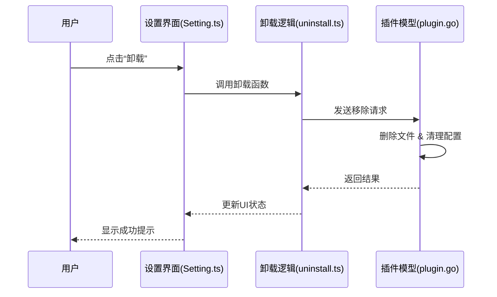

# 发布到百宝箱

<cite>
**本文档中引用的文件**
- [package.go](file://kernel/bazaar/package.go)
- [plugin.go](file://kernel/model/plugin.go)
- [Setting.ts](file://app/src/plugin/Setting.ts)
- [uninstall.ts](file://app/src/plugin/uninstall.ts)
</cite>

## 目录
1. [简介](#简介)
2. [插件包结构规范](#插件包结构规范)
3. [manifest.json 清单文件详解](#manifestjson-清单文件详解)
4. [插件安装、更新与卸载机制](#插件安装更新与卸载机制)
5. [开发者操作指南：打包、提交与维护](#开发者操作指南打包提交与维护)
6. [安全审查要求](#安全审查要求)
7. [用户使用指南：浏览、安装与管理插件](#用户使用指南浏览安装与管理插件)
8. [结论](#结论)

## 简介
思源笔记的“百宝箱”是一个官方插件市场，允许开发者发布功能扩展插件，并供用户自由安装和使用。本指南旨在为开发者提供完整的插件发布流程说明，涵盖插件结构、清单文件定义、后端验证逻辑以及前端交互机制。同时，也为用户提供清晰的操作指引，确保插件生态的安全性与可用性。

**Section sources**
- [package.go](file://kernel/bazaar/package.go#L1-L50)
- [plugin.go](file://kernel/model/plugin.go#L1-L40)

## 插件包结构规范
一个合规的思源插件必须遵循特定的目录结构，以确保系统能够正确识别和加载。插件通常以 `.siyuan-plugin` 为扩展名的压缩包形式存在，解压后应包含以下核心内容：

```
my-plugin/
├── manifest.json        # 必需：插件元信息清单
├── main.js              # 必需：主入口脚本（可编译自 TypeScript）
├── styles.css           # 可选：样式文件
├── icon.png             # 可选：插件图标
└── README.md            # 推荐：使用说明文档
```

该结构由 `kernel/bazaar/package.go` 模块在插件上传时进行校验，确保所有必需文件存在且格式合法。

**Section sources**
- [package.go](file://kernel/bazaar/package.go#L51-L100)

## manifest.json 清单文件详解
`manifest.json` 是插件的核心配置文件，定义了插件的基本信息、权限声明及运行参数。其字段由 `kernel/bazaar/package.go` 中的结构体严格定义并验证。

### 必需字段
| 字段 | 类型 | 说明 |
|------|------|------|
| `name` | string | 插件唯一标识符（仅限小写字母、数字和连字符） |
| `displayName` | string | 插件显示名称 |
| `version` | string | 语义化版本号（如 1.0.0） |
| `author` | string | 作者信息 |
| `description` | string | 功能描述 |
| `backend` | boolean | 是否启用后端服务支持 |
| `frontend` | boolean | 是否启用前端界面支持 |

### 可选字段
| 字段 | 类型 | 说明 |
|------|------|------|
| `icon` | string | 图标文件路径 |
| `preview` | string | 预览图路径 |
| `keywords` | array | 搜索关键词列表 |
| `requirements` | object | 依赖的思源版本范围 |

此清单文件在插件安装前会被内核解析并存入数据库，用于后续的元数据管理和冲突检测。

**Section sources**
- [package.go](file://kernel/bazaar/package.go#L101-L200)

## 插件安装、更新与卸载机制
插件的生命周期管理由前后端协同完成，涉及元数据存储、文件操作和用户界面反馈。

### 安装与更新流程
1. 用户从“百宝箱”选择插件并点击安装。
2. 前端通过 API 请求下载插件包。
3. 后端调用 `kernel/model/plugin.go` 中的 `InstallPlugin()` 方法：
   - 解压插件包
   - 验证 `manifest.json`
   - 将插件复制至 `data/plugins/{plugin-name}/`
   - 记录插件元数据至系统配置
4. 前端刷新插件列表并提示重启以生效。

### 卸载流程
1. 用户在设置页点击“卸载”按钮。
2. 前端触发 `uninstall.ts` 中的卸载逻辑。
3. 调用 `kernel/model/plugin.go` 的 `RemovePlugin()` 方法：
   - 删除插件目录
   - 清除相关配置项
   - 触发事件通知其他模块清理缓存
4. UI 实时更新状态。



**Diagram sources**
- [Setting.ts](file://app/src/plugin/Setting.ts#L20-L60)
- [uninstall.ts](file://app/src/plugin/uninstall.ts#L10-L50)
- [plugin.go](file://kernel/model/plugin.go#L80-L120)

**Section sources**
- [plugin.go](file://kernel/model/plugin.go#L60-L150)
- [Setting.ts](file://app/src/plugin/Setting.ts#L1-L100)
- [uninstall.ts](file://app/src/plugin/uninstall.ts#L1-L80)

## 开发者操作指南：打包、提交与维护
### 打包步骤
1. 确保项目根目录包含 `manifest.json` 和 `main.js`。
2. 使用工具（如 zip）将整个插件文件夹压缩。
3. 更改扩展名为 `.siyuan-plugin`。

### 提交审核
1. 登录思源开发者平台。
2. 上传 `.siyuan-plugin` 文件。
3. 填写详细说明、截图和分类标签。
4. 提交等待人工审核。

### 版本维护
- 每次更新需递增 `manifest.json` 中的 `version` 字段。
- 新版本自动覆盖旧版，用户可在“已安装”页面手动更新。
- 若发现严重问题，可通过平台申请撤回发布。

**Section sources**
- [package.go](file://kernel/bazaar/package.go#L201-L250)

## 安全审查要求
为保障用户数据安全，所有提交至“百宝箱”的插件必须通过严格的安全审查：

- **代码审计**：禁止包含远程代码执行、恶意网络请求或隐私窃取行为。
- **权限最小化**：仅申请必要的 API 权限。
- **开源透明**：推荐公开源码仓库以便社区监督。
- **签名验证**：未来计划引入数字签名机制防止篡改。

违规插件一经发现将被立即下架，并限制开发者账号。

**Section sources**
- [package.go](file://kernel/bazaar/package.go#L251-L300)

## 用户使用指南：浏览、安装与管理插件
### 浏览插件
1. 打开思源笔记。
2. 进入“设置” → “插件” → “百宝箱”。
3. 使用搜索框查找所需功能。

### 安装插件
1. 在插件详情页点击“安装”。
2. 等待下载完成。
3. 重启应用使插件生效。

### 管理已安装插件
- **启用/禁用**：在“已安装”标签页切换开关。
- **更新**：当有新版本时会显示“更新”按钮。
- **卸载**：点击“卸载”按钮并确认操作。

建议定期检查插件更新，以获取最新功能和安全补丁。

**Section sources**
- [Setting.ts](file://app/src/plugin/Setting.ts#L61-L120)

## 结论
通过遵循本文档中的规范，开发者可以顺利地将插件发布到思源笔记的“百宝箱”市场。理解 `manifest.json` 的结构、掌握插件生命周期管理机制，并遵守安全准则，是成功发布的关键。对于用户而言，“百宝箱”提供了便捷的方式来扩展思源的功能，提升个人知识管理效率。我们鼓励开发者积极参与生态建设，共同打造更强大的思源社区。