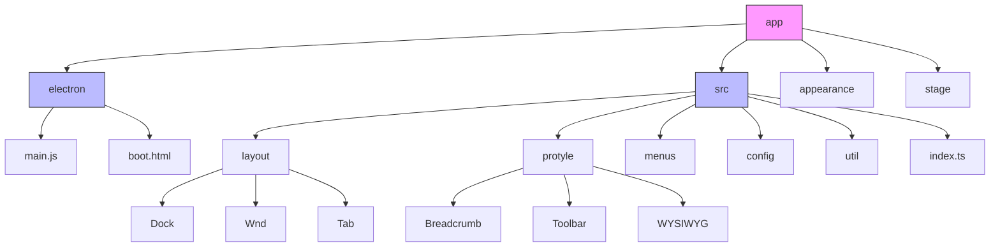
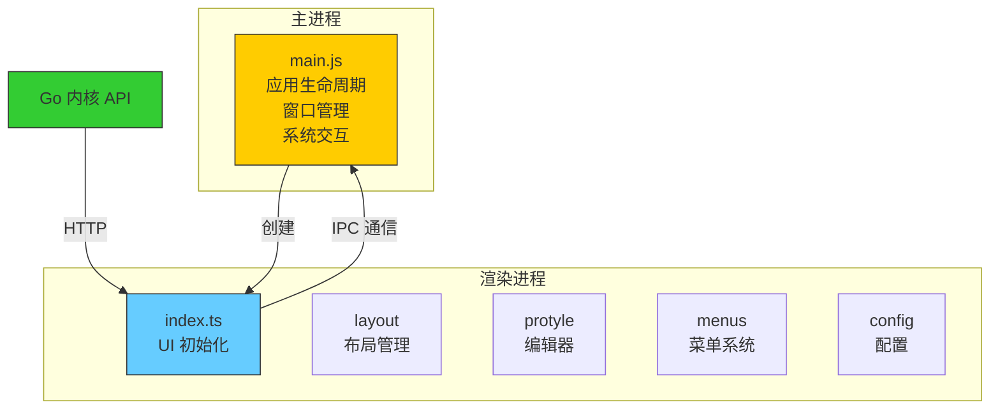
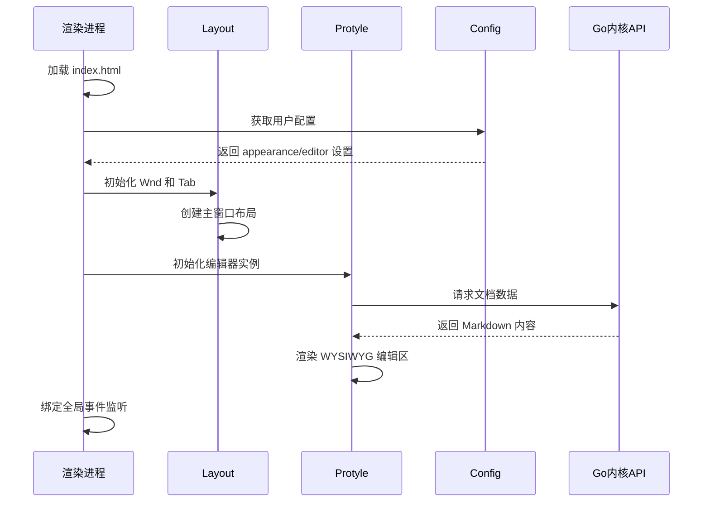
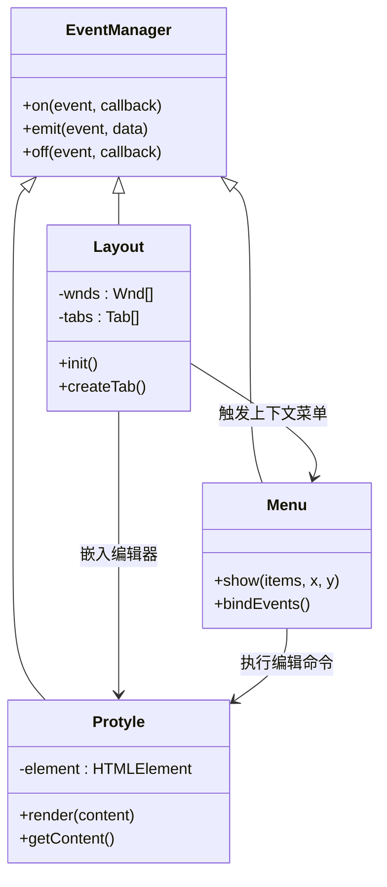
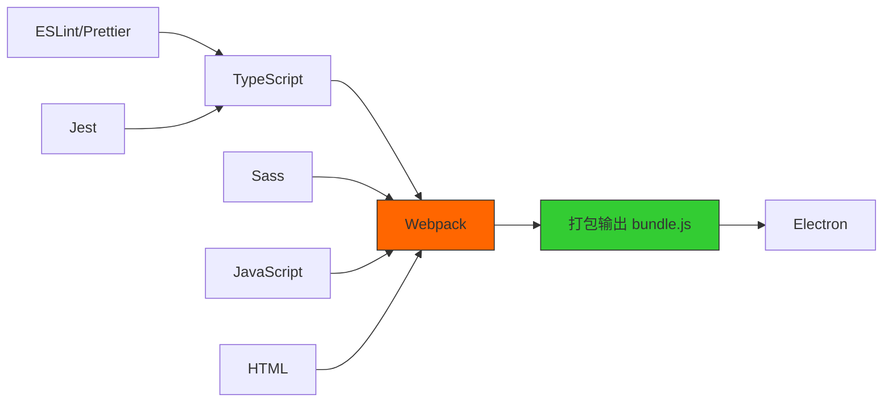

# 前端架构

<cite>
**本文档引用的文件**
- [main.js](file://app/electron/main.js)
- [webpack.config.js](file://app/webpack.config.js)
- [index.ts](file://app/src/index.ts)
- [layout](file://app/src/layout)
- [protyle](file://app/src/protyle)
- [menus](file://app/src/menus)
- [config](file://app/src/config)
- [util/fetch.ts](file://app/src/util/fetch.ts)
</cite>

## 目录
1. [简介](#简介)
2. [项目结构](#项目结构)
3. [核心组件](#核心组件)
4. [架构概览](#架构概览)
5. [详细组件分析](#详细组件分析)
6. [依赖分析](#依赖分析)
7. [性能考量](#性能考量)
8. [故障排除指南](#故障排除指南)
9. [结论](#结论)

## 简介
思源笔记是一款基于 Electron 框架构建的跨平台桌面应用，其前端架构采用现代 Web 技术栈实现。本架构文档旨在深入解析该应用的前端设计与实现机制，涵盖主进程与渲染进程的职责划分、TypeScript 与 Webpack 的技术集成、模块化组织方式以及前后端通信策略。通过系统性地剖析 src 目录下的关键模块如布局（layout）、编辑器（protyle）和菜单（menus），揭示其在用户界面管理、状态同步及交互响应方面的工程实践，并探讨其在可维护性、性能优化和跨平台兼容性上的设计权衡。

## 项目结构

思源笔记的前端代码主要位于 `app` 目录下，遵循清晰的功能分层原则进行组织：



**Diagram sources**
- [main.js](file://app/electron/main.js)
- [index.ts](file://app/src/index.ts)

**Section sources**
- [main.js](file://app/electron/main.js)
- [index.ts](file://app/src/index.ts)

## 核心组件

前端核心由多个高内聚模块构成，各司其职：
- **layout**：负责窗口布局管理，包括标签页（Tab）、窗口（Wnd）和停靠栏（Dock）的创建与生命周期控制。
- **protyle**：富文本编辑器核心，提供所见即所得（WYSIWYG）编辑能力，支持块级操作、实时预览与工具栏交互。
- **menus**：统一菜单系统，处理上下文菜单、顶部菜单及右键菜单的动态生成与事件绑定。
- **config**：配置管理中心，封装对用户偏好设置的读取、更新与持久化逻辑。
- **util**：通用工具集，包含网络请求（fetch.ts）、DOM 操作、路径处理等基础函数。

这些模块通过事件总线和共享状态协调工作，确保 UI 行为的一致性和响应性。

**Section sources**
- [layout](file://app/src/layout)
- [protyle](file://app/src/protyle)
- [menus](file://app/src/menus)
- [config](file://app/src/config)
- [util](file://app/src/util)

## 架构概览

思源笔记采用典型的 Electron 多进程架构，分离关注点以提升稳定性和安全性。



**Diagram sources**
- [main.js](file://app/electron/main.js)
- [index.ts](file://app/src/index.ts)

## 详细组件分析

### 主进程分析（main.js）

主进程是整个应用的入口控制器，负责管理应用的启动、关闭、窗口创建及系统级事件监听。

```mermaid
flowchart TD
Start([应用启动]) --> CreateWindow["创建浏览器窗口"]
CreateWindow --> LoadURL["加载 init.html"]
LoadURL --> IPCSetup["设置 IPC 通信通道"]
IPCSetup --> SystemEvents["监听系统事件<br/>关闭、最小化等"]
SystemEvents --> Ready["应用就绪"]
Note over CreateWindow,Ready: Electron 主进程控制流
```

**Diagram sources**
- [main.js](file://app/electron/main.js)

**Section sources**
- [main.js](file://app/electron/main.js)

### 渲染进程初始化

渲染进程从 `src/index.ts` 入口开始执行，逐步构建用户界面并建立与后端的数据连接。



**Diagram sources**
- [index.ts](file://app/src/index.ts)
- [layout](file://app/src/layout)
- [protyle](file://app/src/protyle)
- [config](file://app/src/config)

**Section sources**
- [index.ts](file://app/src/index.ts)
- [layout](file://app/src/layout)
- [protyle](file://app/src/protyle)
- [config](file://app/src/config)

### 模块通信机制

各前端模块通过事件驱动方式进行松耦合通信，避免直接依赖。



**Diagram sources**
- [layout](file://app/src/layout)
- [protyle](file://app/src/protyle)
- [menus](file://app/src/menus)

## 依赖分析

前端构建依赖于现代化工具链，确保开发效率与生产质量。



**Diagram sources**
- [webpack.config.js](file://app/webpack.config.js)

**Section sources**
- [webpack.config.js](file://app/webpack.config.js)

## 性能考量

前端架构在性能方面采取多项优化措施：
- **代码分割**：通过 Webpack 实现按需加载，减少初始包体积。
- **资源懒加载**：图片、PDF 等大资源仅在可见时加载。
- **虚拟滚动**：长文档使用虚拟滚动技术提升渲染效率。
- **防抖节流**：频繁触发的操作（如搜索、保存）加入延迟处理。
- **缓存策略**：利用 localStorage 和内存缓存减少重复计算与网络请求。

此外，通过 Service Worker 实现离线访问支持，增强用户体验。

## 故障排除指南

常见前端问题及其排查方法：
- **界面无响应**：检查是否发生 JavaScript 异常，查看开发者工具控制台日志。
- **样式错乱**：确认 SCSS 编译是否成功，检查 CSS 类名冲突。
- **无法连接内核**：验证 Go 内核服务是否正常运行，检查端口占用情况。
- **编辑卡顿**：禁用插件测试性能影响，检查是否存在大量未提交的变更。
- **菜单不显示**：调试右键事件是否被正确捕获，确认菜单项数据结构完整性。

建议开启调试模式并结合网络面板分析请求延迟。

**Section sources**
- [util/fetch.ts](file://app/src/util/fetch.ts)
- [dialog](file://app/src/dialog)

## 结论

思源笔记的前端架构体现了现代桌面应用开发的最佳实践。通过 Electron 实现跨平台能力，结合 TypeScript 提升代码可维护性，利用 Webpack 完成高效构建。模块化的设计使得 layout、protyle、menus 等核心组件职责清晰、易于扩展。前后端通过 HTTP API 进行解耦通信，保证了系统的灵活性与稳定性。整体架构在性能、可维护性和用户体验之间取得了良好平衡，为后续功能迭代奠定了坚实基础。