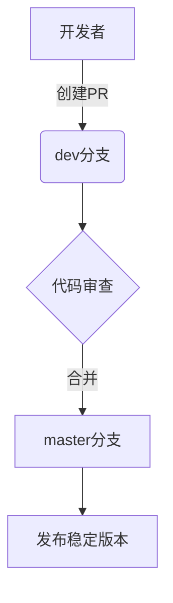

# 贡献指南

<cite>
**本文档中引用的文件**
- [.github/CONTRIBUTING.md](file://.github/CONTRIBUTING.md)
- [.github/CONTRIBUTING_zh_CN.md](file://.github/CONTRIBUTING_zh_CN.md)
- [.github/ISSUE_TEMPLATE/bug_report.yml](file://.github/ISSUE_TEMPLATE/bug_report.yml)
- [.github/ISSUE_TEMPLATE/feature_request.yml](file://.github/ISSUE_TEMPLATE/feature_request.yml)
- [.github/PULL_REQUEST_TEMPLATE.md](file://.github/PULL_REQUEST_TEMPLATE.md)
- [.github/CODE_OF_CONDUCT.md](file://.github/CODE_OF_CONDUCT.md)
- [.github/workflows/cd.yml](file://.github/workflows/cd.yml)
- [.github/workflows/target-branch.yml](file://.github/workflows/target-branch.yml)
</cite>

## 目录
1. [简介](#简介)
2. [报告问题（Issue）](#报告问题issue)
3. [提交代码更改（Pull Request）](#提交代码更改pull-request)
4. [分支管理策略](#分支管理策略)
5. [其他贡献方式](#其他贡献方式)
6. [社区行为准则](#社区行为准则)
7. [开发环境搭建](#开发环境搭建)

## 简介
思源笔记（SiYuan Note）是一个开源的知识管理系统，致力于为用户提供强大的本地优先、块级编辑和双向链接功能。本指南旨在帮助您了解如何有效地参与到项目开发中来，无论是报告问题、提交代码，还是通过其他形式为社区做贡献。

**Section sources**
- [.github/CONTRIBUTING_zh_CN.md](file://.github/CONTRIBUTING_zh_CN.md)

## 报告问题（Issue）

### 报告缺陷（Bug Report）
当您发现软件存在缺陷时，请使用预设的 `🐛 Bug report` 模板提交 Issue。为了帮助开发者快速定位和解决问题，请务必提供以下信息：

- **现有问题检查**：在提交前，请先搜索是否已有相同的问题被报告。
- **默认主题复现**：请确认该问题可以在默认主题（日光/午夜）下复现，以排除自定义主题或插件的影响。
- **排除扩展影响**：请确保已排除主题、代码片段、小部件或其他扩展导致问题的可能性。
- **问题描述**：清晰、准确地描述您遇到的问题。
- **预期结果**：说明您期望的功能表现。
- **截图或录屏**：尽可能附上截图或视频来直观展示问题。
- **版本环境**：填写完整的版本信息，包括：
  - 版本号
  - 操作系统
  - 浏览器（如适用）
- **日志文件**：程序的日志文件位于 `workspace/temp/siyuan.log`，请将其内容粘贴到 Issue 中。
- **其他信息**：提供任何有助于诊断问题的额外信息。

**Section sources**
- [.github/ISSUE_TEMPLATE/bug_report.yml](file://.github/ISSUE_TEMPLATE/bug_report.yml)

### 提出功能请求（Feature Request）
如果您希望为思源笔记添加新功能，请使用 `✨ Request new features` 模板。请详细说明：

- **使用场景**：清晰、准确地描述您需要此功能的具体应用场景。
- **最优解决方案**：尝试描述您认为的最佳实现方案。如果其他类似软件已实现此功能，请一并列出供参考。
- **候选解决方案**：描述您可以接受的其他备选方案。
- **其他信息**：提供关于此功能建议的任何附加信息。

**Section sources**
- [.github/ISSUE_TEMPLATE/feature_request.yml](file://.github/ISSUE_TEMPLATE/feature_request.yml)

## 提交代码更改（Pull Request）

### 提交流程
在提交代码更改之前，请务必遵循以下流程：
1.  **先提 Issue**：如果您想贡献一个新特性或修复一个缺陷，请先提交一个 Issue。只有在社区经过充分讨论并决定采纳后，才应进行代码开发。
2.  **避免直接提交**：不要直接提交 Pull Request，否则可能会因未经讨论而被拒绝。

### 代码规范
- **多语言与文案**：对于翻译文档或修改用户界面文案的贡献，可以直接提交 PR，团队会进行评估。
- **代码风格**：请遵守项目的代码风格约定。前端代码应符合 ESLint 规则，Go 后端代码应使用 `gofmt` 格式化。

### 提交信息格式
请确保您的 Git 提交信息清晰、简洁，并能准确反映更改内容。虽然未指定具体格式，但建议采用“类型: 描述”的模式，例如 `fix: 修复登录页面样式问题` 或 `feat: 添加暗色模式切换按钮`。

### 测试覆盖率
我们鼓励在提交新功能或修复缺陷时，同时提供相应的测试用例，以保证代码质量和系统的稳定性。

**Section sources**
- [.github/PULL_REQUEST_TEMPLATE.md](file://.github/PULL_REQUEST_TEMPLATE.md)

## 分支管理策略
本项目采用标准的分支开发模式：
- **`dev` 分支**：这是所有开发工作的主分支。**任何代码更改都必须提交到 `dev` 分支**。
- **`master` 分支**：作为稳定分支，通常包含已发布或即将发布的代码。GitHub Actions 工作流 `target-branch.yml` 会自动检测并提醒，将目标为 `master` 的 PR 更改为 `dev` 分支，确保开发流程的正确性。

**Diagram sources**
- [.github/workflows/target-branch.yml](file://.github/workflows/target-branch.yml)

**Section sources**
- [.github/PULL_REQUEST_TEMPLATE.md](file://.github/PULL_REQUEST_TEMPLATE.md)
- [.github/workflows/target-branch.yml](file://.github/workflows/target-branch.yml)

## 其他贡献方式
除了代码开发，您还可以通过多种方式为思源笔记社区做出贡献：
- **翻译文档**：帮助我们将 README、API 文档等翻译成更多语言，让全球用户都能无障碍使用。
- **编写教程**：分享您的使用技巧、工作流或高级应用案例，帮助新用户快速上手。
- **解答问题**：在论坛、GitHub Discussions 或其他社区平台上，帮助解答其他用户提出的问题，营造互助友好的氛围。
- **设计与反馈**：参与 UI/UX 设计讨论，或对产品方向提供宝贵的用户反馈。

## 社区行为准则
我们致力于维护一个开放、包容、尊重和健康的社区环境。所有成员、贡献者和领导者都应遵守《[贡献者公约行为准则](https://www.contributor-covenant.org/version/2/0/code_of_conduct.html)》。

核心原则包括：
- 对他人表现出同理心和善意。
- 尊重不同的观点、视角和经验。
- 给予并优雅地接受建设性反馈。
- 为自己的错误承担责任并向受影响的人道歉。

禁止的行为包括任何形式的骚扰、侮辱性评论、人身攻击、公开或私下骚扰以及发布他人的私人信息。

违反此准则的行为将由社区负责人处理，并可能根据情节严重程度采取警告、临时禁言或永久封禁等措施。

**Section sources**
- [.github/CODE_OF_CONDUCT.md](file://.github/CODE_OF_CONDUCT.md)

## 开发环境搭建

### 获取源码
1.  克隆仓库：`git clone git@github.com:siyuan-note/siyuan.git`
2.  切换到开发分支：`git checkout dev`

### 前端依赖
1.  安装 pnpm：`npm install -g pnpm@10.15.1`
2.  进入 `app` 目录，安装 Electron 依赖：
    *   `pnpm install electron@37.4.0 -D`
3.  安装其他依赖并启动开发服务器：
    *   `pnpm run dev`
    *   `pnpm run start`

> **注意**：在开发环境下，内核进程不会自动启动，需要手动启动。

### 内核编译
1.  安装最新版 Go 语言环境。
2.  启用 CGO 支持：设置环境变量 `CGO_ENABLED=1`。
3.  编译桌面端内核：
    *   进入 `kernel` 目录。
    *   执行编译命令（以 Linux/macOS 为例）：`go build --tags "fts5" -o "../app/kernel/SiYuan-Kernel"`
4.  启动内核：
    *   进入 `app/kernel` 目录。
    *   执行：`./SiYuan-Kernel --wd=.. --mode=dev`

**Section sources**
- [.github/CONTRIBUTING_zh_CN.md](file://.github/CONTRIBUTING_zh_CN.md)