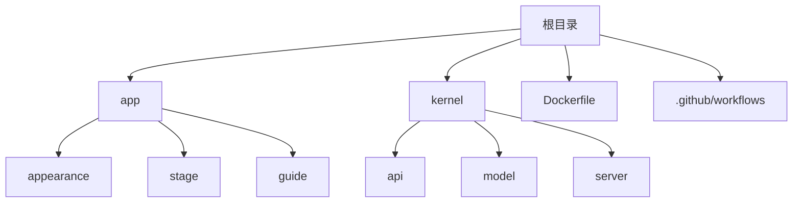
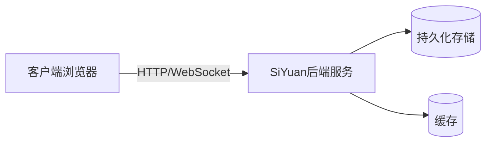
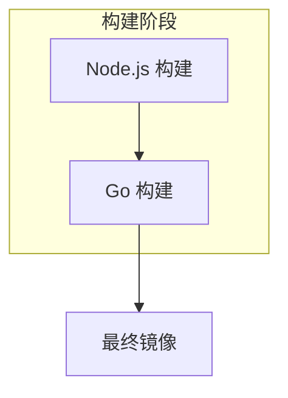
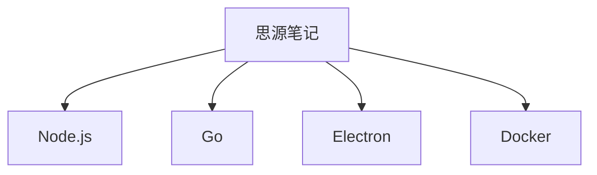

# Docker容器化部署

<cite>
**本文档中引用的文件**
- [Dockerfile](file://Dockerfile)
- [kernel/entrypoint.sh](file://kernel/entrypoint.sh)
- [README_zh_CN.md](file://README_zh_CN.md)
</cite>

## 目录
1. [简介](#简介)
2. [项目结构](#项目结构)
3. [核心组件](#核心组件)
4. [架构概述](#架构概述)
5. [详细组件分析](#详细组件分析)
6. [依赖分析](#依赖分析)
7. [性能考虑](#性能考虑)
8. [故障排除指南](#故障排除指南)
9. [结论](#结论)

## 简介
思源笔记是一款注重隐私保护的个人知识管理系统，支持细粒度块级引用和Markdown所见即所得编辑。通过Docker容器化部署，可以在服务器上轻松运行思源笔记服务。本文档详细说明了如何基于提供的Dockerfile构建镜像、运行容器以及生产环境下的最佳实践。

**Section sources**
- [README_zh_CN.md](file://README_zh_CN.md#L0-L50)

## 项目结构
思源笔记项目的目录结构清晰地划分了前端界面、内核逻辑与配置脚本等部分。主要包含以下几个关键目录：
- `app`：存放前端资源，包括外观主题、语言包及静态页面。
- `kernel`：后端Go语言实现的核心功能模块。
- 根目录下有Docker相关的构建文件如`Dockerfile`和CI/CD工作流定义。



**Diagram sources**
- [Dockerfile](file://Dockerfile#L0-L52)
- [kernel/entrypoint.sh](file://kernel/entrypoint.sh#L0-L52)

## 核心组件
思源笔记的核心由两大部分组成：前端应用（位于`app`目录）和后端服务（位于`kernel`目录）。前端负责用户交互体验，而后端则处理数据存储、网络请求等核心业务逻辑。此外，通过`Dockerfile`实现了多阶段构建流程以优化最终镜像大小并提高安全性。

**Section sources**
- [Dockerfile](file://Dockerfile#L0-L52)
- [kernel/main.go](file://kernel/main.go#L1-L10)

## 架构概述
整个系统采用前后端分离的设计模式，前端使用Electron框架打包成桌面应用程序，而通过Docker部署时则是将Web界面暴露给浏览器访问。后端服务基于Go语言开发，提供了RESTful API接口用于数据操作，并通过WebSocket支持实时通信。



**Diagram sources**
- [Dockerfile](file://Dockerfile#L0-L52)
- [kernel/server/serve.go](file://kernel/server/serve.go#L10-L30)

## 详细组件分析

### Dockerfile 分析
#### 多阶段构建流程
Dockerfile采用了三阶段构建策略来生成最终的轻量级镜像：

1. **Node.js 构建阶段 (NODE_BUILD)**
   - 使用`node:21`作为基础镜像。
   - 安装必要的工具如jq，用于解析package.json中的包管理器信息。
   - 执行pnpm install进行依赖安装，并运行构建命令生成前端资源。

2. **Go 构建阶段 (GO_BUILD)**
   - 基于`golang:1.24-alpine`镜像继续构建过程。
   - 安装编译所需的基本工具链（gcc, musl-dev）。
   - 编译Go程序得到可执行文件kernel，并将其与其他必要资源一起移动到/opt/siyuan/目录下。

3. **最终运行阶段**
   - 选用最小化的`alpine:latest`作为运行环境的基础镜像。
   - 复制前一阶段产出的所有内容至容器内指定位置。
   - 安装运行时所需的证书库、时区数据及su-exec工具。
   - 设置默认环境变量如TZ、HOME等，并开放6806端口供外部连接。
   - 指定入口点为`/opt/siyuan/entrypoint.sh`脚本，启动参数为`/opt/siyuan/kernel`。



**Diagram sources**
- [Dockerfile](file://Dockerfile#L0-L52)

#### 构建参数与基础镜像选择
- **FROM node:21 AS NODE_BUILD**: 选择Node.js 21版本进行前端资源构建，确保兼容最新特性。
- **FROM golang:1.24-alpine AS GO_BUILD**: Alpine Linux因其小巧体积成为理想的中间构建环境；Golang 1.24提供最新的性能改进。
- **FROM alpine:latest**: 最终镜像基于最简版Alpine Linux，仅包含运行所需最少组件，极大减少了攻击面。

**Section sources**
- [Dockerfile](file://Dockerfile#L0-L52)

### 运行容器的标准命令
要成功启动一个思源笔记Docker容器实例，请遵循以下标准命令模板：

```bash
docker run -d \
  -v /siyuan/workspace:/siyuan/workspace \
  -p 6806:6806 \
  -e PUID=1001 -e PGID=1002 \
  b3log/siyuan \
  --workspace=/siyuan/workspace/ \
  --accessAuthCode=your_auth_code_here
```

其中各选项含义如下：
- `-v`: 将宿主机上的`/siyuan/workspace`目录挂载到容器内部相同路径，实现数据持久化。
- `-p`: 映射容器内的6806端口到宿主机同一端口号，便于外部访问。
- `-e`: 设置环境变量PUID和PGID，用以指定容器内运行用户的UID和GID，避免权限问题。
- `--workspace`: 明确指出工作空间的具体路径。
- `--accessAuthCode`: 配置访问授权码，增强安全性。

**Section sources**
- [README_zh_CN.md](file://README_zh_CN.md#L267-L300)

## 依赖分析
该项目依赖多个开源技术和框架，主要包括：
- Node.js及其生态系统（如pnpm）
- Go语言标准库及第三方包
- Electron用于桌面应用封装
- Docker作为容器化解决方案

这些技术共同支撑起了思源笔记的功能实现和服务部署。



**Diagram sources**
- [Dockerfile](file://Dockerfile#L0-L52)
- [app/package.json](file://app/package.json#L1-L10)
- [kernel/go.mod](file://kernel/go.mod#L1-L10)

## 性能考虑
在生产环境中部署思源笔记时应注意以下几点以保证良好性能：
- 合理分配内存资源限制，防止因过度消耗导致系统不稳定。
- 利用反向代理（如Nginx）隐藏实际服务端口，并启用HTTPS加密传输。
- 定期备份重要数据以防意外丢失。
- 监控容器状态及时发现潜在问题。

## 故障排除指南
### 权限错误
当遇到无法写入挂载卷的问题时，请检查宿主机上对应目录的属主是否正确设置为目标PUID:PGID组合。例如：

```bash
chown -R 1001:1002 /siyuan/workspace
```

### 挂载失败
确认Docker守护进程具有足够的权限访问指定路径，并且该路径确实存在于宿主机上。

### 网络连接问题
确保防火墙规则允许6806端口通信，并检查是否有其他服务占用了相同端口。

**Section sources**
- [README_zh_CN.md](file://README_zh_CN.md#L301-L350)
- [kernel/entrypoint.sh](file://kernel/entrypoint.sh#L0-L52)

## 结论
通过上述文档介绍，我们详细了解了如何利用Docker技术对思源笔记进行高效稳定的部署。从构建镜像到运行实例，再到日常维护管理，每一步都有明确指导。希望这份指南能够帮助您快速搭建起属于自己的知识管理平台。