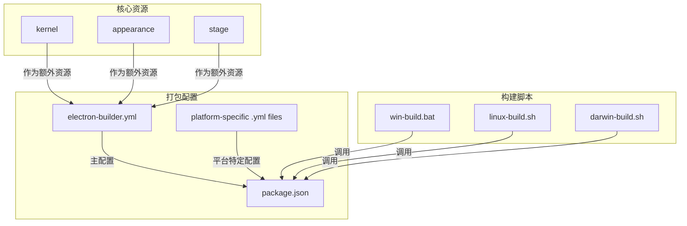
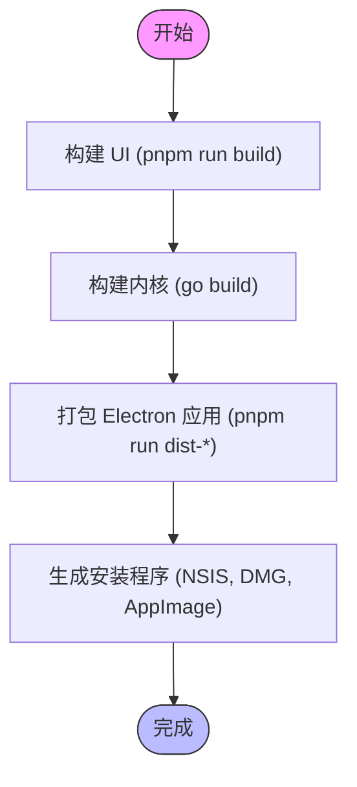
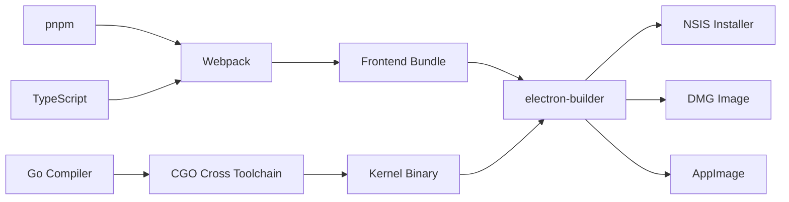

# 桌面应用打包

<cite>
**本文档中引用的文件**  
- [electron-builder.yml](file://app/electron-builder.yml)
- [electron-builder-linux.yml](file://app/electron-builder-linux.yml)
- [electron-builder-darwin.yml](file://app/electron-builder-darwin.yml)
- [package.json](file://app/package.json)
- [win-build.bat](file://scripts/win-build.bat)
- [linux-build.sh](file://scripts/linux-build.sh)
- [darwin-build.sh](file://scripts/darwin-build.sh)
</cite>

## 目录
1. [简介](#简介)
2. [项目结构](#项目结构)
3. [核心组件](#核心组件)
4. [架构概述](#架构概述)
5. [详细组件分析](#详细组件分析)
6. [依赖分析](#依赖分析)
7. [性能考虑](#性能考虑)
8. [故障排除指南](#故障排除指南)
9. [结论](#结论)

## 简介
本文档旨在为思源笔记桌面应用程序提供完整的打包指南。深入解析 `electron-builder` 配置文件，说明如何针对不同操作系统（Windows、macOS、Linux）定义构建目标、生成安装包格式（如 exe、dmg、AppImage）以及签名配置。阐述 `scripts/` 目录下各平台构建脚本的作用、执行流程和依赖关系。描述从源码编译到最终可执行文件生成的完整过程，包括依赖安装、资源打包和版本注入。为开发者提供自定义打包选项的指导，如修改应用图标、设置更新服务器和集成第三方服务，并附带常见问题的故障排除建议。

## 项目结构
思源笔记的打包系统由多个关键目录和文件组成，主要集中在 `app/` 和 `scripts/` 目录下。`app/` 目录包含 Electron 应用的核心代码和构建配置，而 `scripts/` 目录则存放用于自动化跨平台构建的 Shell 和批处理脚本。

**Diagram sources**
- [electron-builder.yml](file://app/electron-builder.yml#L1-L73)
- [package.json](file://app/package.json#L20-L30)
- [win-build.bat](file://scripts/win-build.bat#L1-L80)
- [linux-build.sh](file://scripts/linux-build.sh#L1-L38)
- [darwin-build.sh](file://scripts/darwin-build.sh#L1-L37)

**Section sources**
- [electron-builder.yml](file://app/electron-builder.yml#L1-L73)
- [package.json](file://app/package.json#L1-L85)
- [scripts](file://scripts)

## 核心组件
打包过程的核心是 `electron-builder` 工具及其配置文件。通过 `package.json` 中定义的 npm scripts 触发构建流程，利用 `electron-builder.yml` 及其衍生的平台专用配置文件来精确控制输出格式、资源包含和签名等细节。`scripts/` 目录下的脚本负责协调前端 UI 构建、Go 内核编译和最终的 Electron 打包三个阶段。

**Section sources**
- [package.json](file://app/package.json#L20-L30)
- [electron-builder.yml](file://app/electron-builder.yml#L1-L73)

## 架构概述
思源笔记的打包流程是一个多阶段、跨语言的复杂过程。首先，使用 Webpack 编译 TypeScript 前端代码；其次，使用 Go 编译器生成跨平台的内核二进制文件；最后，通过 `electron-builder` 将前端、内核和所有静态资源（主题、语言包等）整合成一个独立的桌面应用程序。整个流程由平台特定的脚本驱动，确保了在 Windows、Linux 和 macOS 上的一致性。

**Diagram sources**
- [win-build.bat](file://scripts/win-build.bat#L10-L79)
- [linux-build.sh](file://scripts/linux-build.sh#L10-L37)
- [darwin-build.sh](file://scripts/darwin-build.sh#L10-L36)

## 详细组件分析

### electron-builder 配置分析
`electron-builder` 的配置采用主配置文件 (`electron-builder.yml`) 与平台专用配置文件 (`electron-builder-{platform}.yml`) 结合的方式。主配置文件定义了通用属性，如产品名称、应用 ID、版权信息和需要包含的额外资源。平台专用文件则覆盖或补充特定于操作系统的设置。

#### Windows 配置
Windows 平台的配置继承自主配置文件。它指定了 `.ico` 格式的应用图标，并将 `kernel` 目录作为额外资源包含进来，以便 Electron 应用可以调用后端服务。构建目标为 `nsis`，生成标准的 Windows 安装程序。NSIS 配置允许用户选择安装目录、创建桌面快捷方式，并在卸载时删除应用数据。

**Section sources**
- [electron-builder.yml](file://app/electron-builder.yml#L1-L73)
- [win-build.bat](file://scripts/win-build.bat#L50-L60)

#### Linux 配置
Linux 配置 (`electron-builder-linux.yml`) 指定了 `.icns` 图标（尽管通常为 `.png`，此处可能为笔误或特殊处理）、应用分类和可执行文件名。它明确地将 `kernel-linux` 目录映射为最终包内的 `kernel` 目录。构建目标支持多种格式，包括 `tar.gz`、`AppImage` 和 `deb`，以满足不同 Linux 发行版用户的需求。

**Section sources**
- [electron-builder-linux.yml](file://app/electron-builder-linux.yml#L1-L66)

#### macOS 配置
macOS 配置 (`electron-builder-darwin.yml`) 包含了更严格的发布要求。它配置了代码签名 (`identity`)、授权文件 (`entitlements`) 和预配配置文件 (`provisioningProfile`)，这对于通过苹果的 Gatekeeper 安全机制至关重要。同时启用了强化运行时 (`hardenedRuntime`)，并声明了麦克风访问权限。构建目标为 `dmg` 格式，这是 macOS 上常见的分发方式。

**Section sources**
- [electron-builder-darwin.yml](file://app/electron-builder-darwin.yml#L1-L62)

### 构建脚本分析
构建脚本是连接各个构建阶段的粘合剂。每个脚本都遵循相似的逻辑：清理旧构建、安装前端依赖、构建前端、编译对应平台的 Go 内核，最后调用 `electron-builder` 进行打包。

#### Windows 构建脚本 (win-build.bat)
此批处理脚本首先构建前端 UI，然后进入 `kernel` 目录，使用 `go build` 命令为 `windows/amd64` 和 `windows/arm64` 架构分别编译内核。编译完成后，返回 `app` 目录，通过 `pnpm run dist` 和 `pnpm run dist-arm64` 调用 `electron-builder` 生成 64 位和 ARM64 位的安装包。脚本还包含了可选的 `electron-windows-store` 步骤，用于生成 Microsoft Store 兼容的 `.appx` 包。

**Section sources**
- [win-build.bat](file://scripts/win-build.bat#L1-L80)

#### Linux 构建脚本 (linux-build.sh)
该 Shell 脚本的流程与 Windows 脚本类似。它使用 `x86_64-linux-musl-cross` 和 `aarch64-linux-musl-cross` 交叉编译工具链来生成静态链接的 Linux 内核二进制文件，这有助于提高在不同发行版上的兼容性。之后，通过 `pnpm run dist-linux` 和 `pnpm run dist-linux-arm64` 命令触发 Electron 的打包流程。

**Section sources**
- [linux-build.sh](file://scripts/linux-build.sh#L1-L38)

#### macOS 构建脚本 (darwin-build.sh)
macOS 脚本同样先构建前端，然后在 `kernel` 目录下为 `darwin/amd64` 和 `darwin/arm64` 架构编译内核。由于 macOS 的统一内核，此过程相对直接。最后，通过 `pnpm run dist-darwin` 和 `pnpm run dist-darwin-arm64` 命令生成适用于 Intel 和 Apple Silicon Mac 的 `.dmg` 安装包。

**Section sources**
- [darwin-build.sh](file://scripts/darwin-build.sh#L1-L37)

## 依赖分析
打包过程涉及多个外部依赖。前端构建依赖于 `pnpm`、`webpack` 和 `typescript`。内核编译依赖于 `go` 编译器和特定的 CGO 交叉编译工具链（如 MinGW-w64 用于 Windows，musl-cross 用于 Linux）。最终的打包和安装程序生成依赖于 `electron-builder` 及其插件（如 `electron-windows-store`）。这些依赖关系在 `package.json` 和开发环境文档中有明确说明。

**Diagram sources**
- [package.json](file://app/package.json#L50-L85)
- [win-build.bat](file://scripts/win-build.bat#L30-L45)
- [linux-build.sh](file://scripts/linux-build.sh#L20-L30)

**Section sources**
- [package.json](file://app/package.json#L50-L85)

## 性能考虑
为了优化打包时间和分发大小，项目采取了一些策略。`asar: false` 的配置避免了将所有文件打包成一个归档，从而加快了应用启动速度。`compression: "store"` 在主配置中禁用了压缩，因为对于大型应用，解压时间可能超过网络传输节省的时间，尤其是在现代 SSD 上。然而，在 macOS 配置中使用了 `"normal"` 压缩，以平衡 App Store 的上传大小限制。此外，使用静态链接的 Go 二进制文件虽然增大了体积，但消除了对系统库的依赖，提高了部署的可靠性。

## 故障排除指南
*   **构建失败在 Go 编译阶段**: 确保已正确安装指定版本的 Go 编译器，并且 `GOPROXY` 环境变量设置正确以加速模块下载。
*   **Windows 上缺少 gcc**: 如果构建 ARM64 版本失败，请检查是否已安装 `aarch64-w64-mingw32-gcc` 并正确设置了 `CC` 环境变量。
*   **Linux 上找不到 musl-cross 工具链**: 确保已在系统上安装 `x86_64-linux-musl-cross` 和 `aarch64-linux-musl-cross`，并且 `CC` 环境变量指向正确的编译器路径。
*   **macOS 代码签名失败**: 确保已获取有效的开发者证书 (`identity`)、授权文件 (`entitlements.mas.plist`) 和预配配置文件 (`SiYuan.provisionprofile`)，并放置在正确路径。
*   **electron-builder 报错**: 检查 `package.json` 中的 `dist-*` 脚本是否正确引用了对应的 `.yml` 配置文件。确认所有必需的额外资源（如 `LICENSE`, `pandoc/*.zip`）都存在于预期位置。

**Section sources**
- [win-build.bat](file://scripts/win-build.bat#L30-L45)
- [linux-build.sh](file://scripts/linux-build.sh#L20-L30)
- [electron-builder.yml](file://app/electron-builder.yml#L1-L73)

## 结论
思源笔记的打包系统设计精良，通过分离通用配置和平台专用配置，实现了高效且一致的跨平台构建。`scripts/` 目录下的自动化脚本极大地简化了复杂的多阶段构建流程。开发者可以通过修改相应的 YAML 配置文件来自定义应用图标、安装选项和签名设置。理解这一流程对于贡献代码、进行定制化部署或维护私有版本至关重要。