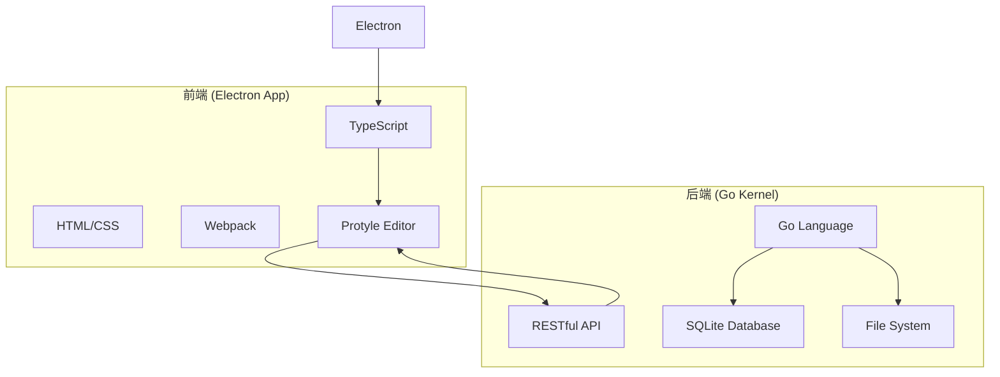

# 项目概述

<cite>
**本文档引用的文件**
- [README.md](file://README.md)
- [README_zh_CN.md](file://README_zh_CN.md)
- [app/src/index.ts](file://app/src/index.ts)
- [app/electron/main.js](file://app/electron/main.js)
- [kernel/main.go](file://kernel/main.go)
</cite>

## 目录
1. [简介](#简介)
2. [核心特性](#核心特性)
3. [系统架构与技术布局](#系统架构与技术布局)
4. [应用场景与用户价值](#应用场景与用户价值)
5. [项目目标与技术愿景](#项目目标与技术愿景)

## 简介

思源笔记（SiYuan）是一款以隐私为首要原则的个人知识管理系统，致力于通过重构用户的思维模式来提升信息组织与知识管理的效率。该系统采用本地优先的设计理念，确保用户数据的安全性与自主控制权。其核心功能围绕“块”（Block）这一基本单元展开，支持细粒度的块级引用和双向链接，允许用户将任意内容片段作为独立的知识节点进行关联和组织。

系统提供所见即所得（WYSIWYG）的 Markdown 编辑体验，用户无需记忆复杂的语法即可高效创作。其设计哲学强调非线性的知识连接，通过构建个人化的知识图谱，帮助用户发现不同信息之间的潜在联系，从而激发创造性思考。思源笔记不仅是一个笔记工具，更是一个强大的第二大脑，适用于个人知识库的构建、学术研究、项目管理和日常灵感记录等多种场景。

**Section sources**
- [README.md](file://README.md#L63-L114)
- [README_zh_CN.md](file://README_zh_CN.md#L63-L114)

## 核心特性

思源笔记集成了多项先进的知识管理功能，大部分功能对所有用户免费开放。

*   **内容块与双向链接**：系统的核心是“块”概念，每个段落、列表项或标题都是一个可被独立引用的块。通过双向链接，用户可以轻松建立知识点之间的关联，形成网状的知识结构。
*   **Markdown 所见即所得编辑**：提供直观的编辑界面，用户在输入 Markdown 语法的同时，能实时预览最终渲染效果，兼顾了格式化能力与操作便捷性。
*   **知识图谱**：系统能够可视化地展示文档间的引用关系，生成动态的知识图谱，帮助用户宏观把握知识体系的全貌。
*   **数据库与视图**：支持创建属性视图（Attribute View），用户可以像操作数据库一样，以表格、看板或画廊等形式管理和查询笔记数据。
*   **高级导出功能**：支持将笔记导出为标准 Markdown、PDF、Word 和 HTML 等多种格式，并保留块引用和嵌入关系。
*   **插件系统**：拥有活跃的社区集市，开发者可以创建和分享插件，极大地扩展了软件的功能边界。
*   **人工智能集成**：通过接入 OpenAI API，提供 AI 写作辅助和问答聊天功能，增强知识处理能力。
*   **多平台支持**：除了桌面应用，还提供 Android、iOS 和鸿蒙系统的移动应用，实现跨设备同步与访问。

**Section sources**
- [README.md](file://README.md#L117-L189)
- [README_zh_CN.md](file://README_zh_CN.md#L117-L189)

## 系统架构与技术布局

思源笔记采用前后端分离的全栈架构，实现了高性能与高可维护性的平衡。

**Diagram sources**
- [app/src/index.ts](file://app/src/index.ts#L0-L231)
- [app/electron/main.js](file://app/electron/main.js#L0-L799)
- [kernel/main.go](file://kernel/main.go#L0-L60)

### 前端架构
前端部分位于 `app` 目录下，基于 Electron 框架构建，实现了跨平台的桌面应用程序。核心技术栈包括：
*   **Electron**: 负责创建主窗口、管理应用生命周期和与操作系统交互。
*   **TypeScript**: 主要编程语言，用于编写业务逻辑和 UI 组件，位于 `app/src` 目录。
*   **Webpack**: 作为模块打包器，负责编译、压缩和打包前端资源。
*   **Protyle**: 思源自研的所见即所得编辑器引擎，提供了强大的块级操作和实时渲染能力。

前端应用启动时，由 `app/electron/main.js` 初始化 Electron 主进程，加载内核服务，并创建渲染窗口。`app/src/index.ts` 是前端应用的入口点，负责初始化全局状态、配置和加载核心模块。

### 后端架构
后端内核位于 `kernel` 目录下，使用 Go 语言编写，提供了高性能的服务端逻辑。主要职责包括：
*   **API 服务**: 通过 HTTP/HTTPS 提供 RESTful API，处理来自前端的所有请求。
*   **数据处理**: 负责笔记的解析、存储、检索和索引，核心逻辑在 `api` 和 `model` 包中。
*   **数据库管理**: 使用 SQLite 作为底层数据库，存储元数据和全文索引，相关代码在 `sql` 包中。
*   **文件系统操作**: 管理工作空间内的文件和目录，如笔记本、文档和资源文件，逻辑在 `filesys` 和 `treenode` 包中。

`kernel/main.go` 是内核的启动入口，它初始化配置、启动 HTTP 服务器、加载数据库并开启后台任务（如定时同步）。前后端通过定义良好的 API 接口进行通信，前端通过 `fetchPost` 等函数调用后端接口获取数据。

**Section sources**
- [app/src/index.ts](file://app/src/index.ts#L0-L231)
- [app/electron/main.js](file://app/electron/main.js#L0-L799)
- [kernel/main.go](file://kernel/main.go#L0-L60)

## 应用场景与用户价值

思源笔记凭借其独特的设计理念和技术优势，适用于广泛的个人知识管理场景。

*   **个人知识库构建**：用户可以将零散的信息（如读书笔记、会议记录、网页摘录）以“块”的形式存入系统，并通过双向链接将其编织成一个有机的整体，构建专属的知识网络。
*   **学术研究与写作**：研究者可以利用块级引用精确标注文献来源，使用 SQL 查询快速检索资料，并借助知识图谱梳理研究思路，极大提升研究效率。
*   **项目管理与任务追踪**：通过创建任务数据库，用户可以像管理项目一样管理笔记，设置截止日期、优先级和状态，实现从想法到执行的无缝衔接。
*   **创意发散与头脑风暴**：非线性的双向链接鼓励自由联想，用户可以从一个想法跳跃到另一个看似无关的想法，从而激发新的创意和洞见。

对于用户而言，思源笔记的价值在于它不仅仅是一个信息存储工具，更是一个促进深度思考和知识创新的平台。它帮助用户摆脱传统线性笔记的束缚，以更符合人类思维模式的方式组织信息，最终实现“重构你的思维”。

**Section sources**
- [README.md](file://README.md#L63-L114)
- [README_zh_CN.md](file://README_zh_CN.md#L63-L114)

## 项目目标与技术愿景

思源笔记的长期目标是成为最值得信赖的个人知识管理解决方案。其技术愿景体现在以下几个方面：

*   **极致的隐私保护**：坚持本地优先原则，用户数据默认存储在本地设备上，云端同步仅为可选功能，从根本上保障用户的数据主权。
*   **开放的生态系统**：通过完全开源（AGPLv3 许可证）和完善的 API，鼓励社区参与开发，共同打造一个繁荣的插件和主题生态。
*   **持续的技术创新**：不断探索前沿技术，如人工智能、知识图谱和自然语言处理，将其融入产品，为用户提供智能化的知识服务。
*   **卓越的用户体验**：追求简洁优雅的界面设计和流畅稳定的操作性能，让知识管理过程变得轻松愉悦。

该项目展现了从个人需求出发，通过技术创新解决实际问题的典范。其清晰的架构划分和模块化设计，不仅为初学者提供了理解系统的高层次上下文，也为开发者明确了各组件的边界和协作方式，确保了项目的可持续发展。

**Section sources**
- [README.md](file://README.md#L63-L114)
- [README_zh_CN.md](file://README_zh_CN.md#L63-L114)